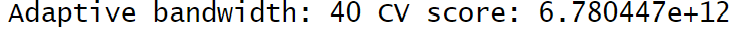
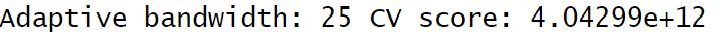

# Geographically Weighted Predictive Models

## 8.1 Overview

Predictive modelling uses statistical learning or machine learning techniques to predict outcomes. By and large, the event one wants to predict is in the future. However, a set of known outcome and predictors (also known as variables) will be used to calibrate the predictive models.

Geospatial predictive modelling is conceptually rooted in the principle that the occurrences of events being modeled are limited in distribution. **When geographically referenced data are used, occurrences of events are neither uniform nor random in distribution over space.** There are geospatial factors (infrastructure, sociocultural, topographic, etc.) that constrain and influence where the locations of events occur. **Geospatial predictive modeling attempts to describe those constraints and influences by spatially correlating occurrences of historical geospatial locations with environmental factors that represent those constraints and influences.**

### 8.1.1 Learning outcomes

In this exercise, we will build a predictive model by using geographical random forest method. The hands-on exercise includes:

-   preparing train and test data sets by using appropriate data sampling methods,

-   calibrating predictive models by using both geospatial statistical learning and machine learning methods,

-   comparing and selecting the best model for predicting the future outcome,

-   predicting the future outcomes by using the best model calibrated.

## 8.2 The Data

-   **Aspatial dataset**:

    -   [HDB Resale data](https://data.gov.sg/datasets/d_8b84c4ee58e3cfc0ece0d773c8ca6abc/view): a list of HDB resale transacted prices in Singapore from Jan 2017 onwards. It is in csv format which can be downloaded from Data.gov.sg.

-   **Geospatial dataset**:

    -   [*MP14_SUBZONE_WEB_PL*](https://data.gov.sg/datasets/d_d14da225fccf921049ab64238ff473d9/view): a polygon feature data providing information of URA 2014 Master Plan Planning Subzone boundary data. It is in ESRI shapefile format. This data set was also downloaded from Data.gov.sg

-   **Locational factors with geographic coordinates**:

    -   Downloaded from **Data.gov.sg**.

        -   [**Eldercare**](https://data.gov.sg/datasets/d_3545b068e3f3506c56b2cb6b6117b884/view) data is a list of eldercare in Singapore. It is in shapefile format.

        -   [**Hawker Centre**](https://data.gov.sg/datasets/d_4a086da0a5553be1d89383cd90d07ecd/view) data is a list of hawker centres in Singapore. It is in geojson format.

        -   [**Parks**](https://data.gov.sg/datasets/d_0542d48f0991541706b58059381a6eca/view) data is a list of parks in Singapore. It is in geojson format.

        -   [**Supermarket**](https://data.gov.sg/datasets/d_cac2c32f01960a3ad7202a99c27268a0/view) data is a list of supermarkets in Singapore. It is in geojson format.

        -   [**CHAS clinics**](https://data.gov.sg/datasets/d_548c33ea2d99e29ec63a7cc9edcccedc/view) data is a list of CHAS clinics in Singapore. It is in geojson format.

        -   [**Childcare service**](https://data.gov.sg/datasets/d_5d668e3f544335f8028f546827b773b4/view) data is a list of childcare services in Singapore. It is in geojson format.

        -   [**Kindergartens**](https://data.gov.sg/datasets/d_7fe9a72b1afff18e48111772c8d0fd39/view) data is a list of kindergartens in Singapore. It is in geojson format.

    -   Downloaded from **Datamall.lta.gov.sg**.

        -   [**MRT**](https://datamall.lta.gov.sg/content/datamall/en/search_datasets.html?searchText=train) data is a list of MRT/LRT stations in Singapore with the station names and codes. It is in shapefile format.

        -   [**Bus stops**](https://datamall.lta.gov.sg/content/datamall/en/search_datasets.html?searchText=train) data is a list of bus stops in Singapore. It is in shapefile format.

-   **Locational factors without geographic coordinates**:

    -   Downloaded from **Data.gov.sg**.

        -   **Primary school** data is extracted from the list on [General information of schools](https://data.gov.sg/datasets/d_688b934f82c1059ed0a6993d2a829089/view) from data.gov portal. It is in csv format.

    -   Retrieved/Scraped from **other sources**

        -   **CBD** coordinates obtained from Google.

        -   **Shopping malls** data is a list of Shopping malls in Singapore obtained from [Wikipedia](https://en.wikipedia.org/wiki/List_of_shopping_malls_in_Singapore).

        -   **Good primary schools** is a list of primary schools that are ordered in ranking in terms of popularity and this can be found at [Local Salary Forum](https://www.salary.sg/2021/best-primary-schools-2021-by-popularity).

## 8.3 Installing and Loading R packages

The code chunk below performs 3 tasks:

-   A list called packages will be created and will consists of all the R packages required to accomplish this exercise.

-   Check if R packages on package have been installed in R and if not, they will be installed.

-   After all the R packages have been installed, they will be loaded.

```{r}
pacman::p_load(sf,spdep,GWmodel,SpatialML,tmap,rsample,Metrics, tidyverse,spatstat)
```

## 8.4 Preparing Data

### 8.4.1 Reading data file to rds

For the hands-on exercise, Prof Kam provided a "mdata.rds" file which comprises the data stated in Section [8.2 The Data] above.

```{r}
mdata <- read_rds("data/rds/mdata.rds")
mdata
```

We note that the object is a simple feature data frame, with point geometry and 15901 features and 17 fields. The projected coordinates system is SVY21.

### 8.4.2 Data Sampling

We split the data set into training (65%) and test (35%) data sets by using *initial_split()* of [**rsample**](https://rsample.tidymodels.org/)package. rsample is a tidymodels package.

```{r}
#| eval: false
set.seed(1234)
resale_split <- initial_split(mdata,
                              prop = 6.5/10,)
train_data <- training(resale_split)
test_data <- testing(resale_split)
```

We save the train and test data sets as new rds files and load them into the R environment to avoid rerunning the above step:

```{r}
#| eval: false
write_rds(train_data,"data/rds/train_data.rds")
write_rds(test_data,"data/rds/test_data.rds")
```

```{r}
train_data <- read_rds("data/rds/train_data.rds")
test_data <- read_rds("data/rds/test_data.rds")
```

## 8.5 Computing Correlation Matrix

Before loading the predictors into a predictive model, it is always good practice to use the correlation matrix to examine for signs of multicollinearity:

```{r}
mdata_nogeo <- mdata %>%
  st_drop_geometry()

corrplot::corrplot(cor(mdata_nogeo[,2:17]),
         diag = FALSE,
         order = "AOE",
         tl.pos = "td",
         tl.cex = 0.5,
         number.cex = 0.7,
         method = "number",
         type = "upper")
```

Note that matrix reorder is very important for mining the hidden structure and pattern in the matrix. There are four methods in corrplot (parameter order), namely “AOE”, “FPC”, “hclust”, “alphabet”. In the code chunk above, “AOE” order is used. It orders the variables by using the *angular order of the eigenvectors* method suggested by [Michael Friendly](https://www.datavis.ca/papers/corrgram.pdf).

The correlation matrix above shows that **all correlation values are below 0.8, there is hence no sign of multicollinearity.**

## 8.6 Building a non-spatial multiple linear regression

We build a multiple linear regression model using the code chunk below:

```{r}
#| eval: false
price_mlr <- lm(resale_price ~ floor_area_sqm + storey_order + remaining_lease_mths + PROX_CBD + PROX_ELDERLYCARE + PROX_HAWKER + PROX_MRT + PROX_PARK+ PROX_MALL + PROX_SUPERMARKET + WITHIN_350M_KINDERGARTEN + WITHIN_350M_CHILDCARE + WITHIN_350M_BUS + WITHIN_1KM_PRISCH,
                data = train_data)
```

We save this as a new rds file and load it into the R environment to avoid re-running the above step:

```{r}
#| eval: false
write_rds(price_mlr, "data/rds/price_mlr.rds")
```

```{r}
price_mlr <- read_rds("data/rds/price_mlr.rds")
summary(price_mlr)
```

We note that the adjusted R2 is 0.737 which indicates that the predictors are able to explain 73.7% of the HDB resale prices.

## 8.7 gwr predictive model

In this section, we will calibrate a model to predict HDB resale prices by using the geographically weighted regression method of [**GWmodel**](https://cran.r-project.org/web/packages/GWmodel/index.html) package.

### 8.7.1 Converting the sf data.frame to SpatialPointDataFrame

```{r}
train_data_sp <- as_Spatial(train_data)
train_data_sp
```

### 8.7.2 Computing adaptive bandwidth

Next, `bw.gwr()` of **GWmodel** package will be used to determine the optimal bandwidth to be used.

The code chunk below is used to determine the adaptive bandwidth with CV method used to determine the optimal bandwidth:

```{r}
#| eval: false
bw_adaptive <- bw.gwr(resale_price ~ floor_area_sqm + storey_order + remaining_lease_mths + PROX_CBD + PROX_ELDERLYCARE + PROX_HAWKER + PROX_MRT + PROX_PARK+ PROX_MALL + PROX_SUPERMARKET + WITHIN_350M_KINDERGARTEN + WITHIN_350M_CHILDCARE + WITHIN_350M_BUS + WITHIN_1KM_PRISCH,
                data = train_data_sp,
                approach = "CV",
                kernel = "gaussian",
                adaptive = TRUE,
                longlat = FALSE)
```

The result shows that 40 neighbour points will be the optimal bandwidth to be used if adaptive bandwidth is used for this data set.



We save the results as a new rds file to avoid re-running the above step which can take a while:

```{r}
#| eval: false
write_rds(bw_adaptive,"data/rds/bw_adaptive.rds")
```

```{r}
bw_adaptive <- read_rds("data/rds/bw_adaptive.rds")
bw_adaptive
```

### 8.7.3 Constructing the adaptive bandwidth gwr model

We will calibrate the gwr-based hedonic pricing model by using adaptive bandwidth and gaussian kernel as shown in the code chunk below:

```{r}
#| eval: false
gwr_adaptive <- gwr.basic(resale_price ~ floor_area_sqm + storey_order + remaining_lease_mths + PROX_CBD + PROX_ELDERLYCARE + PROX_HAWKER + PROX_MRT + PROX_PARK+ PROX_MALL + PROX_SUPERMARKET + WITHIN_350M_KINDERGARTEN + WITHIN_350M_CHILDCARE + WITHIN_350M_BUS + WITHIN_1KM_PRISCH,
                data = train_data_sp,
                bw = bw_adaptive,
                kernel = "gaussian",
                adaptive = TRUE,
                longlat = FALSE)
```

We will save the model as a new rds file to avoid re-running the step above and load it into the R environment:

```{r}
#| eval: false
write_rds(gwr_adaptive,"data/rds/gwr_adaptive.rds")
```

```{r}
gwr_adaptive <- read_rds("data/rds/gwr_adaptive.rds")
gwr_adaptive
```

### 8.7.5 Converting the test data from sf data.frame to SpatialPointDataFrame

We now move on to the test data and convert the test data from sf data.frame to SpatialPointDataFrame:

```{r}
test_data_sp <- as_Spatial(test_data)
test_data_sp
```

### 8.7.6 Computing adaptive bandwidth for test data

Likewise, we use `bw.gwr()` of **GWmodel** package to determine the optimal bandwidth to be used for the test data. We also use the adaptive bandwidth with CV method:

```{r}
#| eval: false
gwr_bw_test_adaptive <- bw.gwr(resale_price ~ floor_area_sqm + storey_order + remaining_lease_mths + PROX_CBD + PROX_ELDERLYCARE + PROX_HAWKER + PROX_MRT + PROX_PARK+ PROX_MALL + PROX_SUPERMARKET + WITHIN_350M_KINDERGARTEN + WITHIN_350M_CHILDCARE + WITHIN_350M_BUS + WITHIN_1KM_PRISCH,
                data = test_data_sp,
                approach = "CV",
                kernel = "gaussian",
                adaptive = TRUE,
                longlat = FALSE)
```

The result shows that 25 neighbour points will be the optimal bandwidth to be used if adaptive bandwidth is used for the test data set.



We save the results as a new rds file to avoid re-running the above step which can take a while:

```{r}
#| eval: false 
write_rds(gwr_bw_test_adaptive,"data/rds/gwr_bw_test_adaptive.rds")
```

```{r}
gwr_bw_test_adaptive <- read_rds("data/rds/gwr_bw_test_adaptive.rds")
gwr_bw_test_adaptive
```

### 8.7.7 Computing predicted values of the test data

We then compute the predicted HDB resale prices from the test data set. It is noted that if we were to use bw = 25 from gwr_bw_test_adaptive above, we would get an error "Error: inv(): matrix is singular" as such we utilise bw = 40 (optimal bandwidth obtained for train data set instead):

```{r}
#| eval: false
gwr_pred <- gwr.predict(resale_price ~ floor_area_sqm + storey_order + remaining_lease_mths + PROX_CBD + PROX_ELDERLYCARE + PROX_HAWKER + PROX_MRT + PROX_PARK+ PROX_MALL + PROX_SUPERMARKET + WITHIN_350M_KINDERGARTEN + WITHIN_350M_CHILDCARE + WITHIN_350M_BUS + WITHIN_1KM_PRISCH,
                data = train_data_sp,
                predictdata = test_data_sp,
                bw = 40,
                kernel = "gaussian",
                adaptive = TRUE,
                longlat = FALSE)
```

## 8.8 Preparing coordinates data

### 8.8.1 Extracting coordinates data

The code chunk below extract the x,y coordinates of the full, training and test data sets:

```{r}
#| eval: false
coords <- st_coordinates(mdata)
coords_train <- st_coordinates(train_data)
coords_test <- st_coordinates(test_data)
```

Before we continue, we write the output as new rds files and load into the R environment for future use:

```{r}
#| eval: false
write_rds(coords_train,"data/rds/coords_train.rds")
write_rds(coords_test,"data/rds/coords_test.rds")
```

```{r}
coords_train <- read_rds("data/rds/coords_train.rds")
coords_test <- read_rds("data/rds/coords_test.rds")
```

### 8.8.2 Dropping geometry field

In this step, we will drop the geometry column of the sf data.frame by using st_drop_geometry() of the sf package:

```{r}
train_data <- train_data %>%
  st_drop_geometry()
```

## 8.9 Calibrating Random Forest Model

In this section, we will calibrate a model to predict HDB resale prices by using the random forest function of the [**ranger**](https://cran.r-project.org/web/packages/ranger/index.html) package:

```{r}
#| eval: false
set.seed(1234)
rf <- ranger(resale_price ~ floor_area_sqm + storey_order + remaining_lease_mths + PROX_CBD + PROX_ELDERLYCARE + PROX_HAWKER + PROX_MRT + PROX_PARK+ PROX_MALL + PROX_SUPERMARKET + WITHIN_350M_KINDERGARTEN + WITHIN_350M_CHILDCARE + WITHIN_350M_BUS + WITHIN_1KM_PRISCH,
                data = train_data)
rf
```

We save this model as a new rds file and load it into the R environment to avoid re-running the step above:

```{r}
#| eval: false
write_rds(rf,"data/rds/rf.rds")
```

```{r}
rf <- read_rds("data/rds/rf.rds")
rf
```

## 8.10 Calibrating Geographical Random Forest Model

In this section, we will calibrate a model to predict HDB resale prices by using `grf()` of [**SpatialML**](https://cran.r-project.org/web/packages/ranger/index.html) package.

### 8.10.1 Calibrating using training data

The code chunk below calibrates a geographic random forest model by using `grf()` of **SpatialML** package:

```{r}
#| eval: false
set.seed(1234)
gwRF_adaptive <- grf(resale_price ~ floor_area_sqm + storey_order + remaining_lease_mths + PROX_CBD + PROX_ELDERLYCARE + PROX_HAWKER + PROX_MRT + PROX_PARK+ PROX_MALL + PROX_SUPERMARKET + WITHIN_350M_KINDERGARTEN + WITHIN_350M_CHILDCARE + WITHIN_350M_BUS + WITHIN_1KM_PRISCH,
                dframe = train_data,
                bw = 55,
                kernel = "adaptive",
                coords = coords_train)
```

We save the model output as a new rds file to avoid re-running the step above, since the process takes some time to run, and load it into the R environment:

```{r}
#| eval: false
write_rds(gwRF_adaptive,"data/rds/gwRF_adaptive.rds")
```

```{r}
gwRF_adaptive <- read_rds("data/rds/gwRF_adaptive.rds")
```

::: callout-note
## Notes from Prof Kam:

-   Query on why bw = 55 is used
:::

### 8.10.2 Predicting by using test data

#### 8.10.2.1 Preparing the test data

The code chunk below will be used to combine the test data with its corresponding coordinates data:

```{r}
test_data <- cbind(test_data,coords_test) %>%
  st_drop_geometry()
```

#### 8.10.2.2 Predicting with test data

Next, `predict.grf()` of spatialML package will be used to predict the resale value by using the test data and gwRF_adaptive model calibrated earlier:

```{r}
#| eval: false
gwRF_pred <- predict.grf(gwRF_adaptive,
                         test_data,
                         x.var.name = "X",
                         y.var.name = "Y",
                         local.w = 1,
                         global.w = 0)
```

We will save the output as a new rds file to avoid re-running the step above and load it into the R environment:

```{r}
#| eval: false
write_rds(gwRF_pred,"data/rds/GRF_pred.rds")
```

```{r}
GRF_pred <- read_rds("data/rds/GRF_pred.rds")
```

#### 8.10.2.3 Converting the predicting output into a data frame

The output of the `predict.grf()` is a vector of predicted values. It is wiser to convert it into a data frame for further visualisation and analysis.

```{r}
GRF_pred_df <- as.data.frame(GRF_pred)
```

We will append the predicted values to the test data via cbind():

```{r}
#| eval: false
test_data_p <- cbind(test_data,GRF_pred_df)
```

We will save it as a new rds file to avoid re-running the step above:

```{r}
#| eval: false
write_rds(test_data_p,"data/rds/test_data_p.rds")
```

```{r}
test_data_p <- read_rds("data/rds/test_data_p.rds")
```

### 8.10.3 Calculating Root Mean Square Error

The root mean square error (RMSE) allows us to measure how far predicted values are from observed values in a regression analysis. In the code chunk below, rmse() of Metrics package is used to compute the RMSE.

```{r}
rmse(test_data_p$resale_price,
     test_data_p$GRF_pred)
```

### 8.10.4 Visualising the predicted values

Alternatively, we can use a scatterplot to visualise the actual resale price and the predicted resale price using the code chunk below:

```{r}
ggplot(test_data_p,
       aes(x=GRF_pred,
           y=resale_price))+
  geom_point()
```

A better predictive model is one that has scatter points close to the diagonal line. The scatterplot can also be used to detect if there are any outliers in the model.
