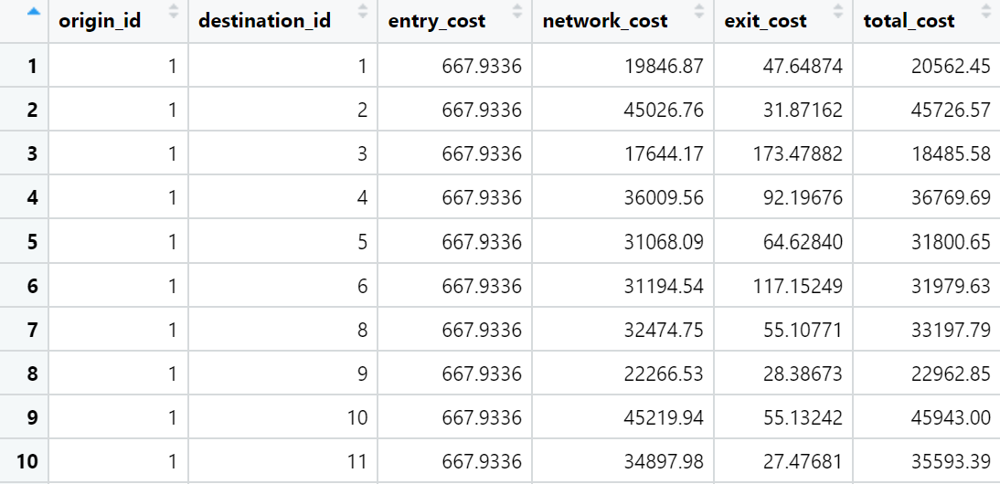
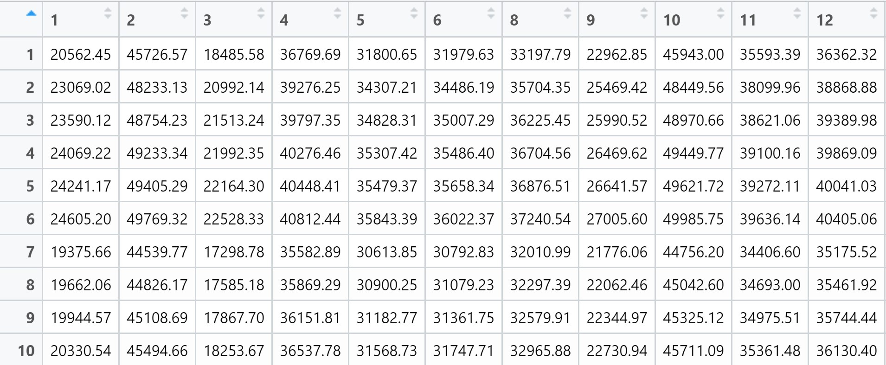

# Modelling Geographical Accessibility

## 9.1 Introduction

In this hands-on exercise, I will model geographical accessibility using R's geospatial analysis packages.

### 9.1.1 Learning Outcomes

By the end of the hands-on exercise, I would have:

-   imported GIS polygon data into R and save them as simple feature data frame using appropriate functions of sf package of R

-   imported aspatial data into R and save them as simple feature data frame using appropriate functions of sf package of R

-   computed accessibility measure using Hansen's potential model and Spatial Accessibility Measure (SAM)

-   visualised the accessibility measures using tmap and ggplot2 packages

## 9.2 The Data

Four datasets will be used:

-   `MP14_SUBZONE_NO_SEA_PL`: URA Master Plan 2014 subzone boundary GIS data. This data set is downloaded from data.gov.sg.

-   `hexagons`: A 250m radius hexagons GIS data. This data set was created by using [*st_make_grid()*](https://r-spatial.github.io/sf/reference/st_make_grid.html) of sf package. It is in ESRI shapefile format.

-   `ELDERCARE`: GIS data showing location of eldercare service. [This data](https://data.gov.sg/dataset/eldercare-services) is downloaded from data.gov.sg. There are two versions. One in ESRI shapefile format. The other one in Google kml file format. For the purpose of this hands-on exercise, ESRI shapefile format is provided.

-   `OD_Matrix`: a distance matrix in csv format. There are six fields in the data file. They are:

    -   `origin_id`: the unique id values of the origin (i.e. `fid` of hexagon data set.),

    -   `destination_id`: the unique id values of the destination (i.e. `fid` of `ELDERCARE` data set.),

    -   `entry_cost`: the perpendicular distance between the origins and the nearest road),

    -   `network_cost`: the actual network distance from the origin and destination,

    -   `exit_cost`: the perpendicular distance between the destination and the nearest road), and

    -   `total_cost`: the summation of `entry_cost`, `network_cost` and `exit_cost`.

All values of the cost-related fields are in metres.

## 9.3 Getting Started

Before we start, we will need to install and load the necessary R packages into the R environment:

-   Spatial data handling: sf

-   Modelling geographical accessibility: spatialAcc

-   Attribute data handling: tidyverse, especially readr and dplyr

-   thematic mapping: tmap

-   Staistical graphic: ggplot2

-   Statistical analysis: ggstatsplot

```{r}
pacman::p_load(sf,SpatialAcc,tidyverse,tmap,ggstatsplot, reshape2)
```

::: callout-note
Note that tidyverse also helps to install readr. dplyr, ggplots, tidyr, stringr, forcats, tibble, purrr and magrittr packages.
:::

## 9.4 Geospatial Data Wrangling

### 9.4.1 Importing geospatial data

Three geospatial data - `MP14_SUBZONE_NO_SEA_PL`, `hexagons` and `ELDERCARE` - will be imported into the R environment using the code chunk below, which utilises *st_read()* of sf package:

```{r}
mpsz <- st_read(dsn = "data/geospatial",
                layer = "MP14_SUBZONE_NO_SEA_PL")
```

```{r}
hexagons <- st_read(dsn = "data/geospatial",
                layer = "hexagons")
```

```{r}
eldercare <- st_read(dsn = "data/geospatial",
                layer = "ELDERCARE")
```

We note the following about the R objects above:

-   mpsz: simple feature object with multipolygon geometry type

-   hexagons: simple feature object with polygon geometry type

-   eldercare: simple feature object with point geometry type

We note that the three simple feature objects are in the SVY21 projected crs however mpsz does not have the right EPSG information as seen from the code chunk below:

::: panel-tabset
## mpsz

```{r}
st_crs(mpsz)
```

EPSG code is stated as 9001 however the correct EPSG code for SVY21 is 3414.

## hexagons

```{r}
st_crs(hexagons)
```

## eldercare

```{r}
st_crs(eldercare)
```
:::

### 9.4.2 Updating CRS information

The code chunk below updates mpsz with the correct EPSG code 3414:

```{r}
mpsz <- st_transform(mpsz,3414)
```

After transforming the projection metdata, we can verify the projection using *st_crs()* of sf package:

```{r}
#| code-fold: true
st_crs(mpsz)
```

The EPSG code is indicated as 3414 now.

### 9.4.3 Cleaning and updating attribute fields of the geospatial data

There are many redundant fields in the `eldercare` and `hexagons` data tables. The code chunk below is used to exclude the redundant fields and at the same time add new fields `demand` and `capacity` into the `hexagons` and `eldercare` sf data frame respectively.

Both fields are derived using *mutate()* of dplyr package.

```{r}
eldercare <- eldercare %>%
  select(fid,ADDRESSPOS) %>%
  mutate(capacity = 100)
```

```{r}
hexagons <- hexagons %>%
  select(fid) %>%
  mutate(demand = 100)
```

Note that a constant value of 100 is used for the purpose of this hands-on exercise but in practice, the actual demand of the hexagon and capacity of the eldercare centre should be used.

::: callout-note
## Questions to raise

-   what determines the actual demand of the hexagon?
:::

## 9.5 Aspatial Data Handling and Wrangling

### 9.5.1 Importing Distance Matrix

The code chunk below uses *read_csv()* of **readr** package to import `OD_Matrix.csv` as a tibble data.frame called `ODMatrix` into the R environment:

```{r}
ODMatrix <- read_csv("data/aspatial/OD_Matrix.csv", skip = 0)
```

::: callout-note

**skip**

:   Number of lines to skip before reading data. If `comment` is supplied any commented lines are ignored *after* skipping.
:::

### 9.5.2 Tidying distance matrix

The imported ODMatrix organised the distance matrix columnwise:



However, most of the modelling packages in R expect a matrix that looks like the below:



-   **rows represent origins** i.e. aka the from field and the **columns represent destinations** i.e. aka the to field

The code chunk below uses *spread()* of **tidyr** package to **transform the ODMatrix from a thin format into a fat format:**

```{r}
distmat <- ODMatrix %>%
  select(origin_id,destination_id,total_cost) %>%
  pivot_wider(names_from= destination_id,
              values_from = total_cost) %>%
  select(c(-c('origin_id')))
```

Currently, the distance is measured in metres as the SVY21 projected coordinate system is used. We use the code chunk below to convert the unit of measurement from metres to kilometres:

```{r}
distmat_km <- as.matrix(distmat/1000)
```

## 9.6 Modelling and Visualising Accessibility using Hansen Method

### 9.6.1 Computing Hansen's accessibility

We now calculate Hansen's accessibility using *ac()* of [**SpatialAcc**](https://cran.r-project.org/web/packages/SpatialAcc/index.html) package and we save the output into a data frame called `acc_Handsen`.

```{r}
acc_Hansen <- data.frame(ac(hexagons$demand,
                            eldercare$capacity,
                            distmat_km,
                            d0 = 50,
                            power = 2,
                            family = "Hansen"))
```

```{r}
#| echo: false
head(acc_Hansen,10)
```

Note that the default field name is very long and messy, we will hence rename it to `accHansen` using the code chunk below:

```{r}
colnames(acc_Hansen) <- "accHansen"
```

```{r}
#| echo: false
head(acc_Hansen,10)
```

Next, we will convert the data table into tibble format using the code chunk below:

```{r}
acc_Hansen <- as_tibble(acc_Hansen)
```

```{r}
#| echo: false
head(acc_Hansen,10)
```

Lastly, we will use *bind_cols()* of dplyr to join the acc_Hansen tibble data frame with the hexagons simple features data frame and name the output as `hexagon_Hansen`:

```{r}
hexagon_Hansen <- bind_cols(hexagons,acc_Hansen)
```

```{r}
head(hexagon_Hansen)
```

Note that hexagon_Hansen is a simple feature data frame and not a typical tibble data frame.

Note that we can actually simplify the steps above with just the single code chunk below:

```{r}
#| eval: false
acc_Hansen <- data.frame(ac(hexagons$demand,
                            eldercare$capacity,
                            distmat_km,
                            d0 = 50,
                            power = 2,
                            family = "Hansen"))

colnames(acc_Hansen) <- "accHansen"
acc_Hansen <- as_tibble(acc_Hansen)
hexagon_Hansen(bind_cols(hexagons,acc_Hansen))
```

::: callout-note
## Explanation of ac() function of SpatialAcc package

-   SpatialAcc package provides a set of accessibility measures from a set of locations (demand) to another set of locations (supply)

-   ac() function measures the accessibility certain geographical areas have to certain amenities

    -   the former usually refers to the population residence and the latter to services such as healthcare, education, culture

    -   general formula: ac(p, n, D, d0, power, family):

        -   p: vector that quantifies the demand for services in each location i.e. in the context of healthcare, it could refer to the population at risk such as number of older people interested in geriatric services at hospitals

        -   n: vector that quantifies the supply of services in each location i.e. number of beds at hospitals

        -   D: matrix of a quantity separating the demand from the supply, usually a distance matrix i.e. road network distance or travel time through the road network

        -   d0: threshold distance or time that defines the catchment area (spatial kernel)

        -   power: power of separation variable, usually 2 from the theory of gravity model in geography

        -   family: character value used to define the accessibility measure function, default is "SAM", options are "2SFCA", "KD2SFCA", "Hansen"
:::

::: callout-note
## Questions to raise

-   how to determine the threshold to set for d0 and value to use for power
:::

### 9.6.2 Visualising Hansen's accessibility

#### 9.6.2.1 Extracting map extend

We will extract the extend of hexagons simple feature data frame by using *st_bbox()* of sf package:

```{r}
mapex <- st_bbox(hexagons)
mapex
```

The code chunk below uses a collection of mapping functions of the **tmap** package to create a high cartographic quality map to indicate the accessibility to eldercare centres in Singapore:

```{r}
tmap_mode('plot')
tm_shape(hexagon_Hansen,
         bbox = mapex) +
  tm_fill(col = "accHansen",
          n = 10,
          style = "quantile",
          border.col = "black",
          border.lwd = 1)+
  tm_shape(eldercare) +
  tm_symbols(size = 0.1, col = "skyblue") +
  tm_layout(main.title = "Accessibility to eldercare: Hansen method",
            main.title.position = "center",
            main.title.size = 2,
            legend.outside = FALSE,
            legend.height = 0.28,
            legend.width = 3.0,
            legend.format = list(digits = 6),
            legend.position = c("right","top"),
            frame = TRUE) +
  tm_compass(type = "8star", size = 2) +
  tm_scale_bar(width = 0.15)+
  tm_grid(lwd = 0.1, alpha = 0.5)
```

::: callout-note
## Questions to raise

-   why do i need to indicate bbox = mapex when the geometry in hexagon_Hansen is based on the hexagons polygon geometry?
:::

### 9.6.3 Statistical graphic visualisation

In this section, we will compare the distribution of Hansen's accessibility values by URA Planning Region.

First, we need to add the planning region into the `hexagon_Hansen` simple feature data frame using the code chunk below:

```{r}
hexagon_Hansen <- st_join(hexagon_Hansen, mpsz,
                          join = st_intersects)
```

We use ggplot to plot the distribution via boxplot:

```{r}
ggplot(hexagon_Hansen,
       aes(y=log(accHansen),
           x= REGION_N))+
  geom_boxplot()+
  geom_point(stat = "summary",
             fun.y = "mean",
             color = "red",
             size = 2)
```

## 9.7 Modelling and Visualising Accessibility using KD2SFCA Method

### 9.7.1 Computing KD2SFCA's accessibility

In this section, we will repeat most of the steps carried out above for the purpose of calculating, modelling and visualising accessbility using the KD2SFCA instead of the Hansen method:

```{r}
acc_KD2SFCA <- data.frame(ac(hexagons$demand,
                             eldercare$capacity,
                             distmat_km,
                             d0 = 50,
                             power = 2,
                             family = "KD2SFCA"))

colnames(acc_KD2SFCA) <- "accKD2SFCA"
acc_KD2SFCA <- as_tibble(acc_KD2SFCA)
hexagon_KD2SFA <- bind_cols(hexagons,acc_KD2SFCA)
```

### 9.7.2 Visualising KD2SFCA's accessibility

We also utilise the tmap package functions to create a high cartographic quality map to indicate the accessibility to eldercare centres in Singapore. Note that we reuse mapex created earlier for the bbox argument.

```{r}
tmap_mode('plot')
tm_shape(hexagon_KD2SFA,
         bbox = mapex)+
  tm_fill(col = "accKD2SFCA",
          n = 10,
          style = "quantile",
          border.col = "black",
          border.lwd = 1)+
  tm_shape(eldercare)+
  tm_symbols(size = 0.1, col = "skyblue")+
  tm_layout(main.title = "Accessibility to eldercare: KD2SFCA Method",
            main.title.position = "center",
            main.title.size = 2,
            legend.outside = FALSE,
            legend.height = 0.28,
            legend.width = 3.0,
            legend.format = list(digits = 6),
            legend.position = c("right","top"),
            frame = TRUE) +
  tm_compass(type = "8star",size = 2)+
  tm_scale_bar(width = 0.15)+
  tm_grid(lwd = 0.1, alpha = 0.5)
```

### 9.7.3 Statistical graphic visualisation

In this section, we will compare the distribution of KD2SFCA accessbility values by URA Planning Region.

First, we need to add the planning region field into the *hexagon_KD2SFCA* simple features data frame using the code chunk below:

```{r}
hexagon_KD2SFA <- st_join(hexagon_KD2SFA,mpsz,
                          join = st_intersects)
```

We use ggplot() to plot the distribution via a boxplot:

```{r}
ggplot(hexagon_KD2SFA,
       aes(y= accKD2SFCA,
           x = REGION_N))+
  geom_boxplot()+
  geom_point(stat = "summary",
             fun.y = "mean",
             colour = "red",
             size = 2)
```

## 9.8 Modelling and Visualising Accessibility using Spatial Accessibility Measure (SAM) Method

### 9.8.1 Computing SAM accessibility

As with that for section [9.7 Modelling and Visualising Accessibility using KD2SFCA Method], we will repeat the analysis for the SAM method:

```{r}
acc_SAM <- as.data.frame(ac(hexagons$demand,
                            eldercare$capacity,
                            distmat_km,
                            d0 = 50,
                            power = 2,
                            family = "SAM"))
colnames(acc_SAM) <- "accSAM"
acc_SAM <- as_tibble(acc_SAM)
hexagon_SAM <- bind_cols(hexagons, acc_SAM)
```

### 9.8.2 Visualising SAM's accessibility

We will visualise the accessibility to eldercare centres in Singapore using tmap functions. We use mapex for the bbox argument.

```{r}
tmap_mode('plot')
tm_shape(hexagon_SAM,
         bbox = mapex)+
  tm_fill(col = "accSAM",
          n = 10,
          style = "quantile",
          border.col = "black",
          border.lwd = 1)+
  tm_shape(eldercare)+
  tm_symbols(size = 0.1, col = "skyblue")+
  tm_layout(main.title = "Accessibility to eldercare: SAM method",
            main.title.position = "center",
            main.title.size = 2,
            legend.outside = FALSE,
            legend.height = 0.28,
            legend.width = 3.0,
            legend.format = list(digits =3),
            legend.position = c("right","top"),
            frame = TRUE)+
  tm_compass(type = "8star",size = 2)+
  tm_scale_bar(width = 0.15)+
  tm_grid(lwd = 0.1,alpha = 0.5)
```

### 9.8.3 Statistical graphic visualisation

We will also compare the distribution of SAM accessbility values by URA planning parameters.

Before doing so, we will add the planning region to the *hexagon_SAM* simple feature data frame:

```{r}
hexagon_SAM <- st_join(hexagon_SAM,mpsz,
                       join = st_intersects)
```

We will use ggplot to plot the distribution via a boxplot:

```{r}
ggplot(hexagon_SAM,
       aes(y = accSAM,
           x = REGION_N))+
  geom_boxplot()+
  geom_point(stat = "summary",
             fun.y = "mean",
             color = "red",
             size = 2)
```
