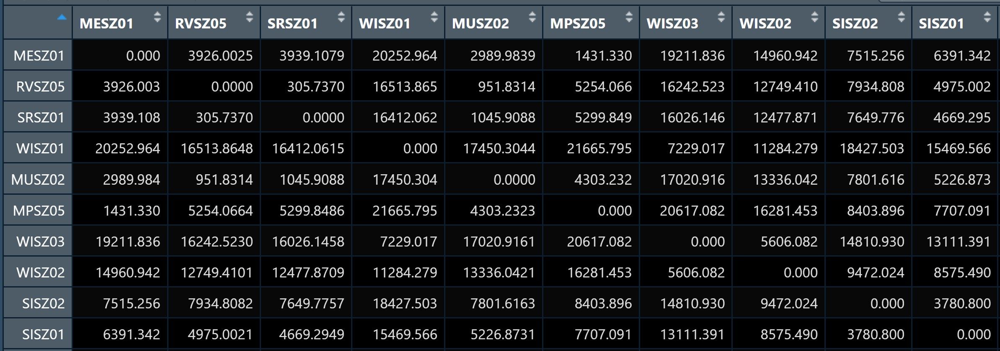
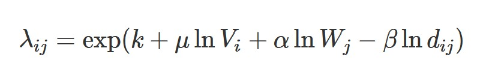
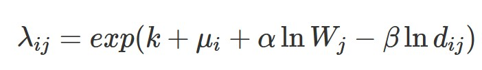
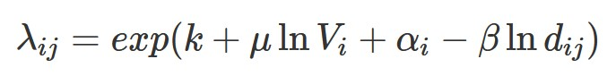
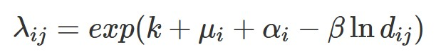

# Calibrating Spatial Interaction Models with R

## 10.1 Overview

Spatial Interaction Models (SIMs) are mathematical models for estimating flows between spatial entities developed by Alan Wilson in the late 1960s and early 1970, with considerable uptake and refinement for transport modelling since then Boyce and Williams (2015).

There are four main types of traditional SIMs (Wilson 1971):

-   Unconstrained

-   Production-constrained

-   Attraction-constrained

-   Doubly-constrained

Ordinary least square (OLS), log-normal, Poisson and negative binomial (NB) regression methods have been extensively used to calibrate OD flow models by processing flow data as different types of dependent variables. In this chapter, we will use appropriate R packages to calibrate SIM by using the four regression methods.

::: callout-note
Calibration is the process of adjusting parameters in the model to try and get the estimates to agree with the observed data as much as possible.

Adjusting the parameters is the sort of iterative process that computers are particularly good at and the goodness-of-fit statistics can be used to indicate when the optimum solution is found. Historically this process required a researcher with the requisite programming skills to write a computer algorithm to iteratively adjust each parameter, check the goodness-of-fit, and then start all over again until the goodness-of-fit statistic was maximised/minimised. (Adam Dennett, 2018)
:::

## 10.2 The Case Study and Data

In this exercise, we will calibrate SIM to determine factors affecting the public bus passenger flows during the morning peak in Singapore. This exercise is a continuation from [Hands-on Exercise 10A](https://isss626-ksm.netlify.app/hands-on_ex/hands-on_ex10/hands-on_ex10a), please refer to the link for detailed datasets used. In this exercise, we will additionally use an attribute data file called pop.csv provided by Prof Kam.

## 10.3 Getting Started

We load the necessary R packages using the code chunk below:

```{r}
pacman::p_load(sf,sp, tidyverse,tmap,reshape2, performance, ggpubr)
```

## 10.4 Computing Distance Matrix

In spatial interaction, a distance matrix is a table that shows the distance between pairs of locations. For example, in the table below we can see an Euclidean distance of 3926.0025 between MESZ01 and RVSZ05, of 3939.1079 between MESZ01 and SRSZ01, and so on. By definition, an location’s distance from itself, which is shown in the main diagonal of the table, is 0.



In this section, we will learn how to compute a distance matrix using the URA Master Plan 2019 Planning Subzone boundary saved as an rds file called *mpsz:*

```{r}
mpsz <- read_rds("data/rds/mpsz.rds")
mpsz
```

Note that it is a sf tibble data frame.

### 10.4.1 Converting sf data.table to SpatialPolygonsDataFrame

There are at least two ways to compute the required distance matrix. One is based on sf and the other is based on sp. Past experience shown that computing distance matrix by using sf function took relatively longer time than the sp method especially for large data sets. In view of this, sp method is used in the code chunks below.

First, [`as.Spatial()`](https://r-spatial.github.io/sf/reference/coerce-methods.html) will be used to convert *mpsz* from sf tibble data frame to SpatialPolygonsDataFrame of sp object as shown in the code chunk below:

```{r}
mpsz_sp <- as(mpsz,"Spatial")
mpsz_sp
```

### 10.4.2 Computing distance matrix

Next, [`spDists()`](https://www.rdocumentation.org/packages/sp/versions/2.1-1/topics/spDistsN1) of sp package will be used to compute the Euclidean distance between the centroids of the planning subzones.

::: callout-note
## Reasons why the distance is calculated between two centroids of a pair of spatial polygons

-   **Simplicity:** Finding the centroid and computing a single point-to-point distance is much faster than calculating all possible distances between the polygons' edges or vertices.

-   **Representative Distance**: For many applications, the centroid reasonably approximates the "center" of a polygon, so the distance between centroids can serve as a general measure of proximity. This is especially useful if the goal is to estimate how close two regions are in a broad sense rather than to pinpoint the exact minimum distance between boundaries.

-   **General Comparability**: Using centroids provides a standardized point-based measurement, making comparisons across different polygon pairs straightforward and consistent, even if polygons are irregular or vary in size.

-   **Avoiding Edge Complexity**: Polygons can have complex, irregular boundaries, and calculating distances along these edges would be more intensive and could introduce unnecessary detail if only a rough proximity estimate is needed.
:::

```{r}
dist <- spDists(mpsz_sp,
                longlat = FALSE)
```

::: callout-note
## In-class notes from Prof Kam

-   note that actually st_distance() can be used directly on the sf object, is just that it takes a longer time hence in this exercise, Prof Kam guided to convert sf object to sp object and apply spDists() instead
:::

```{r}
head(dist, n = c(10,10))
```

Note that the output *dist* is a matrix object class. Note that the column and row headers are not labelled with the planning subzone codes.

### 10.4.3 Labeling column and row headers of a distance matrix

First, we will create a list sorted according to the distance matrix by planning subzone code:

```{r}
sz_names <- mpsz$SUBZONE_C
```

Next, we will attach these names to the rows and columns for distance matrix:

```{r}
colnames(dist) <- paste0(sz_names)
rownames(dist) <- paste0(sz_names)
```

::: callout-note
## In-class notes from Prof Kam

-   note that this step would not be necessary if st_distance() had been applied
:::

### 10.4.4 Pivoting distance value by SUBZONE_C

Next, we will pivot the distance matrix into a long table using the row and column subzone codes shown in the code chunk below:

```{r}
distPair <- melt(dist) %>%
  rename(dist = value)
head(distPair,10)
```

Note that the within zone distance is 0.

::: callout-note
## In-class notes from Prof Kam

-   note that melt() came from reshape2 package, which is the "grandfather" of dplyr
:::

### 10.4.5 Updating intra-zonal distances

In this section, we will append a constant value to replace the intra-zonal distance of 0.

First, we will select and find out the minimum value of distance using `summary()`:

```{r}
distPair %>%
  filter(dist > 0) %>%
  summary()
```

Next, a constant distance value of 50m is added into the intra-zones distance.

```{r}
distPair$dist <- ifelse(distPair$dist == 0,
                        50,
                        distPair$dist)
```

::: callout-note
## Questions to raise

-   why is 50m used as the constant distance value?
:::

We use the code chunk below to check the result data frame:

```{r}
distPair %>%
  summary()
```

We rename the origin and destination fields in the data frame:

```{r}
distPair <- distPair %>%
  rename(orig = Var1,
         dest = Var2)
```

We save the output as a new rds file and load into the R environment for future use:

```{r}
#| eval: false
write_rds(distPair,"data/rds/distPair.rds")
```

```{r}
distPair <- read_rds("data/rds/distPair.rds")
```

## 10.5 Preparing flow data

The code chunk below is used to import the *od_data_fii* rds file created in [Hands-on Exercise 10A](https://isss626-ksm.netlify.app/hands-on_ex/hands-on_ex10/hands-on_ex10a).

```{r}
od_data_fii <- read_rds("data/rds/od_data_fii.rds")
```

Next, we will compute the total passenger trips between and within the planning subzones by using the code chunk below:

```{r}
flow_data <- od_data_fii %>%
  group_by(ORIGIN_SZ,DESTIN_SZ) %>%
  summarise(TRIPS = sum(MORNING_PEAK))
```

```{r}
head(flow_data,10)
```

### 10.5.1 Separating intra-flow from passenger volume

The code chunk below is used to add three new fields in the `flow_data` dataframe:

```{r}
# making the number of trips for intra-flows 0
flow_data$FlowNoIntra <- ifelse(flow_data$ORIGIN_SZ == flow_data$DESTIN_SZ,
                                0,
                                flow_data$TRIPS)

# making the offset 0.000001 if intra-flow and 1 if inter-flow
flow_data$offset <- ifelse(
  flow_data$ORIGIN_SZ == flow_data$DESTIN_SZ,
   0.000001,
  1)
```

### 10.5.2 Combining passenger volume data with distance value

Before we can join *flow_data* and *distPair,* we need to convert data value type of *ORIGIN_SZ* and *DESTIN_SZ* fields of *flow_data* data frame into factor data types:

```{r}
flow_data$ORIGIN_SZ <- as.factor(flow_data$ORIGIN_SZ)
flow_data$DESTIN_SZ <- as.factor(flow_data$DESTIN_SZ)
```

Next, `left_join()` of **dplyr** will be used to *flow_data* dataframe and *distPair* dataframe:

```{r}
flow_data1 <- flow_data %>%
  left_join(distPair,
            by = c("ORIGIN_SZ" = "orig",
                   "DESTIN_SZ" = "dest"))
```

## 10.6 Preparing Origin and Destination Attributes

### 10.6.1 Importing population data

```{r}
pop <- read_csv("data/aspatial/pop.csv")
glimpse(pop)
```

### 10.6.2 Geospatial data wrangling

```{r}
pop <- pop %>%
  left_join(mpsz,
            by = c("PA" = "PLN_AREA_N",
                   "SZ" = "SUBZONE_N")) %>%
  select(1:6) %>%
  rename(SZ_NAME = SZ,
         SZ = SUBZONE_C)
```

### 10.6.3 Preparing origin attribute

```{r}
flow_data1 <- flow_data1 %>%
  left_join(pop,
            by = c(ORIGIN_SZ = "SZ")) %>%
  rename(ORIGIN_AGE7_12 = AGE7_12,
         ORIGIN_AGE13_24 = AGE13_24,
         ORIGIN_AGE25_64 = AGE25_64) %>%
  select(-c(PA,SZ_NAME))
```

### 10.6.4 Preparing destination attribute

```{r}
flow_data1 <- flow_data1 %>%
  left_join(pop,
            by = c(DESTIN_SZ = "SZ")) %>%
  rename(DESTIN_AGE7_12 = AGE7_12,
         DESTIN_AGE13_24 = AGE13_24,
         DESTIN_AGE25_64 = AGE25_64) %>%
  select(-c(PA,SZ_NAME))
```

::: callout-note
## In-class notes from Prof Kam

-   note that strictly speaking, population should not be set as the destination attribute but rather can consider factors such as number of schools, workplaces

-   population was used here for simplicity
:::

We save the output as a new rds file *SIM_data* and load it into the R environment for future use:

```{r}
#| eval: false
write_rds(flow_data1, "data/rds/SIM_data.rds")
```

```{r}
SIM_data <- read_rds("data/rds/SIM_data.rds")
```

## 10.7 Calibrating Spatial Interaction Models

In this section, we will calibrate Spatial Interaction Models using Poisson Regression:

### 10.7.1 Visualising the dependent variable

First, we plot the distribution of the dependent variable i.e. TRIPS using a histogram

```{r}
ggplot(SIM_data,
       aes(x = TRIPS))+
  geom_histogram()+
  ggtitle("Distribution of Trips during Morning Peak Hour")
```

Note that the distribution is highly skewed and does not resemble a normal distribution.

Next, we visualise the relation between the dependent variable and one of the key independent variable in Spatial Interaction Model which is distance:

```{r}
ggplot(SIM_data,
       aes(x=dist,
           y=TRIPS))+
  geom_point()+
  geom_smooth(method = lm)+
  ggtitle("Distribution of Trips during Morning Peak by Distance")
```

Note that the relationship between number of trips and distance hardly resemble a linear relationship.

On the other hand, if we plot the scatterplot using the log transformed version of both variables, we can see that the relationship is closer to that of a linear relationship:

```{r}
ggplot(SIM_data,
       aes(x=log(dist),
           y=log(TRIPS)))+
  geom_point()+
  geom_smooth(method = lm)+
  ggtitle("Distribution of Trips (Log) during Morning Peak by Distance (Log")
```

### 10.7.2 Checking for variables with zero values

Since Poisson Regression is based on log and log 0 is undefined, it is important for us to ensure that no 0 values in the explanatory variables.

In the code chunk below, summary() of Base R is used to compute the summary statistics of all variables in *SIM_data* data frame.

```{r}
summary(SIM_data)
```

We note from the print report above that variables FlowNoIntra, ORIGIN_AGE7_12, ORIGIN_AGE13_24, ORIGIN_AGE25_54, DESTIN_AGE7_12, DESTIN_AGE13_24, DESTIN_AGE25_54 consist of 0 values.

The code chunk below will be used to replace 0 values with 0.99:

```{r}
#SIM_data$FlowNoIntra <- ifelse(SIM_data$FlowNoIntra == 0,1, SIM_data$FlowNoIntra)
SIM_data$DESTIN_AGE7_12 <- ifelse(
  SIM_data$DESTIN_AGE7_12 == 0,
  0.99, SIM_data$DESTIN_AGE7_12)
SIM_data$DESTIN_AGE13_24 <- ifelse(
  SIM_data$DESTIN_AGE13_24 == 0,
  0.99, SIM_data$DESTIN_AGE13_24)
SIM_data$DESTIN_AGE25_64 <- ifelse(
  SIM_data$DESTIN_AGE25_64 == 0,
  0.99, SIM_data$DESTIN_AGE25_64)
SIM_data$ORIGIN_AGE7_12 <- ifelse(
  SIM_data$ORIGIN_AGE7_12 == 0,
  0.99, SIM_data$ORIGIN_AGE7_12)
SIM_data$ORIGIN_AGE13_24 <- ifelse(
  SIM_data$ORIGIN_AGE13_24 == 0,
  0.99, SIM_data$ORIGIN_AGE13_24)
SIM_data$ORIGIN_AGE25_64 <- ifelse(
  SIM_data$ORIGIN_AGE25_64 == 0,
  0.99, SIM_data$ORIGIN_AGE25_64)
```

We rerun summary again to check:

```{r}
summary(SIM_data)
```

### 10.7.3 Unconstrained Spatial Interaction Model

In this section, we will calibrate an unconstrained spatial interaction model by using `glm()` of Base Stats. The explanatory variables are origin population by different age cohort, destination population by different age cohort (i.e. *ORIGIN_AGE25_64*) and distance between origin and destination in km (i.e. *dist*).

The general formula of Unconstrained Spatial Interaction Model is as follows:



The code chunk used to calibrate to model is shown below:

```{r}
uncSIM <- glm(formula = TRIPS ~ 
                log(ORIGIN_AGE25_64) + 
                log(DESTIN_AGE25_64) +
                log(dist),
              family = poisson(link = "log"),
              data = SIM_data,
              na.action = na.exclude)
uncSIM
```

::: callout-note
-   note that log(ORIGIN_AGE25_64) and log(DESTIN_AGE25_64) are positive

-   note that log(dist) is negative aka travel longer, willingness to travel is lesser
:::

### 10.7.4 R-Squared function

In order to measure how much variation of the trips can be accounted by the model we will write a function to calculate R-Squared value as shown below.

```{r}
CalcRSquared <- function(observed,estimated){
  r <- cor(observed,estimated)
  R2 <- r^2
  R2
}
```

Next, we will compute the R-squared of the unconstrained SIM by using the code chunk below.

```{r}
CalcRSquared(uncSIM$data$TRIPS, uncSIM$fitted.values)
```

```{r}
r2_mcfadden(uncSIM)
```

::: callout-note
## In-class notes from Prof Kam:

-   in reality, we do not have to go through these steps to calculate R2, we can instead use the performance package like in [10.7.8 Model Comparison]

-   using r2_mcfadden() might be better for poisson, negative binomial models
:::

### 10.7.5 Origin (Production) constrained SIM

In this section, we will fit an origin constrained SIM by using the code chunk below.

The general formula of Origin Constrained Spatial Interaction Model is as follows:



```{r}
orcSIM <- glm(formula = TRIPS ~ 
                 ORIGIN_SZ +
                 log(DESTIN_AGE25_64) +
                 log(dist),
              family = poisson(link = "log"),
              data = SIM_data,
              na.action = na.exclude)
summary(orcSIM)
```

We can examine how the constraints hold for destinations this time:

```{r}
CalcRSquared(orcSIM$data$TRIPS, orcSIM$fitted.values)
```

### 10.7.6 Destination constrained

In this section, we will fit a destination constrained SIM by using the code chunk below.

The general formula of Destination Constrained Spatial Interaction Model is as follows:



```{r}
decSIM <- glm(formula = TRIPS ~ 
                DESTIN_SZ + 
                log(ORIGIN_AGE25_64) + 
                log(dist),
              family = poisson(link = "log"),
              data = SIM_data,
              na.action = na.exclude)
summary(decSIM)
```

We can examine how the constraints hold for destinations this time:

```{r}
CalcRSquared(decSIM$data$TRIPS, decSIM$fitted.values)
```

### 10.7.7 Doubly constrained

In this section, we will fit a doubly constrained SIM by using the code chunk below.

The general formula of Doubly Constrained Spatial Interaction Model is as follows:



```{r}
dbcSIM <- glm(formula = TRIPS ~ 
                ORIGIN_SZ + 
                DESTIN_SZ + 
                log(dist),
              family = poisson(link = "log"),
              data = SIM_data,
              na.action = na.exclude)
summary(dbcSIM)
```

We can examine how the constraints hold for destinations this time.

```{r}
CalcRSquared(dbcSIM$data$TRIPS, dbcSIM$fitted.values)
```

We note that there is a relatively greater improvement in the R2 value.

### 10.7.8 Model Comparison

Another useful model performance measure for continuous dependent variable is [Root Mean Squared Error](https://towardsdatascience.com/what-does-rmse-really-mean-806b65f2e48e). In this sub-section, we will use compare_performance() of [**performance**](https://easystats.github.io/performance/index.html) package.

First of all, we will create a list called *model_list* by using the code chunk below:

```{r}
model_list <- list(unconstrained=uncSIM,
                   originConstrained=orcSIM,
                   destinationConstrained=decSIM,
                   doublyConstrained=dbcSIM)
```

Next, we will compute the RMSE of all the models in *model_list* file by using the code chunk below:

```{r}
compare_performance(model_list,
                    metrics = "RMSE")
```

The print above reveals that doubly constrained SIM is the best model among all the four SIMs because it has the smallest RMSE value of 3252.297.

::: callout-note
## In-class notes from Prof Kam

-   note that r2_mcfadden() is not available for group display like above - only meant for RMSE, AIC/BIC etc
:::

### 10.7.9 Visualising fitted values

In this section, we will visualise the observed values and the fitted values.

Firstly, we will extract the fitted values from each model by using the code chunk below:

::: panel-tabset
## Unconstrained SIM

```{r}
df <- as.data.frame(uncSIM$fitted.values) %>%
  round(digits = 0)
```

```{r}
SIM_data <- SIM_data %>%
  cbind(df) %>%
  rename(uncTRIPS = "uncSIM$fitted.values")
```

## Origin constrained SIM

```{r}
df <- as.data.frame(orcSIM$fitted.values) %>%
  round(digits = 0)
```

```{r}
SIM_data <- SIM_data %>%
  cbind(df) %>%
  rename(orcTRIPS = "orcSIM$fitted.values")
```

## Destination constrained SIM

```{r}
df <- as.data.frame(decSIM$fitted.values) %>%
  round(digits = 0)
```

```{r}
SIM_data <- SIM_data %>%
  cbind(df) %>%
  rename(decTRIPS = "decSIM$fitted.values")
```

## Doubly constrained SIM

```{r}
df <- as.data.frame(dbcSIM$fitted.values) %>%
  round(digits = 0)
```

```{r}
SIM_data <- SIM_data %>%
  cbind(df) %>%
  rename(dbcTRIPS = "dbcSIM$fitted.values")
```
:::

```{r}
unc_p <- ggplot(data = SIM_data,
                aes(x = uncTRIPS,
                    y = TRIPS)) +
  geom_point() +
  geom_smooth(method = lm)

orc_p <- ggplot(data = SIM_data,
                aes(x = orcTRIPS,
                    y = TRIPS)) +
  geom_point() +
  geom_smooth(method = lm)

dec_p <- ggplot(data = SIM_data,
                aes(x = decTRIPS,
                    y = TRIPS)) +
  geom_point() +
  geom_smooth(method = lm)

dbc_p <- ggplot(data = SIM_data,
                aes(x = dbcTRIPS,
                    y = TRIPS)) +
  geom_point() +
  geom_smooth(method = lm)
```

Now, we will put the graphs into a single visual for better comparison:

```{r}
ggarrange(unc_p, orc_p, dec_p, dbc_p,
          ncol = 2,
          nrow = 2)
```

::: callout-note
## In-class notes from Prof Kam

-   note that for the above plots, a lot of points are clustered at bottom left, can apply log transformation so that you can see the results spread out better

-   when calibrating model, keep the distance as positive such that when it gets returned, the distance obtained will be negative (i.e. inversely related)

-   note that **FlowNoIntra** and **Offset** are not used in this exercise, meant for Spatial Econometrics (chapter not covered in this module)
:::
