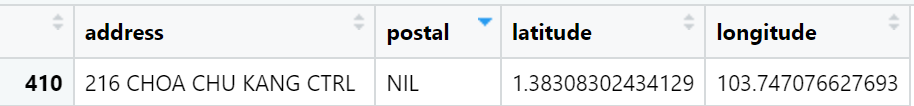
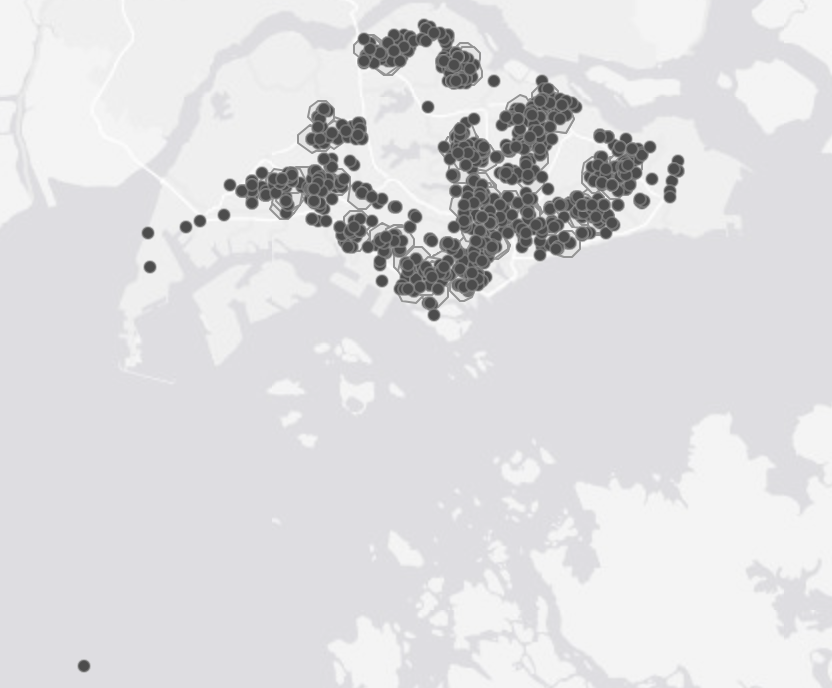

# Geographically Weighted Predictive Models

## The Data

-   **Aspatial dataset**:

    -   [HDB Resale data](https://data.gov.sg/datasets/d_8b84c4ee58e3cfc0ece0d773c8ca6abc/view): a list of HDB resale transacted prices in Singapore from Jan 2017 onwards. It is in csv format which can be downloaded from Data.gov.sg.

## Installing and Loading R packages

-   httr: allow R to talk to http

-   [rvest](https://rvest.tidyverse.org/): used to crawl websites, less flexible than the version in python but easy to start with

-   [jsonlite](https://cran.r-project.org/web/packages/jsonlite/index.html): to communicate with one map API and convert data into dataframe format

```{r}
pacman::p_load(sf,spdep,GWmodel,SpatialML,tmap,rsample,Metrics, tidyverse,spatstat, httr, jsonlite, rvest)
```

## Preparing Data

```{r}
resale <- read_csv("data/aspatial/resale.csv") %>%
  filter(month >= "2023-01" & month <= "2024-09")
```

-   note that the original resale dataset has no postal code, will need to utilise [One Map API](https://www.onemap.gov.sg/apidocs/) to do reverse geocoding - returns x, y coordinates for address that is passed through the system

    -   note that don't push over too much data i.e. 10,000 as it will take some time to return the results -\> push a small number of results i.e. 10, 50 to test the waters. Note that code is available in Javascript or Python.

    <!-- -->

    -   note that outputs lat, long is in WGS84 while the xcoord and ycoords are in SVY21.

-   note that for take-home exercise 3b i.e. proximity to parks, malls - will have to get xcoords and ycoords for those locations too, to determine proximity

-   we note that there are 47.424 rows of observations as made of several different housing types i.e. 2 room, 3 room, 4 room

### Data Wrangling

```{r}
resale_tidy <- resale %>%
  mutate(address = paste(block,street_name)) %>% #combine two columns to obtain address
  mutate(remaining_lease_yr = as.integer(
    str_sub(remaining_lease, 0, 2)))%>% #find remaining lease in terms of year as the current remaining lease column lease is a mix of xx years yy months, too difficult to use
  mutate(remaining_lease_mth = as.integer(
    str_sub(remaining_lease, 9, 11))) #find remaining lease in terms of months
```

Reduce the sample size just for demonstration purposes so that code runs faster:

```{r}
resale_selected <- resale_tidy %>%
  filter(month == "2024-09")
```

There will be addresses with the same street name hence have the code below to create a list of unique addresses - creates a list as API only understands a list:

```{r}
add_list <- sort(unique(resale_selected$address))
```

## Getting postal code via One Map API

The code chunk below creates a function to obtain coordinates:

```{r}
#| eval: false
get_coords <- function(add_list){
  
  # Create a data frame to store all retrieved coordinates
  postal_coords <- data.frame()
    
  for (i in add_list){
    #print(i)

    r <- GET('https://www.onemap.gov.sg/api/common/elastic/search?',
             #note that the address allows the passing of several addresses
             #note that the above does not use an API key
           query=list(searchVal=i,
                     returnGeom='Y',
                     getAddrDetails='Y'))
    data <- fromJSON(rawToChar(r$content))
    found <- data$found
    res <- data$results
    
    # Create a new data frame for each address
    new_row <- data.frame()
    
    # If single result, append 
    if (found == 1){
      postal <- res$POSTAL 
      lat <- res$LATITUDE
      lng <- res$LONGITUDE
      new_row <- data.frame(address= i, 
                            postal = postal, 
                            latitude = lat, 
                            longitude = lng)
      ## note that can change lat and long to x and y-coords if want the projected coordinate system directly
    }
    
    # If multiple results, drop NIL and append top 1
    else if (found > 1){
      # Remove those with NIL as postal
      res_sub <- res[res$POSTAL != "NIL", ]
      
      # Set as NA first if no Postal
      if (nrow(res_sub) == 0) {
          new_row <- data.frame(address= i, 
                                postal = NA, 
                                latitude = NA, 
                                longitude = NA)
      }
      
      else{
        top1 <- head(res_sub, n = 1)
        postal <- top1$POSTAL 
        lat <- top1$LATITUDE
        lng <- top1$LONGITUDE
        new_row <- data.frame(address= i, 
                              postal = postal, 
                              latitude = lat, 
                              longitude = lng)
      }
    }

    else {
      new_row <- data.frame(address= i, 
                            postal = NA, 
                            latitude = NA, 
                            longitude = NA)
    }
    
    # Add the row
    postal_coords <- rbind(postal_coords, new_row)
  }
  return(postal_coords)
}
```

We obtain the coordinates from *add_list:*

```{r}
#| eval: false
coords <- get_coords(add_list)
```

We save the coordinates as a new rds file:

```{r}
write_rds(coords,"data/rds/coords.rds")
```

-   Note that one address has a NIL postal code i.e. sometimes it happens if the building is torn down:



but luckily for this case, it has the latitude and longitude values.

-   **note that postal code is chr field so that the 0, if the first value of the postal code, is retained**

::: callout-note
## Notes from Prof Kam:

-   take-home exercise 3b

    -   note that Main Upgrading Program (MUP) i.e. upgrading of lifts, is important for HDB unit as price will be adjusted upwards

    -   methods for proximity to different locational factors, can refer to [hands-on ex01]{.underline}:

        -   can use straight distance, network distance, direct flying distance

        -   do event counts for number of childcare centres/kindergartens/primary schools

        -   can refer to sf package for more elaborate methods
:::

## Notes on Hands-on Exercise 8

Refer to this site: <https://isss626-ksm.netlify.app/hands-on_ex/hands-on_ex08/hands-on_ex08> for in-class notes from Prof Kam

-   overlapping points

## Notes on Take-home Ex03

-   stick to SpatialML package but take note of rendering time, **need to play around w number of trees etc (if have big sample size i.e. 15000, use less trees i.e. 50 instead of default 500)**

-   just pick out 3-room or 4-room flats etc to reduce the number of observations

-   use st_distance() to find proximity to parks etc

-   for the number of xxx within 350m/to count number of point features within 1km of another point features:

    -   refer to hands-on ex01 [geoprocessing function](https://r4gdsa.netlify.app/chap01.html#geoprocessing-with-sf-package)

    -   refer to example below

### Count number of points within a distance

#### Importing data

*ELDERCARE* is in shapefile format while *CHASClinics* is in kml format.

Note that the import code is written differently for kml file which requires an extension .kml

```{r}
eldercare <- st_read(dsn = "data/geospatial",
                     layer = "ELDERCARE") %>%
  st_transform(3414)

CHAS <- st_read("data/geospatial/CHASClinics.kml") %>%
  st_transform(3414)
```

-   sf package's st_read will allow almost any data structure to be imported

-   st_transform() is important as it ensures that all data files have the same EPSG code - different codes will have different units i.e. WGS 84 in decimal degree while SVY21 is in metres. Prof also shared that typically kml files are in WGS 84 format.

-   note that in this case can keep z coordinate - if have to use spatstat, need to drop it

#### Creating a buffer

Next, st_buffer() of sf package is used to create a buffer of 1km around each eldercare feature:

-   note that SVY21/EPSG 3414 unit of measurement is in metres hence 1000 instead of 1

```{r}
buffer_1km <- st_buffer(eldercare,
                        dist = 1000)
```

#### Visualise our buffer

-   plot the newly created buffers and the CHAS clinics

-   plot polygon before point if not all points would be covered by polygon

-   note that there are points that are not mutually exclusive

```{r}
tmap_mode("view")
tm_shape(buffer_1km)+
  tm_polygons()+
  tm_shape(CHAS)+
  tm_dots()
```

```{r}
tmap_mode("plot")
```

::: callout-note
Note that there is an outlier from the above data (screenshot appended below):


:::

#### Counting points

The code chunk below is used to count the number of CHAS clinic within 1 km of each eldercare centre

```{r}
buffer_1km$pts_count <- lengths(
  st_intersects(buffer_1km, CHAS))
```

-   lengths return the number and provide it in the new field "pts_count" in buffer_1km
