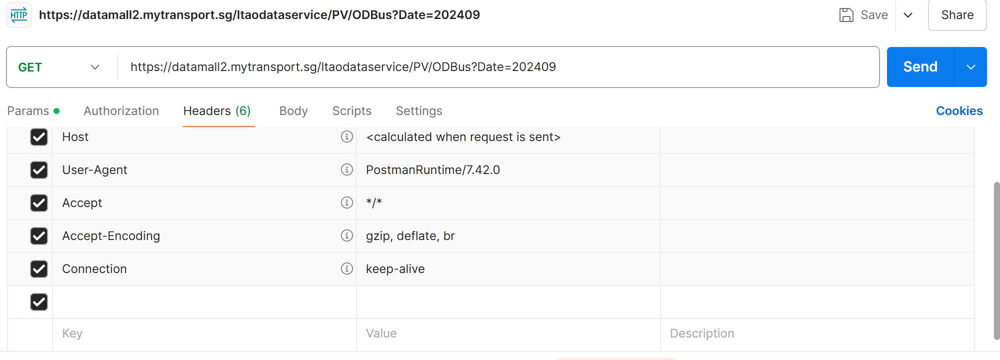
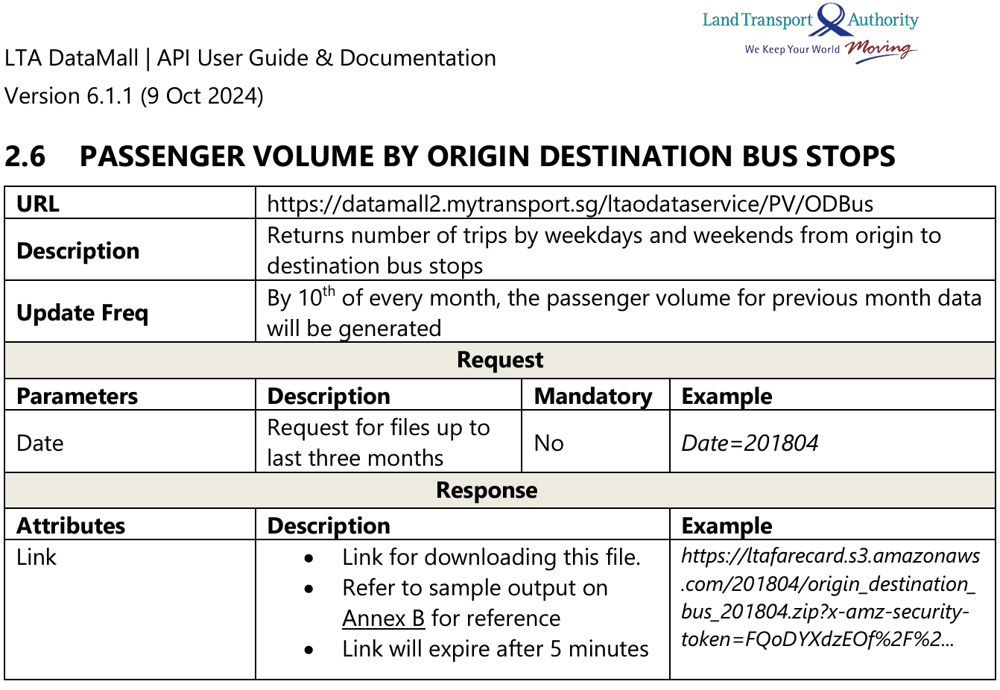

# In-class Exercise 10

## Extracting dynamic datasets from Datamall.lta.gov.sg

-   Refer to the [LTA User Guide](https://datamall.lta.gov.sg/content/dam/datamall/datasets/LTA_DataMall_API_User_Guide.pdf) to obtain the URL to the dataset of choice. An example is shown below:

    {width="481"}

-   

## Run through of Hands-on Exercise 10

Please refer to [Hands-on Exercise 10A](https://isss626-ksm.netlify.app/hands-on_ex/hands-on_ex10/hands-on_ex10a) and [Hands-on Exercise 10B](https://isss626-ksm.netlify.app/hands-on_ex/hands-on_ex10/hands-on_ex10b) for in-class notes.

## More tips on Take-home Exercise 3

-   We can also feed postal codes instead of full addresses into the one Map API. However, Prof Kam has also provided a shorter get_coords() function specific to postal code (refer to notes in Prof Kam's in-class exercise 10)
