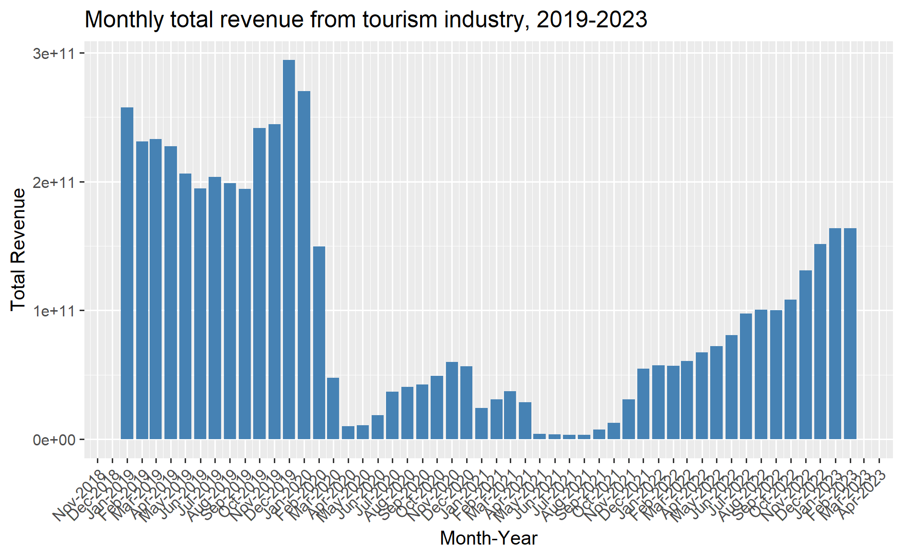
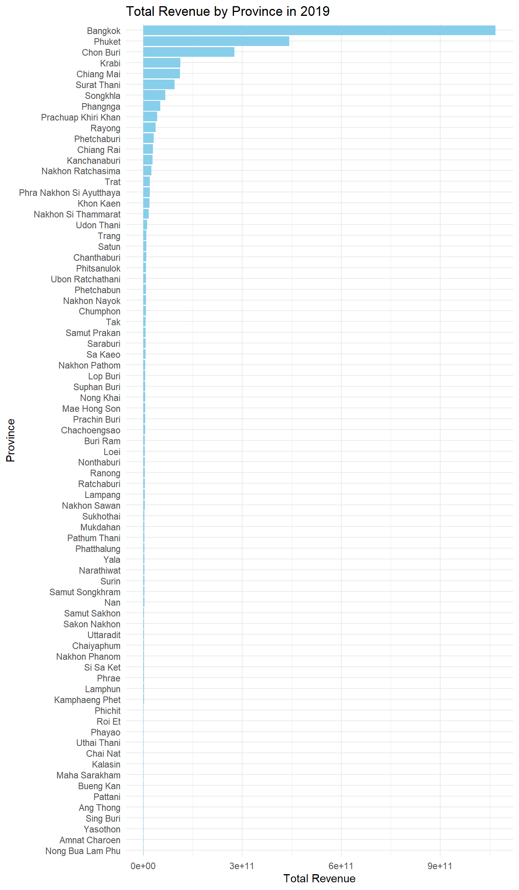

# Take-home Exercise 2: Discovering impacts of COVID-19 on Thailand tourism economy at the province level using spatial and spatio-temporal statistics

## 1. Setting the Scene

Tourism is one of Thailand’s largest industries, accounting for \~20% of the gross domestic product (GDP). In 2019, Thailand earned US\$90 billion from domestic and international tourism, but the COVID-19 pandemic caused revenues to crash to US\$24 billion in 2020.

The figure below shows the total revenue receipt from tourism sector between Jan 2019 to Feb 2023, and indicates that the revenue from tourism industry has been gradually recovering since Sep 2021.

{width="401"}

However, it is important to note that the tourism economy of Thailand is not evenly distributed. The figure below reveals that the tourism economy of Thailand in 2019 was mainly focused on five provinces, namely Bangkok, Phuket, Chon Buri, Krabi and Chiang Mai.

{width="437"}

## 2. Objectives

The objectives of this take-home exercise will be to discover:

-   if the key indicators of tourism economy of Thailand are independent from space and space and time.

-   If the tourism economy is indeed spatial and spatio-temporal dependent, to detect where the clusters, outliers and emerging hot spot/cold spot areas are.

## 3. The Task

The specific tasks of this take-home exercise are as follows:

-   Using appropriate function of **sf** and **tidyverse**, prepare the following geospatial data layer:

    -   a study area layer in sf polygon features. It must be at [province level](https://en.wikipedia.org/wiki/Provinces_of_Thailand) (including Bangkok) of Thailand.

    -   a tourism economy indicators layer within the study area in sf polygon features.

    -   a derived tourism economy indicator layer in [**spacetime s3 class of sfdep**](https://sfdep.josiahparry.com/articles/spacetime-s3), keeoing the time series at **month and year levels**.

-   Using the extracted data, perform global spatial autocorrelation analysis using [sfdep methods](https://is415-gaa-tskam.netlify.app/in-class_ex/in-class_ex05/in-class_ex05-glsa).

-   Using the extracted data, perform local spatial autocorrelation analysis using [sfdep methods](https://r4gdsa.netlify.app/chap10.html).

-   Using the extracted data, perform emerging hotspot analysis using [sfdep methods](https://is415-gaa-tskam.netlify.app/in-class_ex/in-class_ex05/in-class_ex05-ehsa).

-   Describe the spatial patterns revealed by the analysis above.

## 4. Installing and Loading the necessary R packages

Key packages that will be required for analysis are:

-   [**sf**](https://r-spatial.github.io/sf/) for importing, managing, and processing vector-based geospatial data

-   [**sfdep**](https://sfdep.josiahparry.com/) to compute spatial weights, global and local spatial autocorrelation statistics. It builds on the spdep package, and creates an sf and tidyverse friendly interface.

-   [**tmap**](https://cran.r-project.org/web/packages/tmap/) which provides functions for plotting cartographic quality static point patterns maps or interactive maps by using [leaflet](https://leafletjs.com/) API.

-   [**tidyverse**](https://www.tidyverse.org/) for performing data science tasks such as importing, wrangling and visualising data.

-   [**Kendall**](https://www.rdocumentation.org/packages/Kendall/versions/2.2.1/topics/Kendall) to compute the Mann-Kendall trend test

We use the following code chunk to install and load the necessary R packages for our analysis:

```{r}
pacman::p_load(sf, sfdep, tmap, tidyverse, knitr, plotly, Kendall, VIM, naniar, DT)
```

## 5. The Data

Two data sets shall be used:

-   [Thailand Domestic Tourism Statistics](https://www.kaggle.com/datasets/thaweewatboy/thailand-domestic-tourism-statistics) at Kaggle - **version 2** of the data set will be used.

-   [Thailand - Subnational Administrative Boundaries](https://data.humdata.org/dataset/cod-ab-tha?) at HDX - the province boundary data set will be used.

The following sections will include data importing, cleaning and wrangling.

## 5.1 Thailand Domestic Tourism Statistics

### 5.1.1 Importing the csv file

The code chunk below uses [`read_csv()`](https://readr.tidyverse.org/reference/read_delim.html) of readr package to load the Thailand Domestic Tourism Statistics:

```{r}
tourism <- read_csv("data/rawdata/thailand_domestic_tourism_2019_2023_ver2.csv")
```

The *thai_tourism* data has 30,800 rows and 7 variables, namely *date, province_thai, province_eng, region_thai, region_eng, variable* and *value.*

### 5.1.2 Cleaning the data

#### 5.1.2.1 Dropping unwanted variables

We will drop the columns *province_thai* and *region_thai* as these variables are replicates of *province_eng* and *region_eng* in the Thai language which we do not understand and hence will not be helpful for our analysis:

```{r}
tourism <- tourism[,!names(tourism) %in% c("province_thai","region_thai")]
```

#### 5.1.2.2 Determine the presence of missing data

We determine the presence of missing values using the [vis_miss()](https://www.rdocumentation.org/packages/visdat/versions/0.6.0/topics/vis_miss) function of the [naniar](https://cran.r-project.org/web/packages/naniar/vignettes/getting-started-w-naniar.html) package:

```{r}
vis_miss(tourism)
```

From the output above, we note that there are no missing data.

#### 5.1.2.3 Creating new year, month and day variables

From the code chunk below, we note that the *date* variable in *tourism* data frame is in the Date vector format:

```{r}
class(tourism$date)
```

We form new variables *year* and *month* using the lubridate package:

```{r}
tourism <- tourism %>%
  mutate(year_month = ymd(date),
         year = year(date),
         month = month(date,
                       label = TRUE,
                       abbr = TRUE),
.before = 2)
```

#### 5.1.2.4 Determine the distribution of provinces and corresponding regions

We first study the distribution of regions in the data:

```{r}
#| code-fold: true
ggplot(tourism, 
       aes(x = fct_reorder(region_eng, region_eng, .fun = length))) + 
  geom_bar() +
  labs(title = "Distribution of domestic tourism statistics across regions", x = "Regions", y = "Count") +
  theme(axis.text.x = element_text(angle = 45, hjust = 1))
```

From the output above, we note that there 5 different regions represented. Notably, the western region is not represented in the data.

We take a more detailed look by determining the unique provinces represented in the data and their corresponding regions. This step aims to check for two things:

-   whether there are any duplicate data entries i.e. entries that are meant to represent the same province but have spelling errors.

-   whether the regions for the provinces are accurately indicated

```{r}
tourism_unique <- tourism %>%
  select(province_eng,region_eng) %>%
  distinct() %>%
  arrange(region_eng,province_eng)

tourism_unique
```

From the output above, we note that all 77 Thailand provinces are represented in the data, and that there are no spelling errors/misrepresented provinces.

However, with reference to the [source on provinces in Thailand](https://en.wikipedia.org/wiki/Provinces_of_Thailand), we note a few mistakes in the regions indicated for the provinces.

-   The *east_northeast* region can actually be renamed as *northeast* region for clarity and consistency with how detailed the other provinces are labelled

-   Kanchanaburi, Phetchaburi, Prachuap Khiri Khan and Ratchaburi are stated as being in the central region but actually reside in the west region

-   Tak is stated as being in the north region but actually resides in the west region

-   Nakhon Nayok is stated as being in the east region but actually resides in the central region

-   Kamphaeng Phet, Nakhon Sawan, Phetchabun, Phichit, Phitsanulok, Sukhothai and Uthai Thani are stated as being in the north region but actually reside in central region

-   Sisaket is stated as being in the south region but actually resides in the northeast region

#### 5.1.2.4.1 Correcting the erroneous regions of provinces

We use the code chunk below to rename the "east_northeast" region to just "northeast" and correct the erroneous regions of the provinces mentioned above:

```{r}
tourism <- tourism %>%
  mutate(region_eng = case_when(
    region_eng == "east_northeast" ~ "northeast",
    province_eng %in% c("Kanchanaburi", "Phetchaburi", "Prachuap Khiri Khan", "Ratchaburi", "Tak") ~ "west",
    province_eng %in% c("Nakhon Nayok","Kamphaeng Phet","Nakhon Sawan","Phetchabun","Phichit","Phitsanulok","Sukhothai","Uthai Thani") ~ "central",
    province_eng == "Sisaket" ~ "northeast",
    TRUE ~ region_eng
  ))
```

We check by generating the data table of provinces and their corresponding regions:

```{r}
#| code-fold: true
tourism_unique <- tourism %>%
  select(province_eng,region_eng) %>%
  distinct() %>%
  arrange(region_eng,province_eng)

datatable(tourism_unique)
```

Re-plotting the distribution of domestic tourism statistics across the regions:

```{r}
#| code-fold: true
ggplot(tourism, 
       aes(x = fct_reorder(region_eng, region_eng, .fun = length))) + 
  geom_bar(fill = "skyblue") +
  labs(title = "Distribution of domestic tourism statistics across regions", x = "Regions", y = "Count") +
  theme(axis.text.x = element_text(angle = 45, hjust = 1))
```

We note that most of the domestic tourism statistics come from the central region, followed by northeast, south, north, east and finally the west region.

#### 5.1.2.5 Determine the distribution of variables and corresponding values

We also study the distribution of variables under the column *variable* in the *tourism* data frame.

```{r}
#| code-fold: true
ggplot(tourism, 
       aes(x = fct_reorder(variable, variable, .fun = length))) + 
  geom_bar(fill = "skyblue") +
  labs(title = "Distribution of Variable", x = "Variable", y = "Count") +
  theme(axis.text.x = element_text(angle = 45, hjust = 1))
```

We note that there are 8 different types of variables. Details of the variables and their definitions are provided in the table below:

+-------------+--------------------+-------------------------------------------------------------------------+
| S/N         | Variable           | Definition                                                              |
+=============+====================+=========================================================================+
| **1**       | no_tourist_all     | Total number of domestic tourists who visited the province              |
+-------------+--------------------+-------------------------------------------------------------------------+
| **2**       | no_tourist_thai    | Number of Thai tourists who visited the province                        |
+-------------+--------------------+-------------------------------------------------------------------------+
| **3**       | no_tourist_foreign | Number of foreign tourists who visited the province                     |
+-------------+--------------------+-------------------------------------------------------------------------+
| **4**       | no_tourist_stay    | Total number of tourists who stay overnight                             |
+-------------+--------------------+-------------------------------------------------------------------------+
| **5**       | ratio_tourist_stay | Ratio of tourists that stay overnight                                   |
+-------------+--------------------+-------------------------------------------------------------------------+
| **6**       | revenue_all        | Revenue generated by the tourism industry in the province, in Thai Baht |
+-------------+--------------------+-------------------------------------------------------------------------+
| **7**       | revenue_foreign    | Revenue generated by foreign tourists in the province, in Thai Baht     |
+-------------+--------------------+-------------------------------------------------------------------------+
| **8**       | revenue_thai       | Revenue generated by Thai tourists in the province, in Thai Baht        |
+-------------+--------------------+-------------------------------------------------------------------------+

#### 5.1.2.5.1 pivot_wider() to expand variables as individual columns

We utilise the *pivot_wider()* function to separate the different variable types as individual columns:

```{r}
tourism_wider <- tourism %>%
  pivot_wider(names_from = variable, values_from = value)
```

#### 5.1.2.5.2 Checking the revenue figures

Based on the definition of the different variable types, we note that "revenue_all" should equal to the sum of "revenue_foreign" and "revenue_thai". We check through the data for erroneous data entries using the code chunk below:

```{r}
#| code-fold: true
revenue_numbers <- tourism_wider %>%
  group_by(province_eng,year_month) %>%
  summarise(
    sum_revenue = sum(revenue_foreign, revenue_thai, na.rm = TRUE),
  revenue_all = sum(revenue_all,na.rm = TRUE),
            .groups = "drop") %>%
  mutate(is_rev_equal = sum_revenue == revenue_all)

revenue_numbers
```

We note from the output below that the data entries for revenue match up:

```{r}
revenue_numbers %>%
  filter(!is_rev_equal)
```

#### 5.1.2.5.3 Checking the tourist numbers

Similarly, based on the definition of the different variable types, we note that "no_tourist_all" should equal to the sum of "no_tourist_foreign" and "no_tourist_thai". We check through the data for erroneous entries by using the code chunk below:

```{r}
#| code-fold: true
tourism_numbers <- tourism_wider %>%
  group_by(province_eng,year_month) %>%
  summarise(
    sum_tourists = sum(no_tourist_foreign, no_tourist_thai, na.rm = TRUE),
  tourists_all = sum(no_tourist_all,na.rm = TRUE),
            .groups = "drop") %>%
  mutate(is_touristno_equal = sum_tourists == tourists_all)

tourism_numbers
```

We note from the output below that the data entries for tourist numbers match up:

```{r}
tourism_numbers %>%
  filter(!is_touristno_equal)
```

#### 5.1.2.5.4 Checking the distribution of values of each variable

We then study the distribution of values of each variable.

::: panel-tabset
## Revenue

```{r}
#| code-fold: true
selected_revenue <- tourism %>%
  filter(variable %in% c("revenue_all", "revenue_thai", "revenue_foreign"))

# Calculate summary statistics
summary_stats <- selected_revenue %>%
  group_by(variable) %>%
  summarise(
    Min = min(value),
    Q1 = quantile(value, 0.25),
    Median = median(value),
    Q3 = quantile(value, 0.75),
    Max = max(value)
  )

ggplot(selected_revenue, aes(x = variable, y = value, fill = variable)) +
  geom_boxplot() +
  geom_text(data=summary_stats, aes(x = variable, 
                               y = Max + 1000, 
                               label = paste("Min:", Min,
                                             "\nQ1:", Q1, 
                                             "\nMedian:", Median, 
                                             "\nQ3:", Q3, 
                                             "\nMax:", Max)),
            position = position_dodge(width = 0.75), 
            vjust = 0, hjust = 1, size = 2, color = "black") +
  labs(title = "Boxplots of Different Revenue Types", x = "Revenue Type", y = "Revenue")+
  scale_y_continuous(limits = c(0,12e+10))
```

From the boxplots above, we note that the minimum value for "revenue_foreign" is -\$4250. This could have either occurred due to errors in data entry or due to negative tourism impacts i.e. refunds and cancellations as a more detailed study showed that the negative foreign revenues occurred in Jul and Aug 2021 in Nakhon Pathom, coinciding with the time period when [Thailand announced a new 14-day COVID-19 restriction in Bangkok and surrounding provinces including Nakhon Pathom](https://www.tatnews.org/2021/07/thailand-announces-new-14-day-covid-19-restrictions-in-bangkok-and-5-surrounding-provinces/). As such, these entries were not removed from the data.

## Tourist Numbers

```{r}
#| code-fold: true
selected_tourists <- tourism %>%
  filter(variable %in% c("no_tourist_all","no_tourist_thai", "no_tourist_foreign"))

# Calculate summary statistics
summary_stats <- selected_tourists %>%
  group_by(variable) %>%
  summarise(
    Min = min(value),
    Q1 = quantile(value, 0.25),
    Median = median(value),
    Q3 = quantile(value, 0.75),
    Max = max(value)
  )

ggplot(selected_tourists, aes(x = variable, y = value, fill = variable)) +
  geom_boxplot() +
  geom_text(data=summary_stats, aes(x = variable, 
                               y = Max + 100000, 
                               label = paste("Min:", Min,
                                             "\nQ1:", Q1, 
                                             "\nMedian:", Median, 
                                             "\nQ3:", Q3, 
                                             "\nMax:", Max)),
            position = position_dodge(width = 0.75), 
            vjust = 0, hjust = 1, size = 2, color = "black") +
  labs(title = "Boxplots of Different Tourist Numbers", x = "Tourist Type", y = "Number of Tourists")+
  scale_y_continuous(limits = c(0,8e+6))
```

We note that there does not seem to be erroneous data for tourist numbers.

## Overnight Stay

```{r}
#| code-fold: true
# Calculate summary statistics
summary_stats <- tourism_wider %>%
  summarise(
    Min = min(no_tourist_stay),
    Q1 = quantile(no_tourist_stay, 0.25),
    Median = median(no_tourist_stay),
    Q3 = quantile(no_tourist_stay, 0.75),
    Max = max(no_tourist_stay)
  )

ggplot(tourism_wider, aes(x = "", y = no_tourist_stay)) +
  geom_boxplot(fill = "lightblue") +
  geom_text(data = summary_stats, aes(x = "", y = Max + 100000,
                                      label = paste("Min:", Min,
                                                     "\nQ1:", Q1,
                                                     "\nMedian:", Median,
                                                     "\nQ3:", Q3,
                                                     "\nMax:", Max)),
            vjust = 0, size = 2, color = "black") +
  labs(title = "Distribution of Number of Overnight Tourist Stays",
       y = "Number of Occupied Hotel Rooms") +
  scale_y_continuous(limits = c(0,4e+6))+
  theme(axis.title.x = element_blank())
```

We note that there does not seem to be erroneous data for number of overnight tourist stays.
:::

#### 5.1.2.5.5 Removing *date* variable

We remove the "date" variable to keep the data more tidy for further analysis.

```{r}
tourism <- tourism_wider %>%
  select(-date)
```

#### 5.1.2.6 Saving as a new rds file

We save the cleaned data as a new rds file *tourism_cleaned:*

```{r}
#| eval: false
tourism_cleaned <- write_rds(tourism,"data/rds/tourism_cleaned.rds")
```

```{r}
tourism_cleaned <- read_rds("data/rds/tourism_cleaned.rds")
```

### 5.1.3 Creating new data frames for further analysis

As this exercise will study the independence of tourism indicators from space as well as space and time, we will create different data frames for both analysis

#### 5.1.3.1 Data frame for spatial analysis

We create the data frame for spatial analysis by grouping the *tourism_cleaned* data by province and region and generating the median for each of the eight variables.

```{r}
#| eval: false
tourism_cleaned_spat <- tourism_cleaned %>%
  group_by(province_eng, region_eng) %>%
  summarize(median_tot_revenue = median(revenue_all, na.rm = TRUE),
            median_foreign_revenue = median(revenue_foreign, na.rm = TRUE),
            median_thai_revenue = median(revenue_thai, na.rm = TRUE),
            median_tot_tourist = median(no_tourist_all, na.rm = TRUE),
            median_tot_foreign = median(no_tourist_foreign, na.rm = TRUE),
            median_tot_thai = median(no_tourist_thai, na.rm = TRUE),
            median_occup_rate = median(ratio_tourist_stay, na.rm = TRUE),
            median_occup_no = median(no_tourist_stay, na.rm = TRUE),
            .groups = 'drop')
```

#### 5.1.3.1.1 Saving as a new rds file

We save the file as a new rds file *tourism_cleaned_spat:*

```{r}
#| eval: false
tourism_cleaned_spat <- write_rds(tourism_cleaned_spat,"data/rds/tourism_cleaned_spat.rds")
```

```{r}
tourism_cleaned_spat <- read_rds("data/rds/tourism_cleaned_spat.rds")
```

#### 5.1.3.2 Data frames for spatio-temporal analysis

Before creating the data frames for spatio-temporal analysis, we first plot the *total revenue* by *year_month* to study the trend of revenue over time:

```{r}
#| code-fold: true
tourism_cleaned_summary <- tourism_cleaned %>%
  mutate(year_month = as.character(year_month)) %>%
  group_by(year_month) %>%
  summarize(total_revenue = sum(revenue_all, na.rm = TRUE))

ggplot(tourism_cleaned_summary, aes(x = year_month, y = total_revenue)) +
  geom_bar(stat = "identity", fill = "skyblue") +
  labs(title = "Total Revenue by Year-Month", x = "Year-Month", y = "Total Revenue") +
  theme_minimal() +
  theme(axis.text.x = element_text(angle = 90, hjust = 1))
```

Based on the distribution of total revenue across the year_month variable, it can be seen that temporally, we can split the data into 3 time periods, namely:

-   **pre-COVID:** Between Jan 2019 to Mar 2020

-   **during COVID:** Between Apr 2020 to Aug 2021

-   **post-COVID:** Between Sep 2021 to Feb 2023

We hence create a new variable *time_period* by categorising the data in the *tourism_cleaned* data frame based on the three time periods above:

```{r}
#| eval: false 
tourism_cleaned_temp <- tourism_cleaned %>%
  mutate(time_period = case_when(
    year_month >= "2019-01-01" & year_month <= "2020-03-01" ~ "Pre-COVID",
    year_month >= "2020-04-01" & year_month <= "2021-08-01" ~ "During-COVID",
    year_month >= "2021-09-01" & year_month <= "2023-02-01" ~ "Post-COVID",
    TRUE ~ NA_character_))
```

We then group the data by province and time period and generate the median for each of the eight variables:

```{r}
#| eval: false 
tourism_cleaned_temp <- tourism_cleaned_temp %>%
  group_by(province_eng,time_period) %>%
  summarize(median_tot_revenue = median(revenue_all, na.rm = TRUE),
            median_foreign_revenue = median(revenue_foreign, na.rm = TRUE),
            median_thai_revenue = median(revenue_thai, na.rm = TRUE),
            median_tot_tourist = median(no_tourist_all, na.rm = TRUE),
            median_tot_foreign = median(no_tourist_foreign, na.rm = TRUE),
            median_tot_thai = median(no_tourist_thai, na.rm = TRUE),
            median_occup_rate = median(ratio_tourist_stay, na.rm = TRUE),
            median_occup_no = median(no_tourist_stay, na.rm = TRUE),
            .groups = 'drop')
```

#### 5.1.3.2.1 Saving as new rds files

We then split the data frame into three separate data frames based on the time period:

```{r}
#| eval: false
precovid <- tourism_cleaned_temp %>%
  filter(time_period == "Pre-COVID")
duringcovid <- tourism_cleaned_temp %>%
  filter(time_period == "During-COVID")
postcovid <- tourism_cleaned_temp %>%
  filter(time_period == "Post-COVID")
```

We save the files as a new rds files:

```{r}
#| eval: false 
precovid <- write_rds(precovid,"data/rds/precovid.rds")
duringcovid <- write_rds(duringcovid,"data/rds/duringcovid.rds")
postcovid <- write_rds(postcovid,"data/rds/postcovid.rds")
```

```{r}
precovid <- read_rds("data/rds/precovid.rds")
duringcovid <- read_rds("data/rds/duringcovid.rds")
postcovid <- read_rds("data/rds/postcovid.rds")
```

## 5.2 Thailand Subnational Administrative Boundaries

### 5.2.1 Importing the shapefile

The code chunk below uses [`st_read()`](https://www.rdocumentation.org/packages/sf/versions/1.0-17/topics/st_read) of **sf** package to import the Thailand Subnational Administrative Boundaries shapefile into R. There are a few different files representing different levels of administrative boundaries - level 0 (country), level 1 (province), level 2 (district) and level 3 (sub-district, tambon). As we are only interested in province level administrative boundaries, we will just load the file corresponding to level 1.

The imported shapefile will be a **simple features** **object** of **sf**.

```{r}
#| eval: false
province <- st_read(dsn = "data/rawdata",
                    layer = "tha_admbnda_adm1_rtsd_20220121")
```

We note that the simple features data has a multipolygon geometry and has 77 features and 16 fields. It is in WGS84 geographic coordinate system.

### 5.2.2 Removing the unwanted variables

Of the fields available, only "ADM1_EN" and "geometry" are essential hence the following code chunk keeps only these two variables in the simple features object:

```{r}
#| eval: false
province <- province %>%
  select(ADM1_EN)
```

### 5.2.3 Checking the name of the provinces

As we will be joining the *province* simple features object and the attribute data from *tourism_cleaned* and related data frames using the province names ("ADM1_EN" in *province* simple features object and "province_eng" in *tourism_cleaned* dataframe), it is important to check through the naming of the provinces to ensure that they all match up.

We hence extract the unique province names from both *tourism_cleaned* and *province:*

```{r}
#| eval: false
unique_tour_prov <- tourism_cleaned %>%
  distinct(province_eng)
```

```{r}
#| eval: false
unique_shp_prov <- province %>%
  distinct(ADM1_EN)
```

We then combine via a full join and read through the list of province names for discrepancies:

```{r}
#| eval: false
combined_prov <- full_join(unique_shp_prov,unique_tour_prov,
                           by = c("ADM1_EN"="province_eng"))
```

```{r}
#| eval: false
#| echo: false
combined_prov <- write_rds(combined_prov,"data/rds/combined_prov.rds")
```

```{r}
#| echo: false
combined_prov <- read_rds("data/rds/combined_prov.rds")
```

```{r}
combined_prov <- combined_prov %>%
  arrange(ADM1_EN)

combined_prov
```

We note repeated entries for eight provinces which are spelt differently in the original *province* sf object vs *tourism_cleaned* dataframe:

-   Buri Ram vs Buriram

-   Chai Nat vs Chainat

-   Chon Buri vs Chonburi

-   Lop Buri vs Lopburi

-   Nong Bua Lam Phu vs Nong Bua Lamphu

-   Phangnga vs Phang Nga

-   Prachin Buri vs Prachinburi

-   Si Sa Ket vs Sisaket

#### 5.2.3.1 Adjusting the naming of provinces in *province* sf object

We utilise the following code chunk to adjust the naming of the eight provinces to be aligned with the naming in the *tourism_cleaned* dataframe to faciliate relational join in subsequent analysis. We also rename "ADM1_EN" to "province_eng" to faciliate the creation of timeseries cube in subsequent analysis.

```{r}
#| eval: false
province <- province %>%
  mutate(ADM1_EN = case_when(
    ADM1_EN == "Buri Ram" ~ "Buriram",
    ADM1_EN == "Chai Nat" ~ "Chainat",
    ADM1_EN == "Chon Buri" ~ "Chonburi",
    ADM1_EN == "Lop Buri" ~ "Lopburi",
    ADM1_EN == "Nong Bua Lam Phu" ~ "Nong Bua Lamphu",
    ADM1_EN == "Phangnga" ~ "Phang Nga",
    ADM1_EN == "Prachin Buri" ~ "Prachinburi",
    ADM1_EN == "Si Sa Ket" ~ "Sisaket",
    TRUE ~ ADM1_EN)) %>%
  rename(province_eng = ADM1_EN)
```

We save this as new rds file to avoid reloading the original datafile above:

```{r}
#| eval: false 
province <- write_rds(province,"data/rds/province.rds")
```

```{r}
province <- read_rds("data/rds/province.rds")
```

## 5.3 Performing relational join

### 5.3.1 Relational join with *tourism_cleaned* data frame

We then perform a left relational join to update the *province* sf object with the attribute fields of the *tourism_cleaned* data frame:

```{r}
combined_prov_tourism <- left_join(province,tourism_cleaned)
```

```{r}
glimpse(combined_prov_tourism)
```

We note that the *combined_prov_tourism* data has the same number of rows, 3850 rows, as the original *tourism_cleaned* data frame indicating that the cleaning up of the different province spellings was done accurately.

#### 5.3.1.1 Saving as a new rds file

We save the combined file as a new rds file and load it into the R environment for further analysis:

```{r}
#| eval: false
combined_data <- write_rds(combined_prov_tourism,"data/rds/combined_prov_tourism.rds")
```

```{r}
combined_data <- read_rds("data/rds/combined_prov_tourism.rds")
```

### 5.3.2 Relational join with *tourism_cleaned_spat* data frame

We also perform a left relational join to update the *province* sf object with the attribute fields of the *tourism_cleaned_spat* data frame for spatial analysis:

```{r}
combined_tourism_spat <- left_join(province,tourism_cleaned_spat)
```

```{r}
glimpse(combined_tourism_spat)
```

We note that the data frame has 77 rows of data - each one representing each Thai province.

#### 5.3.2.1 Saving as a new rds file

We save the combined file as a new rds file and load it into the R environment for further analysis:

```{r}
#| eval: false 
combined_data_spat <- write_rds(combined_tourism_spat,"data/rds/combined_data_spat.rds")
```

```{r}
combined_data_spat <- read_rds("data/rds/combined_data_spat.rds")
```

### 5.3.3 Relational join with *precovid, duringcovid* and *postcovid* data frames

We also perform a left relational join to update the *province* sf object with the attribute fields of the *precovid, duringcovid* and *postcovid* data frames for spatio-temporal analysis:

```{r}
combined_tourism_precovid <- left_join(province,precovid)
combined_tourism_durcovid <- left_join(province,duringcovid)
combined_tourism_postcovid <- left_join(province,postcovid)
```

#### 5.3.3.1 Saving as a new rds file

We save the combined files as new rds files and load it into the R environment for further analysis:

```{r}
#| eval: false  
combined_tourism_precovid <- write_rds(combined_tourism_precovid,"data/rds/combined_tourism_precovid.rds")
combined_tourism_durcovid <- write_rds(combined_tourism_durcovid,"data/rds/combined_tourism_durcovid.rds")
combined_tourism_postcovid <- write_rds(combined_tourism_postcovid,"data/rds/combined_tourism_postcovid.rds")
```

```{r}
combined_tourism_precovid <- read_rds("data/rds/combined_tourism_precovid.rds")
combined_tourism_durcovid <- read_rds("data/rds/combined_tourism_durcovid.rds")
combined_tourism_postcovid <- read_rds("data/rds/combined_tourism_postcovid.rds")
```

## 5.4 Creating a time series cube

In order to carry out emerging hot/cold spot analysis, we will need to create a time series cube. We do so by using [spacetime()](https://sfdep.josiahparry.com/articles/spacetime-s3.html) of sfdep to create a spatio-temporal cube. However before that we will convert the date field into integer format.

```{r}
spt <- tourism_cleaned %>%
  mutate(year_month = as.integer(gsub("-","",year_month)))
```

::: callout-note
Note that the original date or time field cannot be used as it is in continuous form and might not be an integer. Note that real numbers cannot be used in ".time_col" under the spacetime function.
:::

The following code chunk is then used to create a spatio-temporal cube:

```{r}
spt <- spacetime(
  spt,
  province,
  .loc_col = "province_eng",
  .time_col = "year_month"
)
```

### 5.4.1 Verifying space-time cube object

We utilise the following code chunk to verify if *spt* is indeed a space-time cube object:

```{r}
is_spacetime_cube(spt)
```

We note from the output that we have successfully created a space-time cube object.

### 5.4.2 Saving as a new rds file

We save *spt* as a new rds file and load it into the R environment for further analysis:

```{r}
#| eval: false
spt <- write_rds(spt,"data/rds/spt.rds")
```

```{r}
spt <- read_rds("data/rds/spt.rds")
```

## 6. Key Indicators of the Tourism Economy of Thailand

From the above data, we note that there are several possible key indicators of the tourism economy of Thailand to analyse, namely: (i) Total revenue, (ii) Revenue generated from foreign tourists, (iii) Revenue generated from local/Thai tourists, (iv) Total number of tourists, (v) Number of foreign tourists, (vi) Number of local/Thai tourists and (vii) Rate of tourists who stay overnight. For our analysis, we will focus on the following indicators for reasons stated below:

\(i\) **Total revenue:** Revenue generated from both foreign and local tourists can indicate how well Thai's tourism economy is performing.

\(ii\) **Number of foreign tourists:** Based on [literature](https://www.adb.org/sites/default/files/linked-documents/54177-001-sd-12.pdf), Thailand recorded a total THB1.9 trillion receipts from foreign tourists (65% of the sector’s receipts) or 11.5% of its GDP in 2019. The daily foreign tourist spending was around \$192 per person, more than double of domestic tourists spending. The number of foreign tourists will hence be a strong indicator of how well the Thai tourism economy is performing i.e. the greater number of tourists, coupled with their higher propensity to spend, would be indicative of a booming tourism economy.

\(iii\) **Rate of overnight tourists:** A higher rate of tourists who stay overnight can be indicative of how well the tourism economy is performing as tourists who stay for longer periods in Thailand are likely to incur more expenditure i.e. via spending on accommodation, more activities.

### 6.1 Visualising Indicators of Tourism Economy

We briefly visualise the distribution of these indicators:

::: panel-tabset
## Total Revenue

```{r}
#| code-fold: true
tmap_mode("plot")
tm_shape(combined_data_spat)+
  tm_fill("median_tot_revenue",
          style = "quantile",
          title = "Median Total Revenue")+
  tm_borders(alpha = 0.5)+
  tm_layout(main.title = "Distribution of Median Total Revenue (Quantile classification)",main.title.position = "center",
            main.title.size = 0.5,
            legend.height = 0.45,
            legend.width = 0.35,
            legend.text.size = 0.5,
            legend.outside.size = 0.5)+
  tm_text("province_eng",size = 0.3)
```

## Number of Foreign Tourists

```{r}
#| code-fold: true
tmap_mode("plot")
tm_shape(combined_data_spat)+
  tm_fill("median_tot_foreign",
          style = "quantile",
          title = "Median Number of Foreign Tourists")+
  tm_borders(alpha = 0.5)+
  tm_layout(main.title = "Distribution of Median Number of Foreign Tourists (Quantile classification)",main.title.position = "center",
            main.title.size = 0.5,
            legend.height = 0.45,
            legend.width = 0.35,
            legend.text.size = 0.5,
            legend.outside.size = 0.5)+
  tm_text("province_eng",size = 0.3)
```

## Rate of tourists who stay overnight

```{r}
#| code-fold: true
tmap_mode("plot")
tm_shape(combined_data_spat)+
  tm_fill("median_occup_rate",
          style = "quantile",
          title = "Median Rate of Overnights Tourists")+
  tm_borders(alpha = 0.5)+
  tm_layout(main.title = "Distribution of Median Rate of Overnights Tourists (Quantile classification)",main.title.position = "center",
            main.title.size = 0.5,
            legend.height = 0.45,
            legend.width = 0.35,
            legend.text.size = 0.5,
            legend.outside.size = 0.5)+
  tm_text("province_eng",size = 0.3)
```
:::

## 7. Determining independence from space

### 7.1 Computing Distance-based Spatial Weights

There are two main ways of computing spatial weights - contiguity spatial weights or distance-based spatial weights. Based on the plot of the provinces of Thailand, we note that it would not be appropriate to utilise contiguity spatial weights as there would be provinces with too little neighbours. We will hence utilise distance-based spatial weights.

### 7.1.1 Generating centroids

A connectivity graph takes a point and displays a line to each neighbouring point. As we are working with multipolygons, we will need to get points to make connectivity graphs. As such, we will need to calculate centroids for each province and do so using the code chunk below:

```{r}
#| eval: false
centroids <- combined_data_spat %>%
  st_centroid() %>%  
  select(province_eng, geometry)
```

### 7.1.2 Saving as a new rds file

We save *centroids* as a new rds file and load it into the R environment for further analysis:

```{r}
#| eval: false
centroids <- write_rds(centroids,"data/rds/centroids.rds")
```

```{r}
centroids <- read_rds("data/rds/centroids.rds")
```

### 7.1.3 Visualising the centroids

We visualise where these centroids are:

```{r}
#| code-fold: true
tmap_mode('plot')
tm_shape(province) +
  tm_fill()+
  tm_borders()+
  tm_shape(centroids)+
  tm_dots(col = "darkblue", size = 0.2, alpha = 0.5, title = "Centroids for Spatial Analysis") +
  tm_text("province_eng", size = 0.5, col = "black") +
  tm_layout(main.title = "Centroids of Provinces", main.title.size = 0.5) 
```

We note that none of the centroids generated are in the water and are all located within the regions of provinces. This indicates that the centroids are appropriate for use and do not need to be shifted.

### 7.1.4 Converting centroids to coordinates

We convert the centroids to coordinates using the following code chunk to facilitate further analysis:

```{r}
coords <- st_coordinates(centroids)
```

### 7.1.5 Computing adaptive distance weight matrix

Given that the polygons differ in size, we will construct spatial weights of the study area using adaptive distance weight matrix. The spatial weights are used to define the neighbourhood relationships between the geographical units (i.e. provinces) in the study area. We make use of the [*st_knn()*](https://sfdep.josiahparry.com/reference/st_knn) function of the sfdep package to identify the k nearest neighbours for each point geometry which in this case represents a province. k is set at 6 i.e. to determine 6 nearest neighbours for each point geometry:

```{r}
knn6 <- st_knn(coords,k=6)
knn6
```

We display the content of the matrix using the code chunk below:

```{r}
str(knn6)
```

Based on the output from above, we note that each province has six neighbours. We then extract the weights of each province's neighbours using [*st_weights()*](https://sfdep.josiahparry.com/reference/st_weights) function of sfdep:

```{r}
weights <- st_weights(knn6)
```

### 7.1.6 Plotting distance-based neighbours

We visualise the distribution of the point geometries and their connections with their distance-based neighbours using the code chunk below:

```{r}
plot(combined_data_spat$geometry,border="lightgrey")
plot(knn6,coords,pch = 19, cex = 0.6, add = TRUE, col = "red")
```

### 7.2 Global Measures of Spatial Autocorrelation

### 7.2.1 Moran's I

Moran's I is a global spatial autocorrelation analysis that yields only one statistic to summarise how the tourism indicator values differ across the whole study area. We will utilise the [*global_moran_perm()*](https://rdrr.io/cran/sfdep/man/global_moran_perm.html)function of the sfdep package as it allows a number of simulations of the Moran's I analysis to be run.

Our hypotheses for this analysis is as follows:

-   [**H0 null hypothesis:**]{.underline} There is no spatial autocorrelation in the indicator of tourism i.e. observed values are spatially randomly distributed and spatial location of the values have no influence on their similarity

-   [**H1 alternative hypothesis:**]{.underline} There is spatial autocorrelation in the indicator of interest.

We set the confidence interval to be at 95%. Note that the p-values studied for this analysis are under the label "p_ii_sim" as it is the representative p-value for all simulations.

::: panel-tabset
## Total Revenue

```{r}
#| code-fold: true
set.seed(1234)
moran_result <- global_moran_perm(combined_data_spat$median_tot_revenue,
                                  knn6,
                                  weights,
                                  nsim = 1999)
moran_result
```

We run a histogram of the results to determine if sufficient simulations have been run i.e. if the distribution of results seem to be close to a normal distribution. Based on the output below, nsim = 1999 seems to be sufficient.

```{r}
#| code-fold: true
hist(moran_result$res,
     freq = TRUE,
     breaks = 20,
     xlab = "Simulated Moran's I")

abline(v=0,
       col="red")
```

Based on the results above, we note that the p-value is 0.615, higher than the p-value of 0.05. This indicates that the p-value is not significant. There is insufficient evidence to reject the null hypothesis at the 95% confidence level.

Further, the Moran’s I value is close to zero which indicates that total revenue seem to occur randomly across provinces.

## Number of foreign tourists

```{r}
#| code-fold: true
set.seed(1234)
moran_result <- global_moran_perm(combined_data_spat$median_tot_foreign,
                                  knn6,
                                  weights,
                                  nsim = 1999)
moran_result
```

Similarly, we also plot a histogram to determine if the number of simulations is sufficient to produce a representative finding. As the distribution of moran's I values across the different simulations represent close to a normal distribution, nsim = 1999 used is deemed to be sufficient.

```{r}
#| code-fold: true
hist(moran_result$res,
     freq = TRUE,
     breaks = 20,
     xlab = "Simulated Moran's I")

abline(v=0,
       col="red")
```

Based on the results above, we note that the p-value is 0.22, higher than the p-value of 0.05. This indicates that the p-value is not significant. There is insufficient evidence to reject the null hypothesis at the 95% confidence level.

Further, the Moran’s I value is close to zero which indicates that number of foreign tourists seem to occur randomly across provinces.

## Rate of tourists who stay overnight

```{r}
#| code-fold: true
set.seed(1234)
moran_result <- global_moran_perm(combined_data_spat$median_occup_rate,
                                  knn6,
                                  weights,
                                  nsim = 1999)
moran_result
```

Similarly, a histogram is plotted and as a close to normal distribution is observed, it is determined that nsim = 1999 provides a representative finding of the moran's I statistic.

```{r}
#| code-fold: true
hist(moran_result$res,
     freq = TRUE,
     breaks = 20,
     xlab = "Simulated Moran's I")

abline(v=0,
       col="red")
```

Based on the results above, we note that the p-value is 0.022, smaller than the p-value of 0.05. This indicates that the p-value is significant. There is sufficient evidence to reject the null hypothesis at the 95% confidence level.

Further, the Moran’s I value is positive (0.14629) which indicates that the indicator (rate of tourists who stay overnight) has a moderate degree of positive spatial autocorrelation, that it is not randomly distributed across provinces and that nearby provinces are likely to have similar rates of overnight tourists.
:::

### 7.2.2 Geary's c

Similar to Moran's I, Geary's c is also a measure of spatial autocorrelation however it focuses more on the differences between immediate neigbours. We utilise [*global_c_perm()*](https://sfdep.josiahparry.com/reference/global_c_perm) function of sfdep package as it allows a number of simulations to be run for the Geary's c analysis. The hypotheses for this analysis is as follows:

-   [**H0 null hypothesis:**]{.underline} There is no spatial autocorrelation in the indicator of tourism i.e. observed values are spatially randomly distributed and spatial location of the values have no influence on their dissimilarity

-   [**H1 alternative hypothesis:**]{.underline} There is spatial autocorrelation in the indicator of interest.

We set the confidence interval to be 95%. Note that the p-values studied for this analysis are under the label "p_ii_sim" as it is the representative p-value for all simulations.

::: panel-tabset
## Total revenue

```{r}
#| code-fold: true
set.seed(1234)
geary_result <- global_c_perm(combined_data_spat$median_tot_revenue,
                                  knn6,
                                  weights,
                                  nsim = 1999)
geary_result
```

We run a histogram of the results to determine if sufficient simulations have been run i.e. if the distribution of results seem to be close to a normal distribution. Based on the output below, nsim = 1999 seems to be sufficient.

```{r}
#| code-fold: true
hist(geary_result$res,
     freq = TRUE,
     breaks = 20,
     xlab = "Simulated Geary's c")

abline(v=1,
       col="red")
```

Based on the results above, we note that the p-value is 0.9595, higher than the p-value of 0.05. This indicates that the p-value is not significant. There is insufficient evidence to reject the null hypothesis at the 95% confidence level.

Like the result from Moran's I, the Geary's c result also indicates that total revenue seem to occur randomly across provinces.

## Number of foreign tourists

```{r}
#| code-fold: true
set.seed(1234)
geary_result <- global_c_perm(combined_data_spat$median_tot_foreign,
                                  knn6,
                                  weights,
                                  nsim = 1999)
geary_result
```

The histogram below is close to a normal distribution hence indicating that nsim = 1999 would provide a representative statistic finding.

```{r}
#| code-fold: true
hist(geary_result$res,
     freq = TRUE,
     breaks = 20,
     xlab = "Simulated Geary's c")

abline(v=1,
       col="red")
```

Based on the results above, we note that the p-value is 0.9575, higher than the p-value of 0.05. This indicates that the p-value is not significant. There is insufficient evidence to reject the null hypothesis at the 95% confidence level.

Like the result from Moran's I, the Geary's c result also indicates that number of foreign tourists seem to occur randomly across provinces.

## Rate of overnight touristss

```{r}
#| code-fold: true
set.seed(1234)
geary_result <- global_c_perm(combined_data_spat$median_occup_rate,
                                  knn6,
                                  weights,
                                  nsim = 1999)
geary_result
```

Based on the histogram below, nsim = 1999 would provide a representative finding as the histogram shows a close to normal distribution.

```{r}
#| code-fold: true
hist(geary_result$res,
     freq = TRUE,
     breaks = 20,
     xlab = "Simulated Geary's c")

abline(v=1,
       col="red")
```

Based on the results above, we note that the p-value is 0.008, smaller than the p-value of 0.05. This indicates that the p-value is significant. There is sufficient evidence to reject the null hypothesis at the 95% confidence level.

Further, the Geary's c value is slightly less than 1 (0.82128) which indicates that the indicator (rate of overnight tourists) has a moderate degree of positive spatial autocorrelation/clustering, that it is not randomly distributed across provinces and that nearby provinces are likely to have similar values. This is a similar finding to the Moran's I result above.
:::

### 7.3 Local Measures of Spatial Autocorrelation

Besides global measures of spatial autocorrelation, we study further by also carrying out local measures of spatial autocorrelation. In contrast with the former which assesses the overall study area, local measures help to evaluate the spatial distribution of tourism indicators of specific locations with respect to their neighbours and allows the detection of clusters (high-high or low-low) or outliers (high-low or low-high). In general, the hypotheses for local moran's I are as follows:

-   [**H0 null hypothesis:**]{.underline} There is no local spatial autocorrelation in the indicator of tourism i.e. observed values are spatially randomly distributed and there is no relationship between the value at a location and the values at neighbouring locations.

-   [**H1 alternative hypothesis:**]{.underline} There is local spatial autocorrelation in the indicator of interest. The value at a location is either similar or dissimilar to values at neighbouring locations.

We set the confidence interval to be at 95%. Note that the p-values studied for this analysis are under the label "p_ii_sim" as it is the representative p-value for all simulations.

### 7.3.1 Total Revenue

::: panel-tabset
## Local Moran's I

```{r}
set.seed(1234) 
lisa <- combined_data_spat %>%
  mutate(local_moran = local_moran(combined_data_spat$median_tot_revenue,
                                 knn6,
                                 weights,     
                                 nsim = 1999),
         .before = 1) %>%
  unnest(local_moran)
```

We visualise local Moran's I and corresponding p-value using the code chunk below:

```{r}
#| code-fold: true
tmap_mode("plot")
map1 <- tm_shape(lisa)+
  tm_fill("ii",
          title = "Local Moran Statistic")+
  tm_text("province_eng",size = 0.3)+
  tm_borders(alpha = 0.5)+
  tm_view(set.zoom.limits = c(6,8))+
  tm_layout(
    main.title = "local Moran's I for Total Revenue",
    main.title.size = 0.5
  )

map2 <- tm_shape(lisa)+
  tm_fill("p_ii_sim",
          breaks = c(0,0.001,0.01,0.05,1),
          labels = c("0.001","0.01","0.05","Not sig"),
                     title = "p-values (based on simulation)")+
  tm_text("province_eng",size = 0.3)+
  tm_borders(alpha = 0.5)+
  tm_view(set.zoom.limits = c(6,8))+
  tm_layout(
    main.title = "p-value of local Moran's I for Total Revenue",
    main.title.size = 0.5
  )

tmap_arrange(map1, map2, ncol=2)
```

Based on the results above, we note that Bangkok displays the strongest negative spatial autocorrelation for total revenue which indicates that it is dissimilar and hence could be an outlier in comparison to its neighbours. However, we note from the corresponding plot of p-values that the p-value for this result is not significant, there is insufficient evidence to reject the null hypothesis at the confidence interval of 95% and indicates that the spatial autocorrelation could have occurred randomly.

Of these provinces, Nakhon Sawan and provinces on the northeast side of Thailand have local moran's I values that are positive but less than 1 with corresponding p-values that are significant. There is hence sufficient evidence to reject the null hypothesis for these provinces. There is local spatial autocorrelation in these provinces, more specifically spatial clustering of similar values of total revenue.

In contrast, the Chachoengsao province has a local moran's I value that is close to 1 but negative and has a corresponding significant p-value. There is hence sufficient evidence to reject the null hypothesis for this province. There is local spatial autocorrelation in this province, more specifically spatial dispersion as the province has a total revenue value dissimilar to its neighbours.

## LISA

We can also plot the LISA map. In lisa sf data.frame, there are three fields containing the LISA categories - *mean*, *median* and *pysal*. In general, classification in *mean* will be used, as shown in the code chunk below.

```{r}
#| code-fold: true
lisa_sig <- lisa  %>%
  filter(p_ii_sim < 0.05)
tmap_mode("plot")
tm_shape(lisa) +
  tm_polygons() +
  tm_borders(alpha = 0.5) +
tm_shape(lisa_sig) +
  tm_fill("mean") + 
  tm_borders(alpha = 0.4)
```

Similar to our interpretation of the local moran's I and p-value plot above, we note that Nakhon Sawan and provinces on the northeast side of Thailand are categorised as Low-Low clusters while Chachoengsao is a Low-High outlier.
:::

### 7.3.2 Number of foreign tourists

::: panel-tabset
## Local Moran's I

```{r}
set.seed(1234) 
lisa <- combined_data_spat %>%
  mutate(local_moran = local_moran(combined_data_spat$median_tot_foreign,
                                 knn6,
                                 weights,     
                                 nsim = 1999),
         .before = 1) %>%
  unnest(local_moran)
```

We visualise local Moran's I and corresponding p-value using the code chunk below:

```{r}
#| code-fold: true
tmap_mode("plot")
map3 <- tm_shape(lisa)+
  tm_fill("ii",
          title = "Local Moran Statistic")+
  tm_text("province_eng",size = 0.3)+
  tm_borders(alpha = 0.5)+
  tm_view(set.zoom.limits = c(6,8))+
  tm_layout(
    main.title = "local Moran's I for Number of Foreign Tourists",
    main.title.size = 0.5
  )

map4 <- tm_shape(lisa)+
  tm_fill("p_ii_sim",
          breaks = c(0,0.001,0.01,0.05,1),
          labels = c("0.001","0.01","0.05","Not sig"),
                     title = "p-values (based on simulation)")+
  tm_text("province_eng",size = 0.3)+
  tm_borders(alpha = 0.5)+
  tm_view(set.zoom.limits = c(6,8))+
  tm_layout(
    main.title = "p-value of local Moran's I for Number of Foreign Tourists",
    main.title.size = 0.5
  )

tmap_arrange(map3, map4, ncol=2)
```

Based on the results above, we note that Bangkok displays the strongest negative spatial autocorrelation for number of foreign tourists which indicates that it is dissimilar and hence could be an outlier in comparison to its neighbours. In contrast, we note that Chonburi displays the strongest positive spatial autocorrelation for number of foreign tourists which could indicate clustering. However, we note from the corresponding plot of p-values that the p-values for these results are not significant, there is insufficient evidence to reject the null hypothesis at the confidence interval of 95% and indicates that the spatial autocorrelation at these two provinces could have occurred randomly.

We note that provinces Kanchanaburi, Nakhon Sawan, Chainat, Surin, Sisaket, Amnat Charoen, Mukdahan and Samut Prakan have local moran's I values that are positive but less than 1 with corresponding p-values that are significant. There is hence sufficient evidence to reject the null hypothesis for these provinces. There is local spatial autocorrelation, specifically spatial clustering of similar values of number of foreign tourists in these provinces.

In contrast, the Chachoengsao province has a local moran's I value that is close to 1 but negative and a corresponding significant p-value. There is sufficient evidence to reject the null hypothesis for this province. There is local spatial autocorrelation, specifically spatial dispersion as Chachoengsao has a dissimilar number of foreign tourists as compared to its neighbours.

## LISA

```{r}
#| code-fold: true
lisa_sig <- lisa  %>%
  filter(p_ii_sim < 0.05)
tmap_mode("plot")
tm_shape(lisa) +
  tm_polygons() +
  tm_borders(alpha = 0.5) +
tm_shape(lisa_sig) +
  tm_fill("mean") + 
  tm_borders(alpha = 0.4)
```

Similar to our interpretation of the local moran's I and p-value plot above, we note that there is spatial clustering observed in the following provinces:

-   Kanchanaburi, Nakhon Sawan, Chainat, Surin, Sisaket, Amnat Charoen and Mukdahan are categorised as Low-Low clusters

-   Samut Prakan is categorised as a High-High cluster

Conversely, there is spatial dispersion for Chachoengsao which has been categorised as a Low-High outlier.
:::

### 7.3.3 Rate of overnight tourists

::: panel-tabset
## Local Moran's I

```{r}
set.seed(1234) 
lisa <- combined_data_spat %>%
  mutate(local_moran = local_moran(combined_data_spat$median_occup_rate,
                                 knn6,
                                 weights,     
                                 nsim = 1999),
         .before = 1) %>%
  unnest(local_moran)
```

We visualise local Moran's I and corresponding p-value using the code chunk below:

```{r}
#| code-fold: true
tmap_mode("plot")
map5 <- tm_shape(lisa)+
  tm_fill("ii",
          title = "Local Moran Statistic")+
  tm_text("province_eng",size = 0.3)+
  tm_borders(alpha = 0.5)+
  tm_view(set.zoom.limits = c(6,8))+
  tm_layout(
    main.title = "local Moran's I for Rate of Overnight Tourists",
    main.title.size = 0.5
  )

map6 <- tm_shape(lisa)+
  tm_fill("p_ii_sim",
          breaks = c(0,0.001,0.01,0.05,1),
          labels = c("0.001","0.01","0.05","Not sig"),
                     title = "p-values (based on simulation)")+
  tm_text("province_eng",size = 0.3)+
  tm_borders(alpha = 0.5)+
  tm_view(set.zoom.limits = c(6,8))+
  tm_layout(
    main.title = "p-value of local Moran's I for Rate of Overnight Tourists",
    main.title.size = 0.5
  )

tmap_arrange(map5, map6, ncol=2)
```

Based on the results above, we note that the rate of overnight tourist indicator has a more diverse range of local moran's I values as compared to the other two indicators of total revenue and number of foreign tourists.

We note the following:

-   Phayao, Chiang Rai, Nonthaburi, Ranong, Surat Thani, Bangkok, Phang Nga and Samut Prakan have positive local moran's I values with corresponding significant p-values

-   Mae Hong Son, Nakhon Si Thammarat, Uttaradit and Phra Nakhon Si Ayutthaya have negative local moran's I values with corresponding signficant p-values

There is hence sufficient evidence to reject the null hypothesis for these provinces. There is local spatial autocorrelation in these provinces - for the former group, there is spatial clustering of similar rates of overnight tourists while for the latter, there is spatial dispersion as provinces have dissimilar rates of overnight tourists.

## LISA

```{r}
#| code-fold: true
lisa_sig <- lisa  %>%
  filter(p_ii_sim < 0.05)
tmap_mode("plot")
tm_shape(lisa) +
  tm_polygons() +
  tm_borders(alpha = 0.5) +
tm_shape(lisa_sig) +
  tm_fill("mean") + 
  tm_borders(alpha = 0.4)
```

Similar to our interpretation of the local moran's I and p-value plot above, we note that there is spatial clustering observed in the following provinces:

-   Nonthaburi, Ranong, Surat Thani, Bangkok, Phang Nga and Samut Praka are categorised as Low-Low clusters

-   Phayao and Chiang Rai are categorised as High-High clusters

Conversely, there is spatial dispersion for:

-   Mae Hong Son and Uttaradit which have been categorised as Low-High outliers, and

-   Nakhon Si Thammarat and Phra Nakhon Si Ayutthaya which have been categorised as High-Low outliers.
:::

## 8. Determining independence from space and time

After studying the independence of the tourism indicators - total revenue, number of foreign tourists and rate of overnight tourists - from space, we further analyse their independence from both space and time.

We will utilise the three data frames of Thailand's tourism data that were earlier created in [5.3.3 Relational join with precovid, duringcovid and postcovid data frames] - *combined_tourism_precovid, combined_tourism_durcovid* and *combined_tourism_postcovid* *-* based on different time periods: pre-COVID, during COVID and post-COVID.

### 8.1 Computing Distance-based Spatial Weights

Similar to the section 7 above, we will utilise distance-based spatial weights.

### 8.1.1 Generating centroids

We will calculate centroids for each province for each time period using the code chunk below:

::: panel-tabset
## Pre-COVID

```{r}
#| eval: false
centroids_precovid <- combined_tourism_precovid %>%
  st_centroid() %>%  
  select(province_eng, geometry)
```

## During COVID

```{r}
#| eval: false
centroids_durcovid <- combined_tourism_durcovid %>%
  st_centroid() %>%  
  select(province_eng, geometry)
```

## Post-COVID

```{r}
#| eval: false
centroids_postcovid <- combined_tourism_postcovid %>%
  st_centroid() %>%  
  select(province_eng, geometry)
```
:::

### 8.1.2 Saving as a new rds file

We save the files as new rds files and load it into the R environment for further analysis:

```{r}
#| eval: false
centroids_precovid <- write_rds(centroids_precovid,"data/rds/centroids_precovid.rds")
centroids_durcovid <- write_rds(centroids_durcovid,"data/rds/centroids_durcovid.rds")
centroids_postcovid <- write_rds(centroids_postcovid,"data/rds/centroids_postcovid.rds")
```

```{r}
centroids_precovid <- read_rds("data/rds/centroids_precovid.rds")
centroids_durcovid <- read_rds("data/rds/centroids_durcovid.rds")
centroids_postcovid <- read_rds("data/rds/centroids_postcovid.rds")
```

### 8.1.3 Visualising the centroids

We visualise where these centroids are:

::: panel-tabset
## Pre-COVID

```{r}
#| code-fold: true
tmap_mode('plot')
tm_shape(province) +
  tm_fill()+
  tm_borders()+
  tm_shape(centroids_precovid)+
  tm_dots(col = "darkblue", size = 0.2, alpha = 0.5, title = "Centroids for Spatio-Temporal Analysis - Pre-COVID") +
  tm_text("province_eng", size = 0.5, col = "black") +
  tm_layout(main.title = "Centroids of Provinces (Pre-COVID)", main.title.size = 0.5) 
```

## During COVID

```{r}
#| code-fold: true
tmap_mode('plot')
tm_shape(province) +
  tm_fill()+
  tm_borders()+
  tm_shape(centroids_durcovid)+
  tm_dots(col = "darkblue", size = 0.2, alpha = 0.5, title = "Centroids for Spatio-Temporal Analysis - During COVID") +
  tm_text("province_eng", size = 0.5, col = "black") +
  tm_layout(main.title = "Centroids of Provinces (During COVID)", main.title.size = 0.5) 
```

## Post-COVID

```{r}
#| code-fold: true
tmap_mode('plot')
tm_shape(province) +
  tm_fill()+
  tm_borders()+
  tm_shape(centroids_postcovid)+
  tm_dots(col = "darkblue", size = 0.2, alpha = 0.5, title = "Centroids for Spatio-Temporal Analysis - Post COVID") +
  tm_text("province_eng", size = 0.5, col = "black") +
  tm_layout(main.title = "Centroids of Provinces (Post COVID)", main.title.size = 0.5) 
```
:::

We note that none of the centroids generated are in the water and are all located within the regions of provinces. This indicates that the centroids are appropriate for use and do not need to be shifted.

### 8.1.4 Converting centroids to coordinates

We convert the centroids to coordinates using the following code chunk to facilitate further analysis:

```{r}
coords_precovid <- st_coordinates(centroids_precovid)
coords_durcovid <- st_coordinates(centroids_durcovid)
coords_postcovid <- st_coordinates(centroids_postcovid)
```

### 8.1.5 Computing adaptive distance weight matrix

Given that the polygons differ in size, we will utilise adaptive distance weight matrix.

::: panel-tabset
## Pre-COVID

```{r}
knn6_precovid <- st_knn(coords_precovid,k=6)
knn6_precovid
```

## During COVID

```{r}
knn6_durcovid <- st_knn(coords_durcovid,k=6)
knn6_durcovid
```

## Post-COVID

```{r}
knn6_postcovid <- st_knn(coords_postcovid,k=6)
knn6_postcovid
```
:::

We display the content of the matrix using the code chunk below:

::: panel-tabset
## Pre-COVID

```{r}
str(knn6_precovid)
```

## During COVID

```{r}
str(knn6_durcovid)
```

## Post-COVID

```{r}
str(knn6_postcovid)
```
:::

Based on the output from above, we note that each province has six neighbours for each time period. We then extract the weights of each province's neighbours at each time period using [*st_weights()*](https://sfdep.josiahparry.com/reference/st_weights) function of sfdep:

```{r}
weights_precovid <- st_weights(knn6_precovid)
weights_durcovid <- st_weights(knn6_durcovid)
weights_postcovid <- st_weights(knn6_postcovid)
```

### 8.1.6 Plotting distance-based neighbours

We visualise the distribution of the point geometries and their connections with their distance-based neighbours for each time period using the code chunks below:

::: panel-tabset
## Pre-COVID

```{r}
plot(combined_tourism_precovid$geometry,border="lightgrey")
plot(knn6_precovid,coords_precovid,pch = 19, cex = 0.6, add = TRUE, col = "red")
```

## During COVID

```{r}
plot(combined_tourism_durcovid$geometry,border="lightgrey")
plot(knn6_durcovid,coords_durcovid,pch = 19, cex = 0.6, add = TRUE, col = "red")
```

## Post-COVID

```{r}
plot(combined_tourism_postcovid$geometry,border="lightgrey")
plot(knn6_postcovid,coords_postcovid,pch = 19, cex = 0.6, add = TRUE, col = "red")
```
:::

## 8.2 Global Measures of Spatial Autocorrelation

### 8.2.1 Moran's I

Similar to the spatial analysis conducted above, we will first study the global measures of spatial autocorrelation. Moran’s I describe how tourism indicators differ across the whole study area. We will utilise the [*global_moran_perm()*](https://rdrr.io/cran/sfdep/man/global_moran_perm.html)function of the sfdep package as it allows a number of simulations of the Moran's I analysis to be run. The hypotheses for the analysis are as follows:

-   [**H0 null hypothesis:**]{.underline} There is no spatial autocorrelation in the indicator of tourism i.e. observed values are spatially randomly distributed and spatial location of the values have no influence on their similarity

-   [**H1 alternative hypothesis:**]{.underline} There is spatial autocorrelation in the indicator of interest.

We set the confidence interval to be at 95%. Note that the p-values studied for this analysis are under the label "p_ii_sim" as it is the representative p-value for all simulations.

### 8.2.1.1 Total Revenue

::: panel-tabset
## Pre-COVID

```{r}
set.seed(1234)
moran_result <- global_moran_perm(combined_tourism_precovid$median_tot_revenue,
                                  knn6_precovid,
                                  weights_precovid,
                                  nsim = 1999)
moran_result
```

We run a histogram of the results to determine if sufficient simulations have been run i.e. if the distribution of results seem to be close to a normal distribution. Based on the output below, nsim = 1999 seems to be sufficient.

```{r}
#| code-fold: true
hist(moran_result$res,
     freq = TRUE,
     breaks = 20,
     xlab = "Simulated Moran's I")

abline(v=0,
       col="red")
```

Based on the results above, we note that the p-value is 0.402, higher than the p-value of 0.05. This indicates that the p-value is not significant. There is insufficient evidence to reject the null hypothesis at the 95% confidence level.

Further, the Moran’s I value is close to zero indicating that total revenue seems to occur randomly across provinces.

## During COVID

```{r}
set.seed(1234)
moran_result <- global_moran_perm(combined_tourism_durcovid$median_tot_revenue,
                                  knn6_durcovid,
                                  weights_durcovid,
                                  nsim = 1999)
moran_result
```

We run a histogram of the results to determine if sufficient simulations have been run i.e. if the distribution of results seem to be close to a normal distribution. Based on the output below, nsim = 1999 seems to be sufficient.

```{r}
#| code-fold: true
hist(moran_result$res,
     freq = TRUE,
     breaks = 20,
     xlab = "Simulated Moran's I")

abline(v=0,
       col="red")
```

Based on the results above, we note that the p-value is 0.421, higher than the p-value of 0.05. This indicates that the p-value is not significant. There is insufficient evidence to reject the null hypothesis at the 95% confidence level.

Further, the Moran’s I value is close to zero indicating that total revenue seems to occur randomly across provinces.

## Post-COVID

```{r}
set.seed(1234)
moran_result <- global_moran_perm(combined_tourism_postcovid$median_tot_revenue,
                                  knn6_postcovid,
                                  weights_postcovid,
                                  nsim = 1999)
moran_result
```

We run a histogram of the results to determine if sufficient simulations have been run i.e. if the distribution of results seem to be close to a normal distribution. Based on the output below, nsim = 1999 seems to be sufficient.

```{r}
#| code-fold: true
hist(moran_result$res,
     freq = TRUE,
     breaks = 20,
     xlab = "Simulated Moran's I")

abline(v=0,
       col="red")
```

Based on the results above, we note that the p-value is 0.645, higher than the p-value of 0.05. This indicates that the p-value is not significant. There is insufficient evidence to reject the null hypothesis at the 95% confidence level.

Further, the Moran’s I value is close to zero indicating that total revenue seems to occur randomly across provinces.
:::

### 8.2.1.2 Number of foreign tourists

::: panel-tabset
## Pre-COVID

```{r}
set.seed(1234) 
moran_result <- global_moran_perm(combined_tourism_precovid$median_tot_foreign,
                                  knn6_precovid,
                                  weights_precovid,
                                  nsim = 1999) 
moran_result
```

We run a histogram of the results to determine if sufficient simulations have been run i.e. if the distribution of results seem to be close to a normal distribution. Based on the output below, nsim = 1999 seems to be sufficient.

```{r}
#| code-fold: true
hist(moran_result$res,
     freq = TRUE,
     breaks = 20,
     xlab = "Simulated Moran's I")

abline(v=0,
       col="red")
```

Based on the results above, we note that the p-value is 0.153, higher than the p-value of 0.05. This indicates that the p-value is not significant. There is insufficient evidence to reject the null hypothesis at the 95% confidence level.

Further, the Moran’s I value is close to zero indicating that number of foreign tourists seem to occur randomly across provinces.

## During COVID

```{r}
set.seed(1234) 
moran_result <- global_moran_perm(combined_tourism_durcovid$median_tot_foreign,                                   knn6_durcovid,
                                  weights_durcovid,
                                  nsim = 1999) 
moran_result
```

We run a histogram of the results to determine if sufficient simulations have been run i.e. if the distribution of results seem to be close to a normal distribution. Based on the output below, nsim = 1999 seems to be sufficient.

```{r}
#| code-fold: true
hist(moran_result$res,  
     freq = TRUE,
     breaks = 20,
     xlab = "Simulated Moran's I")
abline(v=0,
       col="red")
```

Based on the results above, we note that the p-value is 0.65, higher than the p-value of 0.05. This indicates that the p-value is not significant. There is insufficient evidence to reject the null hypothesis at the 95% confidence level.

Further, the Moran’s I value is close to zero indicating that number of foreign tourists seem to occur randomly across provinces.

## Post-COVID

```{r}
set.seed(1234) 
moran_result <- global_moran_perm(combined_tourism_postcovid$median_tot_foreign,                                   knn6_postcovid,
                                  weights_postcovid,
                                  nsim = 1999) 
moran_result
```

We run a histogram of the results to determine if sufficient simulations have been run i.e. if the distribution of results seem to be close to a normal distribution. Based on the output below, nsim = 1999 seems to be sufficient.

```{r}
#| code-fold: true
hist(moran_result$res,
     freq = TRUE,
     breaks = 20,
     xlab = "Simulated Moran's I")
abline(v=0,
       col="red")
```

Based on the results above, we note that the p-value is 0.325, higher than the p-value of 0.05. This indicates that the p-value is not significant. There is insufficient evidence to reject the null hypothesis at the 95% confidence level.

Further, the Moran’s I value is close to zero indicating that number of foreign tourists seem to occur randomly across provinces.
:::

### 8.2.1.3 Rate of overnight tourists

::: panel-tabset
## Pre-COVID

```{r}
set.seed(1234) 
moran_result <- global_moran_perm(combined_tourism_precovid$median_occup_rate,
                                  knn6_precovid,
                                  weights_precovid,
                                  nsim = 1999) 
moran_result
```

We run a histogram of the results to determine if sufficient simulations have been run i.e. if the distribution of results seem to be close to a normal distribution. Based on the output below, nsim = 1999 seems to be sufficient.

```{r}
#| code-fold: true
hist(moran_result$res,
     freq = TRUE,
     breaks = 20,
     xlab = "Simulated Moran's I")

abline(v=0,
       col="red")
```

Based on the results above, we note that the p-value is 0.008, smaller than the p-value of 0.05. This indicates that the p-value is significant. There is sufficient evidence to reject the null hypothesis at the 95% confidence level.

Further, the Moran’s I value is positive (0.15155) which indicates that the indicator (rate of tourists who stay overnight) has a moderate degree of positive spatial autocorrelation/clustering, that it is not randomly distributed across provinces and that nearby provinces are likely to have similar rates of overnight tourists.

## During COVID

```{r}
set.seed(1234) 
moran_result <- global_moran_perm(combined_tourism_durcovid$median_occup_rate,                                   knn6_durcovid,
                                  weights_durcovid,
                                  nsim = 1999) 
moran_result
```

We run a histogram of the results to determine if sufficient simulations have been run i.e. if the distribution of results seem to be close to a normal distribution. Based on the output below, nsim = 1999 seems to be sufficient.

```{r}
#| code-fold: true
hist(moran_result$res,
     freq = TRUE,
     breaks = 20,
     xlab = "Simulated Moran's I")

abline(v=0,
       col="red")
```

Based on the results above, we note that the p-value is 0.001, smaller than the p-value of 0.05. This indicates that the p-value is significant. There is sufficient evidence to reject the null hypothesis at the 95% confidence level.

Further, the Moran’s I value is positive (0.20827) which indicates that the indicator (rate of tourists who stay overnight) has a moderate degree of positive spatial autocorrelation/clustering, that it is not randomly distributed across provinces and that nearby provinces are likely to have similar rates of overnight tourists.

## Post-COVID

```{r}
set.seed(1234) 
moran_result <- global_moran_perm(combined_tourism_postcovid$median_occup_rate,                                   knn6_postcovid,
                                  weights_postcovid,
                                  nsim = 1999) 
moran_result
```

We run a histogram of the results to determine if sufficient simulations have been run i.e. if the distribution of results seem to be close to a normal distribution. Based on the output below, nsim = 1999 seems to be sufficient.

```{r}
#| code-fold: true
hist(moran_result$res,
     freq = TRUE,
     breaks = 20,
     xlab = "Simulated Moran's I")

abline(v=0,
       col="red")
```

Based on the results above, we note that the p-value is 0.004, smaller than the p-value of 0.05. This indicates that the p-value is significant. There is sufficient evidence to reject the null hypothesis at the 95% confidence level.

Further, the Moran’s I value is positive (0.18353) which indicates that the indicator (rate of tourists who stay overnight) has a moderate degree of positive spatial autocorrelation/clustering, that it is not randomly distributed across provinces and that nearby provinces are likely to have similar rates of overnight tourists.
:::

### 8.2.2 Geary's c

Similar to that done for spatial analysis, we also carry out Geary's c analysis to determine spatial autocorrelation of the different tourism indicators between immediate neighbours. We utilise [*global_c_perm()*](https://sfdep.josiahparry.com/reference/global_c_perm) function of sfdep package as it allows a number of simulations to be run for the Geary's c analysis. The hypotheses for this analysis is as follows:

-   [**H0 null hypothesis:**]{.underline} There is no spatial autocorrelation in the indicator of tourism i.e. observed values are spatially randomly distributed and spatial location of the values have no influence on their dissimilarity

-   [**H1 alternative hypothesis:**]{.underline} There is spatial autocorrelation in the indicator of interest.

We set the confidence interval to be 95%. Note that the p-values studied for this analysis are under the label "p_ii_sim" as it is the representative p-value for all simulations.

### 8.2.2.1 Total Revenue

::: panel-tabset
## Pre-COVID

```{r}
set.seed(1234)
geary_result <- global_c_perm(combined_tourism_precovid$median_tot_revenue,
                                  knn6_precovid,
                                  weights_precovid,
                                  nsim = 1999)
geary_result
```

We run a histogram of the results to determine if sufficient simulations have been run i.e. if the distribution of results seem to be close to a normal distribution. Based on the output below, nsim = 1999 seems to be sufficient.

```{r}
#| code-fold: true
hist(geary_result$res,
     freq = TRUE,
     breaks = 20,
     xlab = "Simulated Geary's c")

abline(v=1,
       col="red")
```

Based on the results above, we note that the p-value is 0.966, higher than the p-value of 0.05. This indicates that the p-value is not significant. There is insufficient evidence to reject the null hypothesis at the 95% confidence level.

Further, the Geary's c value is close to one indicating that total revenue seem to occur randomly across provinces.

## During COVID

```{r}
set.seed(1234)
geary_result <- global_c_perm(combined_tourism_durcovid$median_tot_revenue,
                                  knn6_durcovid,
                                  weights_durcovid,
                                  nsim = 1999)
geary_result
```

We run a histogram of the results to determine if sufficient simulations have been run i.e. if the distribution of results seem to be close to a normal distribution. Based on the output below, nsim = 1999 seems to be sufficient.

```{r}
#| code-fold: true
hist(geary_result$res,
     freq = TRUE,
     breaks = 20,
     xlab = "Simulated Geary's c")

abline(v=1,
       col="red")
```

Based on the results above, we note that the p-value is 0.9745, higher than the p-value of 0.05. This indicates that the p-value is not significant. There is insufficient evidence to reject the null hypothesis at the 95% confidence level.

Further, the Geary's c value is close to one indicating that total revenue seem to occur randomly across provinces.

## Post-COVID

```{r}
set.seed(1234)
geary_result <- global_c_perm(combined_tourism_postcovid$median_tot_revenue,
                                  knn6_postcovid,
                                  weights_postcovid,
                                  nsim = 1999)
geary_result
```

We run a histogram of the results to determine if sufficient simulations have been run i.e. if the distribution of results seem to be close to a normal distribution. Based on the output below, nsim = 1999 seems to be sufficient.

```{r}
#| code-fold: true
hist(geary_result$res,
     freq = TRUE,
     breaks = 20,
     xlab = "Simulated Geary's c")

abline(v=1,
       col="red")
```

Based on the results above, we note that the p-value is 0.9595, higher than the p-value of 0.05. This indicates that the p-value is not significant. There is insufficient evidence to reject the null hypothesis at the 95% confidence level.

Further, the Geary's c value is close to one indicating that total revenue seem to occur randomly across provinces.
:::

### 8.2.2.2 Number of foreign tourists

::: panel-tabset
## Pre-COVID

```{r}
set.seed(1234) 
geary_result <- global_c_perm(combined_tourism_precovid$median_tot_foreign,
                                  knn6_precovid,
                                  weights_precovid,
                                  nsim = 1999) 
geary_result
```

We run a histogram of the results to determine if sufficient simulations have been run i.e. if the distribution of results seem to be close to a normal distribution. Based on the output below, nsim = 1999 seems to be sufficient.

```{r}
#| code-fold: true
hist(geary_result$res,
     freq = TRUE,
     breaks = 20,
     xlab = "Simulated Geary's c")

abline(v=1,
       col="red")
```

Based on the results above, we note that the p-value is 0.923, higher than the p-value of 0.05. This indicates that the p-value is not significant. There is insufficient evidence to reject the null hypothesis at the 95% confidence level.

Further, the Geary's c value is close to one indicating that number of foreign tourists seem to occur randomly across provinces.

## During COVID

```{r}
set.seed(1234) 
geary_result <- global_c_perm(combined_tourism_durcovid$median_tot_foreign,                                   knn6_durcovid,
                                  weights_durcovid,
                                  nsim = 1999) 
geary_result
```

We run a histogram of the results to determine if sufficient simulations have been run i.e. if the distribution of results seem to be close to a normal distribution. Based on the output below, nsim = 1999 seems to be sufficient.

```{r}
#| code-fold: true
hist(geary_result$res,  
     freq = TRUE,
     breaks = 20,
     xlab = "Simulated Geary's c")
abline(v=1,
       col="red")
```

Based on the results above, we note that the p-value is 0.9715, higher than the p-value of 0.05. This indicates that the p-value is not significant. There is insufficient evidence to reject the null hypothesis at the 95% confidence level.

Further, the Geary's c value is close to one indicating that number of foreign tourists seem to occur randomly across provinces.

## Post-COVID

```{r}
set.seed(1234) 
geary_result <- global_c_perm(combined_tourism_postcovid$median_tot_foreign,                                   knn6_postcovid,
                                  weights_postcovid,
                                  nsim = 1999) 
geary_result
```

We run a histogram of the results to determine if sufficient simulations have been run i.e. if the distribution of results seem to be close to a normal distribution. Based on the output below, nsim = 1999 seems to be sufficient.

```{r}
#| code-fold: true
hist(geary_result$res,
     freq = TRUE,
     breaks = 20,
     xlab = "Simulated Geary's c")
abline(v=1,
       col="red")
```

Based on the results above, we note that the p-value is 0.9685, higher than the p-value of 0.05. This indicates that the p-value is not significant. There is insufficient evidence to reject the null hypothesis at the 95% confidence level.

Further, the Geary's c value is close to one indicating that number of foreign tourists seem to occur randomly across provinces.
:::

### 8.2.2.3 Rate of overnight tourists

::: panel-tabset
## Pre-COVID

```{r}
set.seed(1234) 
geary_result <- global_c_perm(combined_tourism_precovid$median_occup_rate,
                                  knn6_precovid,
                                  weights_precovid,
                                  nsim = 1999) 
geary_result
```

We run a histogram of the results to determine if sufficient simulations have been run i.e. if the distribution of results seem to be close to a normal distribution. Based on the output below, nsim = 1999 seems to be sufficient.

```{r}
#| code-fold: true
hist(geary_result$res,
     freq = TRUE,
     breaks = 20,
     xlab = "Simulated Geary's c")

abline(v=1,
       col="red")
```

Based on the results above, we note that the p-value is 0.015, smaller than the p-value of 0.05. This indicates that the p-value is significant. There is sufficient evidence to reject the null hypothesis at the 95% confidence level.

Further, the Geary's c value is less than one (0.85382) which indicates that the indicator (rate of tourists who stay overnight) has a moderate degree of positive spatial autocorrelation/clustering, that it is not randomly distributed across provinces and that nearby provinces are likely to have similar rates of overnight tourists.

## During COVID

```{r}
set.seed(1234) 
geary_result <- global_c_perm(combined_tourism_durcovid$median_occup_rate,                                   knn6_durcovid,
                                  weights_durcovid,
                                  nsim = 1999) 
geary_result
```

We run a histogram of the results to determine if sufficient simulations have been run i.e. if the distribution of results seem to be close to a normal distribution. Based on the output below, nsim = 1999 seems to be sufficient.

```{r}
#| code-fold: true
hist(geary_result$res,
     freq = TRUE,
     breaks = 20,
     xlab = "Simulated Geary's c")

abline(v=1,
       col="red")
```

Based on the results above, we note that the p-value is 0.001, smaller than the p-value of 0.05. This indicates that the p-value is significant. There is sufficient evidence to reject the null hypothesis at the 95% confidence level.

Further, the Geary's c value is less than one (0.78232) which indicates that the indicator (rate of tourists who stay overnight) has a moderate degree of positive spatial autocorrelation/clustering, that it is not randomly distributed across provinces and that nearby provinces are likely to have similar rates of overnight tourists.

## Post-COVID

```{r}
set.seed(1234) 
geary_result <- global_c_perm(combined_tourism_postcovid$median_occup_rate,                                   knn6_postcovid,
                                  weights_postcovid,
                                  nsim = 1999) 
geary_result
```

We run a histogram of the results to determine if sufficient simulations have been run i.e. if the distribution of results seem to be close to a normal distribution. Based on the output below, nsim = 1999 seems to be sufficient.

```{r}
#| code-fold: true
hist(geary_result$res,
     freq = TRUE,
     breaks = 20,
     xlab = "Simulated Geary's c")

abline(v=1,
       col="red")
```

Based on the results above, we note that the p-value is 0.0035, smaller than the p-value of 0.05. This indicates that the p-value is significant. There is sufficient evidence to reject the null hypothesis at the 95% confidence level.

Further, the Geary's c value is less than one (0.78502) which indicates that the indicator (rate of tourists who stay overnight) has a moderate degree of positive spatial autocorrelation/clustering, that it is not randomly distributed across provinces and that nearby provinces are likely to have similar rates of overnight tourists.
:::

## 8.3 Local Measures of Spatial Autocorrelation

Similar to that carried out for spatial analysis, we also carry out local measures of spatial autocorrelation for the spatio-temporal analysis. As shared, local measures help to evaluate the spatial distribution of tourism indicators of specific locations with respect to their neighbours and allow the detection of clusters (high-high or low-low) or outliers (high-low or low-high). In general, the hypotheses for local moran's I are as follows:

-   [**H0 null hypothesis:**]{.underline} There is no local spatial autocorrelation in the indicator of tourism i.e. observed values are spatially randomly distributed and there is no relationship between the value at a location and the values at neighbouring locations.

-   [**H1 alternative hypothesis:**]{.underline} There is local spatial autocorrelation in the indicator of interest. The value at a location is either similar or dissimilar to values at neighbouring locations.

We set the confidence interval to be at 95%. Note that the p-values studied for this analysis are under the label "p_ii_sim" as it is the representative p-value for all simulations.

### 8.3.1 Total Revenue

#### 8.3.1.1 Pre-COVID

::: panel-tabset
## Local Moran's I

```{r}
set.seed(1234) 
lisa <- combined_tourism_precovid %>%
  mutate(local_moran = local_moran(combined_tourism_precovid$median_tot_revenue,
                                 knn6_precovid,
                                 weights_precovid,
                                 nsim = 1999),
         .before = 1) %>%
  unnest(local_moran)
```

We visualise local Moran’s I and corresponding p-value using the code chunk below:

```{r}
#| code-fold: true
tmap_mode("plot")
map7 <- tm_shape(lisa)+
  tm_fill("ii",
          title = "Local Moran Statistic")+
  tm_text("province_eng",size = 0.3)+
  tm_borders(alpha = 0.5)+
  tm_view(set.zoom.limits = c(6,8))+
  tm_layout(
    main.title = "local Moran's I for Total Revenue (Pre-COVID)",
    main.title.size = 0.5
  )

map8 <- tm_shape(lisa)+
  tm_fill("p_ii_sim",
          breaks = c(0,0.001,0.01,0.05,1),
          labels = c("0.001","0.01","0.05","Not sig"),
                     title = "p-values (based on simulation)")+
  tm_text("province_eng",size = 0.3)+
  tm_borders(alpha = 0.5)+
  tm_view(set.zoom.limits = c(6,8))+
  tm_layout(
    main.title = "p-value of local Moran's I for Total Revenue (Pre-COVID)",
    main.title.size = 0.5
  )

tmap_arrange(map7, map8, ncol=2)
```

Based on the results above, we note that Bangkok displays the strongest negative spatial autocorrelation for total revenue which indicates that it is dissimilar and hence could be an outlier in comparison to its neighbours. However, we note from the corresponding plot of p-values that the p-value for this result is not significant, there is insufficient evidence to reject the null hypothesis at the confidence interval of 95% and indicates that the spatial autocorrelation could have occurred randomly.

Tak, Phrae, Nakhon Sawan, Ubon Ratchathani, Nakhon Pathom, Roi Et, Mukdahan and Surin have local moran’s I values that are positive but less than 1 with corresponding p-values that are significant. There is hence sufficient evidence to reject the null hypothesis for these provinces. There is local spatial autocorrelation in these provinces. specifically spatial clustering of similar values of total revenue.

In contrast, the Chachoengsao and Samut Prakan provinces have local moran’s I values that are close to 1 but negative and corresponding significant p-values. There is hence sufficient evidence to reject the null hypothesis for these provinces. There is local spatial autocorrelation in these provinces, specifically spatial dispersion as the provinces have total revenue values that are dissimilar to their neighbours.

## LISA

We can also plot the LISA map. In lisa sf data.frame, there are three fields containing the LISA categories - *mean*, *median* and *pysal*. In general, classification in *mean* will be used, as shown in the code chunk below.

```{r}
#| code-fold: true
lisa_sig <- lisa  %>%
  filter(p_ii_sim < 0.05)
tmap_mode("plot")
tm_shape(lisa) +
  tm_polygons() +
  tm_borders(alpha = 0.5) +
tm_shape(lisa_sig) +
  tm_fill("mean") + 
  tm_borders(alpha = 0.4)
```

Similar to our interpretation of the local moran’s I and p-value plots, we note that:

-   provinces Tak, Phrae, Nakhon Sawan, Ubon Ratchathani, Nakhon Pathom, Roi Et, Mukdahan and Surin are categorised as Low-Low clusters

-   while Chachoengsao and Samut Prakan provinces are Low-High outliers.
:::

### 8.3.1.2 During COVID

::: panel-tabset
## Local Moran's I

```{r}
set.seed(1234) 
lisa <- combined_tourism_durcovid %>%
  mutate(local_moran = local_moran(combined_tourism_durcovid$median_tot_revenue,
                                 knn6_durcovid,
                                 weights_durcovid,
                                 nsim = 1999),
         .before = 1) %>%
  unnest(local_moran)
```

We visualise local Moran’s I and corresponding p-value using the code chunk below:

```{r}
#| code-fold: true
tmap_mode("plot")
map9 <- tm_shape(lisa)+
  tm_fill("ii",
          title = "Local Moran Statistic")+
  tm_text("province_eng",size = 0.3)+
  tm_borders(alpha = 0.5)+
  tm_view(set.zoom.limits = c(6,8))+
  tm_layout(
    main.title = "local Moran's I for Total Revenue (During COVID)",
    main.title.size = 0.5
  )

map10 <- tm_shape(lisa)+
  tm_fill("p_ii_sim",
          breaks = c(0,0.001,0.01,0.05,1),
          labels = c("0.001","0.01","0.05","Not sig"),
                     title = "p-values (based on simulation)")+
  tm_text("province_eng",size = 0.3)+
  tm_borders(alpha = 0.5)+
  tm_view(set.zoom.limits = c(6,8))+
  tm_layout(
    main.title = "p-value of local Moran's I for Total Revenue (During COVID)",
    main.title.size = 0.5
  )

tmap_arrange(map9, map10, ncol=2)
```

Based on the results above, we note that Bangkok displays the strongest negative spatial autocorrelation for total revenue which indicates that it is dissimilar and hence could be an outlier in comparison to its neighbours. However, we note from the corresponding plot of p-values that the p-value for this result is not significant, there is insufficient evidence to reject the null hypothesis at the confidence interval of 95% and indicates that the spatial autocorrelation could have occurred randomly.

Nakhon Pathom, Roi Et, Mukdahan, Nakhon Sawan, Surin and Ubon Ratchathani have local moran’s I values that are positive but less than 1 with corresponding p-values that are significant. There is hence sufficient evidence to reject the null hypothesis for these provinces. There is local spatial autocorrelation in these provinces, specifically spatial clustering of similar values of total revenue.

In contrast, the Chachoengsao, Ratchaburi and Samut Songkhram provinces have local moran’s I values that are close to 1 but negative and corresponding significant p-values. There is hence sufficient evidence to reject the null hypothesis for these provinces. There is local spatial autocorrelation in these provinces, specifically spatial dispersion as the provinces have total revenue values that are dissimilar to their neighbours.

## LISA

We can also plot the LISA map based on the *mean* classification:

```{r}
#| code-fold: true
lisa_sig <- lisa  %>%
  filter(p_ii_sim < 0.05)
tmap_mode("plot")
tm_shape(lisa) +
  tm_polygons() +
  tm_borders(alpha = 0.5) +
tm_shape(lisa_sig) +
  tm_fill("mean") + 
  tm_borders(alpha = 0.4)
```

Similar to our interpretation of the local moran’s I and p-value plots, we note that:

-   provinces Nakhon Pathom, Roi Et, Mukdahan, Nakhon Sawan, Surin and Ubon Ratchathani are categorised as Low-Low clusters

-   while Chachoengsao, Ratchaburi and Samut Songkhram provinces are Low-High outliers.
:::

### 8.3.1.3 Post-COVID

::: panel-tabset
## Local Moran's I

```{r}
set.seed(1234) 
lisa <- combined_tourism_postcovid %>%
  mutate(local_moran = local_moran(combined_tourism_postcovid$median_tot_tourist,
                                 knn6_postcovid,
                                 weights_postcovid,
                                 nsim = 1999),
         .before = 1) %>%
  unnest(local_moran)
```

We visualise local Moran’s I and corresponding p-value using the code chunk below:

```{r}
#| code-fold: true
tmap_mode("plot")
map11 <- tm_shape(lisa)+
  tm_fill("ii",
          title = "Local Moran Statistic")+
  tm_text("province_eng",size = 0.3)+
  tm_borders(alpha = 0.5)+
  tm_view(set.zoom.limits = c(6,8))+
  tm_layout(
    main.title = "local Moran's I for Total Revenue (Post-COVID)",
    main.title.size = 0.5
  )

map12 <- tm_shape(lisa)+
  tm_fill("p_ii_sim",
          breaks = c(0,0.001,0.01,0.05,1),
          labels = c("0.001","0.01","0.05","Not sig"),
                     title = "p-values (based on simulation)")+
  tm_text("province_eng",size = 0.3)+
  tm_borders(alpha = 0.5)+
  tm_view(set.zoom.limits = c(6,8))+
  tm_layout(
    main.title = "p-value of local Moran's I for Total Revenue (Post-COVID)",
    main.title.size = 0.5
  )

tmap_arrange(map11, map12, ncol=2)
```

Based on the results above, we note that Samut Sakhon displays the strongest negative spatial autocorrelation for total revenue which indicates that it is dissimilar and hence could be an outlier in comparison to its neighbours. However, we note from the corresponding plot of p-values that the p-value for this result is not significant, there is insufficient evidence to reject the null hypothesis at the confidence interval of 95% and indicates that the spatial autocorrelation could have occurred randomly.

Roi Et, Ubon Ratchathani, Songkhla, Mukdahan, Chachoengsao, Nakhon Phanom, Surin and Samut Songkhram have local moran’s I values that are positive but less than 1 with corresponding p-values that are significant. Of these provinces, Chachoengsao and Samut Songkhram have local moran's I values that are the highest, at approximately 0.56 and 0.43 respectively. There is hence sufficient evidence to reject the null hypothesis for these provinces. There is local spatial autocorrelation in these provinces, specifically spatial clustering of similar values of total revenue.

In contrast, the Ratchaburi, Samut Prakan, Nakhon Nayok, Pathum Thani, Nonthaburi and Nakhon Pathom provinces have local moran’s I values that are close to 1 but negative and corresponding significant p-values. There is hence sufficient evidence to reject the null hypothesis for these provinces. There is local spatial autocorrelation in these provinces, specifically spatial dispersion as the provinces have total revenue values that are dissimilar to their neighbours.

## LISA

We can also plot the LISA map based on the *mean* classification:

```{r}
#| code-fold: true
lisa_sig <- lisa  %>%
  filter(p_ii_sim < 0.05)
tmap_mode("plot")
tm_shape(lisa) +
  tm_polygons() +
  tm_borders(alpha = 0.5) +
tm_shape(lisa_sig) +
  tm_fill("mean") + 
  tm_borders(alpha = 0.4)
```

Similar to our interpretation of the local moran’s I and p-value plots, we note that:

-   provinces Roi Et, Ubon Ratchathani, Songkhla, Mukdahan, Nakhon Phanom and Surin are categorised as Low-Low clusters

-   Chachoengsao and Samut Songkhram are categorised as High-High clusters

-   Ratchaburi, Samut Prakan, Nakhon Nayok, Pathum Thani, Nonthaburi and Nakhon Pathom provinces are Low-High outliers.
:::

### 8.3.2 Number of foreign tourists

### 8.3.2.1 Pre-COVID

::: panel-tabset
## Local Moran's I

```{r}
set.seed(1234) 
lisa <- combined_tourism_precovid %>%
  mutate(local_moran = local_moran(combined_tourism_precovid$median_tot_foreign,
                                 knn6_precovid,
                                 weights_precovid,
                                 nsim = 1999),
         .before = 1) %>%
  unnest(local_moran)
```

We visualise local Moran’s I and corresponding p-value using the code chunk below:

```{r}
#| code-fold: true
tmap_mode("plot")
map13 <- tm_shape(lisa)+
  tm_fill("ii",
          title = "Local Moran Statistic")+
  tm_text("province_eng",size = 0.3)+
  tm_borders(alpha = 0.5)+
  tm_view(set.zoom.limits = c(6,8))+
  tm_layout(
    main.title = "local Moran's I for Number of foreign tourists (Pre-COVID)",
    main.title.size = 0.5
  )

map14 <- tm_shape(lisa)+
  tm_fill("p_ii_sim",
          breaks = c(0,0.001,0.01,0.05,1),
          labels = c("0.001","0.01","0.05","Not sig"),
                     title = "p-values (based on simulation)")+
  tm_text("province_eng",size = 0.3)+
  tm_borders(alpha = 0.5)+
  tm_view(set.zoom.limits = c(6,8))+
  tm_layout(
    main.title = "p-value of local Moran's I for Number of foreign tourists (Pre-COVID)",
    main.title.size = 0.5
  )

tmap_arrange(map13, map14, ncol=2)
```

Based on the results above, we note that Bangkok displays the strongest negative spatial autocorrelation for number of foreign tourists which indicates that it is dissimilar and hence could be an outlier in comparison to its neighbours. However, we note from the corresponding plot of p-values that the p-value for this result is not significant, there is insufficient evidence to reject the null hypothesis at the confidence interval of 95% and indicates that the spatial autocorrelation could have occurred randomly.

Nakhon Sawan, Surin, Mukdahan, Samut Prakan, Chainat, Maha Sarakham, Khon Kaen, Roi Et and Nakhon Phanom have local moran’s I values that are positive but less than 1 with corresponding p-values that are significant. There is hence sufficient evidence to reject the null hypothesis for these provinces. There is local spatial autocorrelation in these provinces, specifically spatial clustering of similar values of total revenue.

In contrast, the Chachoengsao province has a local moran’s I value that are close to 1 but negative and a corresponding significant p-value. There is hence sufficient evidence to reject the null hypothesis for this province. There is local spatial autocorrelation, specifically spatial dispersion, in this province which has number of foreign tourists that are dissimilar to its neighbours.

## LISA

We can also plot the LISA map based on the *mean* classification:

```{r}
#| code-fold: true
lisa_sig <- lisa  %>%
  filter(p_ii_sim < 0.05)
tmap_mode("plot")
tm_shape(lisa) +
  tm_polygons() +
  tm_borders(alpha = 0.5) +
tm_shape(lisa_sig) +
  tm_fill("mean") + 
  tm_borders(alpha = 0.4)
```

Similar to our interpretation of the local moran’s I and p-value plots, we note that:

-   provinces Nakhon Sawan, Surin, Mukdahan, Chainat, Maha Sarakham, Khon Kaen, Roi Et and Nakhon Phanom are categorised as Low-Low clusters

-   Samut Prakan is a High-High cluster

-   Chachoengsao is a Low-High outlier
:::

### 8.3.2.2 During COVID

::: panel-tabset
## Local Moran's I

```{r}
set.seed(1234) 
lisa <- combined_tourism_durcovid %>%
  mutate(local_moran = local_moran(combined_tourism_durcovid$median_tot_foreign,
                                 knn6_durcovid,
                                 weights_durcovid,
                                 nsim = 1999),
         .before = 1) %>%
  unnest(local_moran)
```

We visualise local Moran’s I and corresponding p-value using the code chunk below:

```{r}
#| code-fold: true
tmap_mode("plot")
map15 <- tm_shape(lisa)+
  tm_fill("ii",
          title = "Local Moran Statistic")+
  tm_text("province_eng",size = 0.3)+
  tm_borders(alpha = 0.5)+
  tm_view(set.zoom.limits = c(6,8))+
  tm_layout(
    main.title = "local Moran's I for Number of foreign tourists (During COVID)",
    main.title.size = 0.5
  )

map16 <- tm_shape(lisa)+
  tm_fill("p_ii_sim",
          breaks = c(0,0.001,0.01,0.05,1),
          labels = c("0.001","0.01","0.05","Not sig"),
                     title = "p-values (based on simulation)")+
  tm_text("province_eng",size = 0.3)+
  tm_borders(alpha = 0.5)+
  tm_view(set.zoom.limits = c(6,8))+
  tm_layout(
    main.title = "p-value of local Moran's I for Number of foreign tourists (During COVID)",
    main.title.size = 0.5
  )

tmap_arrange(map15, map16, ncol=2)
```

Based on the results above, we note that Bangkok displays the strongest negative spatial autocorrelation for number of foreign tourists which indicates that it is dissimilar and hence could be an outlier in comparison to its neighbours. However, we note from the corresponding plot of p-values that the p-value for this result is not significant, there is insufficient evidence to reject the null hypothesis at the confidence interval of 95% and indicates that the spatial autocorrelation could have occurred randomly.

Yasothon, Khon Kaen, Kanchanaburi, Amnat Charoen, Nakhon Phanom, Roi Et and Ubon Ratchathani have local moran’s I values that are positive but less than 1 with corresponding p-values that are significant. There is hence sufficient evidence to reject the null hypothesis for these provinces. There is local spatial autocorrelation in these provinces, specifically spatial clustering of similar values of number of foreign tourists.

In contrast, the Chachoengsao and Samut Prakan provinces have local moran’s I values that are close to 1 but negative and corresponding significant p-values. There is hence sufficient evidence to reject the null hypothesis for these provinces. There is local spatial autocorrelation in these provinces, specifically spatial dispersion as the provinces have number of foreign tourists that are dissimilar to their neighbours.

## LISA

We can also plot the LISA map based on the *mean* classification:

```{r}
#| code-fold: true
lisa_sig <- lisa  %>%
  filter(p_ii_sim < 0.05)
tmap_mode("plot")
tm_shape(lisa) +
  tm_polygons() +
  tm_borders(alpha = 0.5) +
tm_shape(lisa_sig) +
  tm_fill("mean") + 
  tm_borders(alpha = 0.4)
```

Similar to our interpretation of the local moran’s I and p-value plots, we note that:

-   provinces Yasothon, Khon Kaen, Kanchanaburi, Amnat Charoen, Nakhon Phanom, Roi Et and Ubon Ratchathani are categorised as Low-Low clusters

-   while Chachoengsao and Samut Prakan provinces are Low-High outliers.
:::

### 8.3.2.3 Post-COVID

::: panel-tabset
## Local Moran's I

```{r}
set.seed(1234) 
lisa <- combined_tourism_postcovid %>%
  mutate(local_moran = local_moran(combined_tourism_postcovid$median_tot_tourist,
                                 knn6_postcovid,
                                 weights_postcovid,
                                 nsim = 1999),
         .before = 1) %>%
  unnest(local_moran)
```

We visualise local Moran’s I and corresponding p-value using the code chunk below:

```{r}
#| code-fold: true
tmap_mode("plot")
map17 <- tm_shape(lisa)+
  tm_fill("ii",
          title = "Local Moran Statistic")+
  tm_text("province_eng",size = 0.3)+
  tm_borders(alpha = 0.5)+
  tm_view(set.zoom.limits = c(6,8))+
  tm_layout(
    main.title = "local Moran's I for Number of foreign tourists (Post-COVID)",
    main.title.size = 0.5
  )

map18 <- tm_shape(lisa)+
  tm_fill("p_ii_sim",
          breaks = c(0,0.001,0.01,0.05,1),
          labels = c("0.001","0.01","0.05","Not sig"),
                     title = "p-values (based on simulation)")+
  tm_text("province_eng",size = 0.3)+
  tm_borders(alpha = 0.5)+
  tm_view(set.zoom.limits = c(6,8))+
  tm_layout(
    main.title = "p-value of local Moran's I for Number of foreign tourists (Post-COVID)",
    main.title.size = 0.5
  )

tmap_arrange(map17, map18, ncol=2)
```

Based on the results above, we note that Samut Sakhon displays the strongest negative spatial autocorrelation for number of foreign tourists which indicates that it is dissimilar and hence could be an outlier in comparison to its neighbours. However, we note from the corresponding plot of p-values that the p-value for this result is not significant, there is insufficient evidence to reject the null hypothesis at the confidence interval of 95% and indicates that the spatial autocorrelation could have occurred randomly.

Roi Et, Ubon Ratchathani, Songkhla, Mukdahan, Chachoengsao, Nakhon Phanom, Surin and Samut Songkhram have local moran’s I values that are positive but less than 1 with corresponding p-values that are significant. Of these provinces, Chachoengsao and Samut Songkhram have local moran's I values that are the highest, at approximately 0.56 and 0.43 respectively. There is hence sufficient evidence to reject the null hypothesis for these provinces. There is local spatial autocorrelation in these provinces, specifically spatial clustering of similar values of number of foreign tourists.

In contrast, Ratchaburi, Samut Prakan, Nakhon Nayok, Pathum Thani, Nonthaburi and Nakhon Pathom provinces have local moran’s I values that are close to 1 but negative and corresponding significant p-values. There is hence sufficient evidence to reject the null hypothesis for these provinces. There is local spatial autocorrelation in these provinces, specifically spatial dispersion as the provinces have number of foreign tourists values that are dissimilar to their neighbours.

## LISA

We can also plot the LISA map based on the *mean* classification:

```{r}
#| code-fold: true
lisa_sig <- lisa  %>%
  filter(p_ii_sim < 0.05)
tmap_mode("plot")
tm_shape(lisa) +
  tm_polygons() +
  tm_borders(alpha = 0.5) +
tm_shape(lisa_sig) +
  tm_fill("mean") + 
  tm_borders(alpha = 0.4)
```

Similar to our interpretation of the local moran’s I and p-value plots, we note that:

-   provinces Roi Et, Ubon Ratchathani, Songkhla, Mukdahan, Nakhon Phanom and Surin are categorised as Low-Low clusters

-   Chachoengsao and Samut Songkhram are categorised as High-High clusters

-   Ratchaburi, Samut Prakan, Nakhon Nayok, Pathum Thani, Nonthaburi and Nakhon Pathom provinces are Low-High outliers.
:::

### 8.3.3 Rate of overnight tourists

### 8.3.3.1 Pre-COVID

::: panel-tabset
## Local Moran's I

```{r}
set.seed(1234) 
lisa <- combined_tourism_precovid %>%
  mutate(local_moran = local_moran(combined_tourism_precovid$median_occup_rate,
                                 knn6_precovid,
                                 weights_precovid,
                                 nsim = 1999),
         .before = 1) %>%
  unnest(local_moran)
```

We visualise local Moran’s I and corresponding p-value using the code chunk below:

```{r}
#| code-fold: true
tmap_mode("plot")
map19 <- tm_shape(lisa)+
  tm_fill("ii",
          title = "Local Moran Statistic")+
  tm_text("province_eng",size = 0.3)+
  tm_borders(alpha = 0.5)+
  tm_view(set.zoom.limits = c(6,8))+
  tm_layout(
    main.title = "local Moran's I for Rate of overnight tourists (Pre-COVID)",
    main.title.size = 0.5
  )

map20 <- tm_shape(lisa)+
  tm_fill("p_ii_sim",
          breaks = c(0,0.001,0.01,0.05,1),
          labels = c("0.001","0.01","0.05","Not sig"),
                     title = "p-values (based on simulation)")+
  tm_text("province_eng",size = 0.3)+
  tm_borders(alpha = 0.5)+
  tm_view(set.zoom.limits = c(6,8))+
  tm_layout(
    main.title = "p-value of local Moran's I for Rate of overnight tourists (Pre-COVID)",
    main.title.size = 0.5
  )

tmap_arrange(map19, map20, ncol=2)
```

Tak, Samut Prakan, Chiang Mai, Ratchaburi, Chachoengsao and Nakhon Si Thammarat have local moran’s I values that are close to 1 but negative and corresponding significant p-values.There is hence sufficient evidence to reject the null hypothesis for these provinces. There is local spatial autocorrelation, more specifically spatial dispersion, in these provinces which have rates of overnight tourists that are dissimilar to their neighbours. Of the provinces, Chiang Mai displays the strongest negative spatial autocorrelation for rate of overnight tourists.

In contrast, the Kalasin, Nan, Surin and Samut Songkhram provinces have local moran's I values that are close to 1 and positive, with corresponding significant p-values. There is hence sufficient evidence to reject the null hypothesis for these provinces. There is local spatial autocorrelation in these provinces, specifically spatial clustering of similar values of rate of overnight tourists.

## LISA

We can also plot the LISA map based on the *mean* classification:

```{r}
#| code-fold: true
lisa_sig <- lisa  %>%
  filter(p_ii_sim < 0.05)
tmap_mode("plot")
tm_shape(lisa) +
  tm_polygons() +
  tm_borders(alpha = 0.5) +
tm_shape(lisa_sig) +
  tm_fill("mean") + 
  tm_borders(alpha = 0.4)
```

Similar to our interpretation of the local moran’s I and p-value plots, we note that:

-   Tak and Chiang Mai are High-Low outliers

-   Samut Prakan, Ratchaburi, Chachoengsao and Nakhon Si Thammarat are Low-High outliers

-   Kalasin, Nan and Surin are Low-Low clusters

-   Samut Songkhram is a High-High cluster
:::

### 8.3.3.2 During COVID

::: panel-tabset
## Local Moran's I

```{r}
set.seed(1234) 
lisa <- combined_tourism_durcovid %>%
  mutate(local_moran = local_moran(combined_tourism_durcovid$median_occup_rate,
                                 knn6_durcovid,
                                 weights_durcovid,
                                 nsim = 1999),
         .before = 1) %>%
  unnest(local_moran)
```

We visualise local Moran’s I and corresponding p-value using the code chunk below:

```{r}
#| code-fold: true
tmap_mode("plot")
map21 <- tm_shape(lisa)+
  tm_fill("ii",
          title = "Local Moran Statistic")+
  tm_text("province_eng",size = 0.3)+
  tm_borders(alpha = 0.5)+
  tm_view(set.zoom.limits = c(6,8))+
  tm_layout(
    main.title = "local Moran's I for Rate of overnight tourists (During COVID)",
    main.title.size = 0.5
  )

map22 <- tm_shape(lisa)+
  tm_fill("p_ii_sim",
          breaks = c(0,0.001,0.01,0.05,1),
          labels = c("0.001","0.01","0.05","Not sig"),
                     title = "p-values (based on simulation)")+
  tm_text("province_eng",size = 0.3)+
  tm_borders(alpha = 0.5)+
  tm_view(set.zoom.limits = c(6,8))+
  tm_layout(
    main.title = "p-value of local Moran's I for Rate of overnight tourists (During COVID)",
    main.title.size = 0.5
  )

tmap_arrange(map21, map22, ncol=2)
```

Based on the results above, we note that Phetchaburi displays the strongest negative spatial autocorrelation for rate of overnight tourists which indicates that it is dissimilar and hence could be an outlier in comparison to its neighbours. However, we note from the corresponding plot of p-values that the p-value for this result is not significant, there is insufficient evidence to reject the null hypothesis at the confidence interval of 95% and indicates that the spatial autocorrelation could have occurred randomly.

Sisaket, Samut Prakan, Bangkok, Nonthaburi, Nakhon Pathom, Surin, Buriram, Samut Sakhon, Ranong, Yasothon, Phra Nakhon Si Ayutthaya, Amnat Charoen and Sa Kaeo have local moran’s I values that are positive but less than 1 with corresponding p-values that are significant. There is hence sufficient evidence to reject the null hypothesis for these provinces. There is local spatial autocorrelation, more specifically spatial clustering in these provinces which have similar rates of overnight tourists as their neighbours.

In contrast, the Maha Sarakham and Nakhon Si Thammarat provinces have local moran’s I values that are close to 1 but negative and corresponding significant p-values. There is hence sufficient evidence to reject the null hypothesis for these provinces. There is local spatial autocorrelation, more specifically spatial dispersion in these provinces which have rates of overnight tourists that are dissimilar to their neighbours.

## LISA

We can also plot the LISA map based on the *mean* classification:

```{r}
#| code-fold: true
lisa_sig <- lisa  %>%
  filter(p_ii_sim < 0.05)
tmap_mode("plot")
tm_shape(lisa) +
  tm_polygons() +
  tm_borders(alpha = 0.5) +
tm_shape(lisa_sig) +
  tm_fill("mean") + 
  tm_borders(alpha = 0.4)
```

Similar to our interpretation of the local moran’s I and p-value plots, we note that:

-   Sisaket, Surin, Buriram, Yasothon, Amnat Charoen and Sa Kaeo are High-High clusters

-   Samut Prakan, Bangkok, Nonthaburi, Nakhon Pathom, Samut Sakhon, Ranong, and Phra Nakhon Si Ayutthaya are Low-Low clusters

-   Maha Sarakham is a Low-High outlier

-   Nakhon Si Thammarat is a High-Low outlier
:::

### 8.3.3.3 Post-COVID

::: panel-tabset
## Local Moran's I

```{r}
set.seed(1234) 
lisa <- combined_tourism_postcovid %>%
  mutate(local_moran = local_moran(combined_tourism_postcovid$median_occup_rate,
                                 knn6_postcovid,
                                 weights_postcovid,
                                 nsim = 1999),
         .before = 1) %>%
  unnest(local_moran)
```

We visualise local Moran’s I and corresponding p-value using the code chunk below:

```{r}
#| code-fold: true
tmap_mode("plot")
map23 <- tm_shape(lisa)+
  tm_fill("ii",
          title = "Local Moran Statistic")+
  tm_text("province_eng",size = 0.3)+
  tm_borders(alpha = 0.5)+
  tm_view(set.zoom.limits = c(6,8))+
  tm_layout(
    main.title = "local Moran's I for Rate of overnight tourists (Post-COVID)",
    main.title.size = 0.5
  )

map24 <- tm_shape(lisa)+
  tm_fill("p_ii_sim",
          breaks = c(0,0.001,0.01,0.05,1),
          labels = c("0.001","0.01","0.05","Not sig"),
                     title = "p-values (based on simulation)")+
  tm_text("province_eng",size = 0.3)+
  tm_borders(alpha = 0.5)+
  tm_view(set.zoom.limits = c(6,8))+
  tm_layout(
    main.title = "p-value of local Moran's I for Rate of overnight tourists (Post-COVID)",
    main.title.size = 0.5
  )

tmap_arrange(map23, map24, ncol=2)
```

Based on the results above, we note that Yala displays the strongest negative spatial autocorrelation for rate of overnight tourists which indicates that it is dissimilar and hence could be an outlier in comparison to its neighbours. However, we note from the corresponding plot of p-values that the p-value for this result is not significant, there is insufficient evidence to reject the null hypothesis at the confidence interval of 95% and indicates that the spatial autocorrelation could have occurred randomly.

Chiang Rai, Phayao and Nan have local moran’s I values that are positive and more than 1 with corresponding p-values that are significant. Chiang Mai, Nonthaburi and Bangkok have local moran’s I values that are positive but less than 1 with corresponding p-values that are significant. There is hence sufficient evidence to reject the null hypothesis for these provinces. There is local spatial autocorrelation, more specifically spatial clustering, in these provinces which have similar rates of overnight tourists. For Chiang Rai, Phayao and Nan, strong spatial clustering is observed.

In contrast, Mae Hong Son has a local moran’s I value that is close to 1 but negative and a corresponding significant p-value. There is hence sufficient evidence to reject the null hypothesis for this province. There is local spatial autocorrelation, more specifically spatial dispersion in this province which has a rate of overnight tourists that is dissimilar to its neighbours.

## LISA

We can also plot the LISA map based on the *mean* classification:

```{r}
#| code-fold: true
lisa_sig <- lisa  %>%
  filter(p_ii_sim < 0.05)
tmap_mode("plot")
tm_shape(lisa) +
  tm_polygons() +
  tm_borders(alpha = 0.5) +
tm_shape(lisa_sig) +
  tm_fill("mean") + 
  tm_borders(alpha = 0.4)
```

Similar to our interpretation of the local moran’s I and p-value plots, we note that:

-   Chiang Rai, Phayao, Chiang Mai and Nan are High-High clusters

-   Nonthaburi and Bangkok are Low-Low clusters

-   Mae Hong Son is a Low-High outlier
:::

## 9. Determining emerging hot spot/cold spot areas

In this section, we will carry out Emerging Hot Spot Analysis (EHSA) which is a spatio-temporal analysis method for revealing and describing how hot and cold spot areas evolve over time.

We earlier built a space-time cube in [5.4 Creating a time series cube] and will next calculate Getis-Ord local Gi\* statistic for each bin using a False Discovery Rate (FDR) correction.

### 9.1 Computing Gi\*

The code chunk below is used to identify neighbours and to derive inverse distance weights:

```{r}
spt_nb <- spt %>%
  activate("geometry") %>%
  mutate(nb = include_self(
    st_contiguity(geometry)),
    wt = st_inverse_distance(nb,
                             geometry,
                             scale = 1,
                             alpha = 1),
    .before = 1) %>%
  set_nbs("nb") %>%
  set_wts("wt")
```

The dataset now has neighbours and weights for each time slice.

We then use the new "nb" and "wt" columns created to calculate the local Gi\* for each location. We do this by grouping by "year_month" and using [local_gstar_perm()](https://sfdep.josiahparry.com/reference/local_gstar) of sfdep package, and thereafter using unnest() to unnest the gi_star column of the newly created *gi_stars* data frame:

::: panel-tabset
## Total revenue

```{r}
gi_stars_totrev <- spt_nb %>%
  group_by(year_month) %>%
  mutate(gi_star = local_gstar_perm(
    revenue_all,
    nb,
    wt)) %>%
  tidyr::unnest(gi_star)
```

## Number of foreign tourists

```{r}
gi_stars_foreign <- spt_nb %>%
  group_by(year_month) %>%
  mutate(gi_star = local_gstar_perm(
    no_tourist_foreign,
    nb,
    wt)) %>%
  tidyr::unnest(gi_star)
```

## Rate of overnight tourists

```{r}
gi_stars_overnight <- spt_nb %>%
  group_by(year_month) %>%
  mutate(gi_star = local_gstar_perm(
    ratio_tourist_stay,
    nb,
    wt)) %>%
  tidyr::unnest(gi_star)
```
:::

### 9.2 Mann-Kendall Test

We then evaluate the hot and cold spot trends by running the Mann-Kendall Test for each location for each tourism indicator. Mann-Kendall test tests for the presence of a monotonic series i.e. only increases (or decreases) and never changes direction. The hypotheses for Mann-Kendall Test are as follows:

-   [**H0 null hypothesis:**]{.underline}No monotonic trend

-   [**H1 alternative hypothesis:**]{.underline} Monotonic trend is present

We will note two values *sl* and *tau* - for the former, it indicates the p-value while the latter ranges between -1 and 1 where -1 represents a perfectly decreasing series while 1 represents a perfectly increasing series.

::: panel-tabset
## Total revenue

```{r}
ehsa_totrev <- gi_stars_totrev %>%
  group_by(province_eng) %>%
  summarise(mk = list(
    unclass(
      Kendall::MannKendall(gi_star)))) %>%
  tidyr::unnest_wider(mk)

head(ehsa_totrev)
```

We note that not all provinces are statistically significant and that there are a mix of provinces with positive and negative increasing trends.

We arrange the data to show significant merging hot/cold spots:

```{r}
emerging_totrev <- ehsa_totrev %>%
  arrange(sl,abs(tau)) %>%
  slice(1:5)

emerging_totrev
```

## Number of foreign tourists

```{r}
ehsa_foreign <- gi_stars_foreign %>%
  group_by(province_eng) %>%
  summarise(mk = list(
    unclass(
      Kendall::MannKendall(gi_star)))) %>%
  tidyr::unnest_wider(mk)

head(ehsa_foreign)
```

We note that not all provinces are statistically significant and that there are a mix of provinces with positive and negative increasing trends.

We arrange the data to show significant emerging hot/cold spots:

```{r}
emerging_foreign <- ehsa_foreign %>%
  arrange(sl,abs(tau)) %>%
  slice(1:5)

emerging_foreign
```

## Rate of overnight tourists

```{r}
ehsa_overnight <- gi_stars_overnight %>%
  group_by(province_eng) %>%
  summarise(mk = list(
    unclass(
      Kendall::MannKendall(gi_star)))) %>%
  tidyr::unnest_wider(mk)

head(ehsa_overnight)
```

We note that not all provinces are statistically significant and that there are a mix of provinces with positive and negative increasing trends.

We arrange the data to show significant emerging hot/cold spots:

```{r}
emerging_overnight <- ehsa_overnight %>%
  arrange(sl,abs(tau)) %>%
  slice(1:5)

emerging_overnight
```
:::

### 9.3 Performing emerging hotspot analysis

Lastly, we will perform EHSA analysis by using the emerging_hotspot_analysis() of sfdep package which takes a spacetime object i.e. spt and the quoted name of the variable of interest (i.e. tourism indicators) for the .var argument. The k argument is used to specify the number of time lags which is set to 1 by default.

::: panel-tabset
## Total revenue

### **EHSA analysis**

```{r}
set.seed(1234)
ehsa_totrev <- emerging_hotspot_analysis(
  x = spt,
  .var = "revenue_all",
  k=1,
  nsim = 99
)
```

```{r}
#| eval: false
#| echo: false
ehsa_totrev <- write_rds(ehsa_totrev,"data/rds/ehsa_totrev.rds")
```

```{r}
#| echo: false
ehsa_totrev <- read_rds("data/rds/ehsa_totrev.rds")
```

```{r}
ehsa_totrev
```

### Visualising the distribution of EHSA classes

We visualise the distribution of the EHSA classes:

```{r}
#| code-fold: true
ggplot(ehsa_totrev,
       aes(x=classification))+
  geom_bar()
```

### Visualising EHSA

We then join the *ehsa_totrev* dataframe to *province* sf object via a left join before visualising the EHSA classes via a map:

```{r}
prov_ehsa_totrev <- province %>%
  left_join(ehsa_totrev,
            by = join_by(province_eng == location))
```

```{r}
#| code-fold: true
ehsa_totrev_sig <- prov_ehsa_totrev %>%
  filter(p_value < 0.05)

tmap_mode("plot")
tm_shape(prov_ehsa_totrev)+
  tm_polygons()+
  tm_borders(alpha = 0.5)+
  tm_shape(ehsa_totrev_sig)+
  tm_fill("classification")+
  tm_borders(alpha = 0.4)+
  tm_text("province_eng",size = 0.5)+
  tm_layout(
    main.title = "Emerging hot/cold spots for Total Revenue",
    main.title.size = 0.8,
    legend.outside = TRUE
  )
```

## Number of foreign tourists

### EHSA analysis

```{r}
set.seed(1234)
ehsa_foreign <- emerging_hotspot_analysis(
  x = spt,
  .var = "no_tourist_foreign",
  k=1,
  nsim = 99
)

ehsa_foreign
```

### Visualising the distribution of EHSA classes

```{r}
#| code-fold: true
ggplot(ehsa_foreign,
       aes(x=classification))+
  geom_bar()
```

### Visualising EHSA

We then join the *ehsa_foreign* dataframe to *province* sf object via a left join before visualising the EHSA classes via a map:

```{r}
prov_ehsa_foreign <- province %>%
  left_join(ehsa_foreign,
            by = join_by(province_eng == location))
```

```{r}
#| code-fold: true
ehsa_foreign_sig <- prov_ehsa_foreign %>%
  filter(p_value < 0.05)

tmap_mode("plot")
tm_shape(prov_ehsa_foreign)+
  tm_polygons()+
  tm_borders(alpha = 0.5)+
  tm_shape(ehsa_foreign_sig)+
  tm_fill("classification")+
  tm_borders(alpha = 0.4)+
  tm_text("province_eng",size = 0.5)+
  tm_layout(
    main.title = "Emerging hot/cold spots for Number of Tourists",
    main.title.size = 0.8,
    legend.outside = TRUE
  )
```

## Rate of overnight tourists

### EHSA analysis

```{r}
set.seed(1234)
ehsa_overnight <- emerging_hotspot_analysis(
  x = spt,
  .var = "ratio_tourist_stay",
  k=1,
  nsim = 99
)

ehsa_overnight
```

### Visualising the distribution of EHSA classes

```{r}
#| code-fold: true
ggplot(ehsa_overnight,
       aes(x=classification))+
  geom_bar()
```

### Visualising EHSA

We then join the *ehsa_overnight* dataframe to *province* sf object via a left join before visualising the EHSA classes via a map:

```{r}
prov_ehsa_overnight <- province %>%
  left_join(ehsa_overnight,
            by = join_by(province_eng == location))
```

```{r}
#| code-fold: true
ehsa_overnight_sig <- prov_ehsa_overnight %>%
  filter(p_value < 0.05)

tmap_mode("plot")
tm_shape(prov_ehsa_overnight)+
  tm_polygons()+
  tm_borders(alpha = 0.5)+
  tm_shape(ehsa_overnight_sig)+
  tm_fill("classification")+
  tm_borders(alpha = 0.4)+
  tm_text("province_eng",size = 0.5)+
  tm_layout(
    main.title = "Emerging hot/cold spots for Rate of Overnight Tourists",
    main.title.size = 0.8,
    legend.outside = TRUE
  )
```
:::

## 10. Conclusion

We summarise our findings in the table below:

+--------------------------------------+------------------------------------------------------------------------------------------------------------------------------------------------------------------------------------------------------------------------------------------------------------------------------------------+------------------------------------------------------------------------------------------------------------------------------------------------------------------------------------------------------------------------------------------------------------------------------------------------------------+--------------------------------------------------------------------------------------------------------------------------------------------------------------------------------------------------------------------------------------------------------------+
|                                      | Total Revenue                                                                                                                                                                                                                                                                            | Number of foreign tourists                                                                                                                                                                                                                                                                                 | Rate of overnight tourists                                                                                                                                                                                                                                   |
+======================================+==========================================================================================================================================================================================================================================================================================+============================================================================================================================================================================================================================================================================================================+==============================================================================================================================================================================================================================================================+
| **Independence from space**          | With reference to the entire Thailand study area, total revenue occurs randomly.                                                                                                                                                                                                         | With reference to the entire Thailand study area, number of foreign tourists occurs randomly.                                                                                                                                                                                                              | Moderate degree of positive spatial autocorrelation/clustering across entire Thailand study area.                                                                                                                                                            |
|                                      |                                                                                                                                                                                                                                                                                          |                                                                                                                                                                                                                                                                                                            |                                                                                                                                                                                                                                                              |
|                                      | However, at the localised level:                                                                                                                                                                                                                                                         | However, at the localised level:                                                                                                                                                                                                                                                                           | At the localised level, it is observed that:                                                                                                                                                                                                                 |
|                                      |                                                                                                                                                                                                                                                                                          |                                                                                                                                                                                                                                                                                                            |                                                                                                                                                                                                                                                              |
|                                      | -   Nakhon Sawan and provinces at the northeast side of Thailand are Low-Low clusters while                                                                                                                                                                                              | -   Kanchanaburi, Nakhon Sawan, Chainat, Surin, Sisaket, Amnat Charoen and Mukdahan are Low-Low clusters                                                                                                                                                                                                   | -   Nonthaburi, Ranong, Surat Thani, Bangkok, Phang Nga and Samut Praka are Low-Low clusters                                                                                                                                                                 |
|                                      |                                                                                                                                                                                                                                                                                          |                                                                                                                                                                                                                                                                                                            |                                                                                                                                                                                                                                                              |
|                                      | -   Chachoengsao is a Low-High outlier.                                                                                                                                                                                                                                                  | -   Samut Prakan is a High-High cluster                                                                                                                                                                                                                                                                    | -   Phayao and Chiang Rai are High-High clusters                                                                                                                                                                                                             |
|                                      |                                                                                                                                                                                                                                                                                          |                                                                                                                                                                                                                                                                                                            |                                                                                                                                                                                                                                                              |
|                                      |                                                                                                                                                                                                                                                                                          | -   Chachoengsao is a Low-High outlier.                                                                                                                                                                                                                                                                    | -   Mae Hong Son and Uttaradit are Low-High outliers                                                                                                                                                                                                         |
|                                      |                                                                                                                                                                                                                                                                                          |                                                                                                                                                                                                                                                                                                            |                                                                                                                                                                                                                                                              |
|                                      |                                                                                                                                                                                                                                                                                          |                                                                                                                                                                                                                                                                                                            | -   Nakhon Si Thammarat and Phra Nakhon Si Ayutthaya are High-Low outliers.                                                                                                                                                                                  |
+--------------------------------------+------------------------------------------------------------------------------------------------------------------------------------------------------------------------------------------------------------------------------------------------------------------------------------------+------------------------------------------------------------------------------------------------------------------------------------------------------------------------------------------------------------------------------------------------------------------------------------------------------------+--------------------------------------------------------------------------------------------------------------------------------------------------------------------------------------------------------------------------------------------------------------+
| **Independence from space and time** | Across the three time periods - pre-COVID, during COVID and post-COVID - total revenue occurs randomly across the entire Thailand study area.                                                                                                                                            | Across the three time periods - pre-COVID, during COVID and post-COVID - number of of tourists occurs randomly across the entire Thailand study area.                                                                                                                                                      | Across the three time periods - pre-COVID, during COVID and post-COVID - rate of overnight tourists has a moderate degree of positive spatial autocorrelation/clustering across entire Thailand study area.                                                  |
|                                      |                                                                                                                                                                                                                                                                                          |                                                                                                                                                                                                                                                                                                            |                                                                                                                                                                                                                                                              |
|                                      | However, at the localised level, we note the following:                                                                                                                                                                                                                                  | However, at the localised level, we note the following:                                                                                                                                                                                                                                                    | At the localised level,                                                                                                                                                                                                                                      |
|                                      |                                                                                                                                                                                                                                                                                          |                                                                                                                                                                                                                                                                                                            |                                                                                                                                                                                                                                                              |
|                                      | -   [**Across all three time periods**]{.underline}**, Roi Et, Ubon Ratchathani, Mukdahan and Surin were consistently Low-Low clusters.**                                                                                                                                                | -   [**Across all three time periods**]{.underline}**, Roi Et and Nakhon Phanom were consistently Low-Low clusters.**                                                                                                                                                                                      | -   There were were no similarities across all three time periods.                                                                                                                                                                                           |
|                                      |                                                                                                                                                                                                                                                                                          |                                                                                                                                                                                                                                                                                                            |                                                                                                                                                                                                                                                              |
|                                      | -   [**For pre-COVID and during COVID**]{.underline}**, Nakhon Sawan, Nakhon Pathom were consistently Low-Low clusters while Chachoengsao was consistently a Low-High outlier.**                                                                                                         | -   [**For pre-COVID and during COVID**]{.underline}**, Khon Kaen was consistently a Low-Low cluster while Chachoengsao was consistently a Low-High outlier.**                                                                                                                                             | -   [**During COVID and post-COVID**]{.underline}**, Bangkok and Nonthaburi were consistently Low-Low clusters.**                                                                                                                                            |
|                                      |                                                                                                                                                                                                                                                                                          |                                                                                                                                                                                                                                                                                                            |                                                                                                                                                                                                                                                              |
|                                      | -   [**During COVID and post-COVID**]{.underline}**, Ratchaburi was consistently a Low-High outlier.**                                                                                                                                                                                   | -   [**For pre-COVID and post-COVID**]{.underline}**, Mukdahan and Surin were consistently Low-Low clusters.**                                                                                                                                                                                             | -   Specific to each time period, the following were observed:                                                                                                                                                                                               |
|                                      |                                                                                                                                                                                                                                                                                          |                                                                                                                                                                                                                                                                                                            |                                                                                                                                                                                                                                                              |
|                                      | -   Specific to each time period, the following were observed:                                                                                                                                                                                                                           | -   [**During COVID and post-COVID**]{.underline}**, Ubon Ratchathani was consistently a Low-Low cluster while Samut Prakan was consistently a Low-High outlier.**                                                                                                                                         |     -   Pre-COVID:                                                                                                                                                                                                                                           |
|                                      |                                                                                                                                                                                                                                                                                          |                                                                                                                                                                                                                                                                                                            |                                                                                                                                                                                                                                                              |
|                                      |     -   Pre-COVID:                                                                                                                                                                                                                                                                       | -   Specific to each time period, the following were observed:                                                                                                                                                                                                                                             |         -   Tak and Chiang Mai were High-Low outliers                                                                                                                                                                                                        |
|                                      |                                                                                                                                                                                                                                                                                          |                                                                                                                                                                                                                                                                                                            |                                                                                                                                                                                                                                                              |
|                                      |         -   Tak and Phrae were Low-Low clusters                                                                                                                                                                                                                                          |     -   Pre-COVID:                                                                                                                                                                                                                                                                                         |         -   Samut Prakan, Ratchaburi, Chachoengsao and Nakhon Si Thammarat were Low-High outliers                                                                                                                                                            |
|                                      |                                                                                                                                                                                                                                                                                          |                                                                                                                                                                                                                                                                                                            |                                                                                                                                                                                                                                                              |
|                                      |         -   Samut Prakan was a Low-High outlier                                                                                                                                                                                                                                          |         -   Nakhon Sawan, Chainat and Maha Sarakham were Low-Low clusters.                                                                                                                                                                                                                                 |         -   Kalasin, Nan and Surin were Low-Low clusters                                                                                                                                                                                                     |
|                                      |                                                                                                                                                                                                                                                                                          |                                                                                                                                                                                                                                                                                                            |                                                                                                                                                                                                                                                              |
|                                      |     -   During COVID:                                                                                                                                                                                                                                                                    |         -   Samut Prakan was a High-High cluster.                                                                                                                                                                                                                                                          |         -   Samut Songkhram was a High-High cluster                                                                                                                                                                                                          |
|                                      |                                                                                                                                                                                                                                                                                          |                                                                                                                                                                                                                                                                                                            |                                                                                                                                                                                                                                                              |
|                                      |         -   Samut Songkhram was a Low-High outlier                                                                                                                                                                                                                                       |     -   During COVID:                                                                                                                                                                                                                                                                                      |     -   During COVID:                                                                                                                                                                                                                                        |
|                                      |                                                                                                                                                                                                                                                                                          |                                                                                                                                                                                                                                                                                                            |                                                                                                                                                                                                                                                              |
|                                      |     -   Post-COVID:                                                                                                                                                                                                                                                                      |         -   Yasothon, Kanchanaburi and Amnat Charoen were Low-Low clusters                                                                                                                                                                                                                                 |         -   Sisaket, Surin, Buriram, Yasothon, Amnat Charoen and Sa Kaeo were High-High clusters                                                                                                                                                             |
|                                      |                                                                                                                                                                                                                                                                                          |                                                                                                                                                                                                                                                                                                            |                                                                                                                                                                                                                                                              |
|                                      |         -   Songkhla and Nakhon Phanom were Low-Low clusters                                                                                                                                                                                                                             |     -   Post-COVID:                                                                                                                                                                                                                                                                                        |         -   Samut Prakan, Nakhon Pathom, Samut Sakhon, Ranong, and Phra Nakhon Si Ayutthaya were Low-Low clusters                                                                                                                                            |
|                                      |                                                                                                                                                                                                                                                                                          |                                                                                                                                                                                                                                                                                                            |                                                                                                                                                                                                                                                              |
|                                      |         -   Chaochoengsao and Samut Songkhram were High-High clusters                                                                                                                                                                                                                    |         -   Songkhla was a Low-Low cluster                                                                                                                                                                                                                                                                 |         -   Maha Sarakham was a Low-High outlier                                                                                                                                                                                                             |
|                                      |                                                                                                                                                                                                                                                                                          |                                                                                                                                                                                                                                                                                                            |                                                                                                                                                                                                                                                              |
|                                      |         -   Samut Prakan, Nakhon Nayok, Pathum Thani, Nonthaburi and Nakhon Pathom were Low-High outliers                                                                                                                                                                                |         -   Chaochoengsao and Samut Songkhram were High-High clusters                                                                                                                                                                                                                                      |         -   Nakhon Si Thammarat was a High-Low outlier                                                                                                                                                                                                       |
|                                      |                                                                                                                                                                                                                                                                                          |                                                                                                                                                                                                                                                                                                            |                                                                                                                                                                                                                                                              |
|                                      | **While there are similarities for some provinces over time for the total revenue indicator, there were different provinces that emerged as clusters or outliers over time. This suggests that the total revenue tourism indicator may exhibit both spatial and temporal dependencies.** |         -   Ratchaburi, Nakhon Nayok, Pathum Thani, Nonthaburi and Nakhon Pathom were Low-High outliers.                                                                                                                                                                                                   |     -   Post-COVID:                                                                                                                                                                                                                                          |
|                                      |                                                                                                                                                                                                                                                                                          |                                                                                                                                                                                                                                                                                                            |                                                                                                                                                                                                                                                              |
|                                      |                                                                                                                                                                                                                                                                                          | **While there are similarities for some provinces over time for the number of foreign tourists indicator, there were different provinces that emerged as clusters or outliers over time. This suggests that the number of foreign tourists indicator may exhibit both spatial and temporal dependencies.** |         -   Chiang Rai, Phayao, Chiang Mai and Nan were High-High clusters                                                                                                                                                                                   |
|                                      |                                                                                                                                                                                                                                                                                          |                                                                                                                                                                                                                                                                                                            |                                                                                                                                                                                                                                                              |
|                                      |                                                                                                                                                                                                                                                                                          |                                                                                                                                                                                                                                                                                                            |         -   Mae Hong Son was a Low-High outlier                                                                                                                                                                                                              |
|                                      |                                                                                                                                                                                                                                                                                          |                                                                                                                                                                                                                                                                                                            |                                                                                                                                                                                                                                                              |
|                                      |                                                                                                                                                                                                                                                                                          |                                                                                                                                                                                                                                                                                                            | As compared to the other two tourism indicators, there were less similarities across the provinces over time for the rate of overnight tourists. This strongly indicates that the rate of overnight tourists exhibit both spatial and temporal dependencies. |
+--------------------------------------+------------------------------------------------------------------------------------------------------------------------------------------------------------------------------------------------------------------------------------------------------------------------------------------+------------------------------------------------------------------------------------------------------------------------------------------------------------------------------------------------------------------------------------------------------------------------------------------------------------+--------------------------------------------------------------------------------------------------------------------------------------------------------------------------------------------------------------------------------------------------------------+
| **Emerging hot/cold spot analysis**  | A mix of provinces with no pattern detected, sporadic coldspot and sporadic hotspot were observed:                                                                                                                                                                                       | A mix of provinces with no pattern detected, sporadic coldspot and sporadic hotspot were observed:                                                                                                                                                                                                         | A mix of provinces with no pattern detected, oscillating coldspot and oscillating hotspot were observed:                                                                                                                                                     |
|                                      |                                                                                                                                                                                                                                                                                          |                                                                                                                                                                                                                                                                                                            |                                                                                                                                                                                                                                                              |
|                                      | -                                                                                                                                                                                                                                                                                        |                                                                                                                                                                                                                                                                                                            |                                                                                                                                                                                                                                                              |
+--------------------------------------+------------------------------------------------------------------------------------------------------------------------------------------------------------------------------------------------------------------------------------------------------------------------------------------+------------------------------------------------------------------------------------------------------------------------------------------------------------------------------------------------------------------------------------------------------------------------------------------------------------+--------------------------------------------------------------------------------------------------------------------------------------------------------------------------------------------------------------------------------------------------------------+
